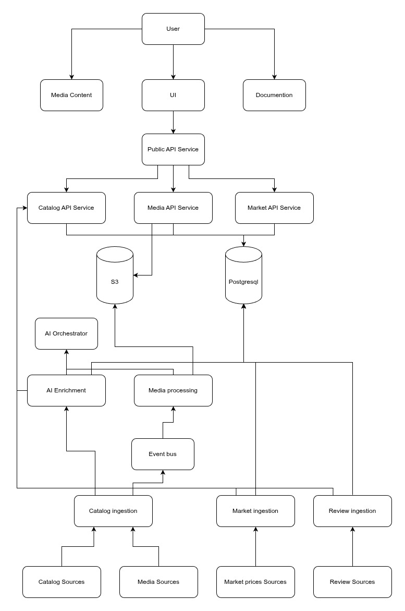

# Monstrino

                    

⏱️ **Coding time:** 

🌐 [Official Website](https://monstrino.com) · 📖 [Documentation](https://documentation.monstrino.com)

Official Website: https://monstrino.com  
Documentation: https://documentation.monstrino.com

**Monstrino** is an automated collector platform for the **Monster High
universe**.

The system continuously discovers, parses, enriches, and stores
structured data about Monster High releases from multiple sources.

Its goal is to create the **most complete structured catalog of Monster
High releases** while demonstrating **production‑grade backend
architecture**.

---

# Table of Contents

- [Monstrino](#monstrino)
- [Table of Contents](#table-of-contents)
- [Overview](#overview)
- [Key Features](#key-features)
  - [Automated Catalog Generation](#automated-catalog-generation)
  - [AI Data Enrichment](#ai-data-enrichment)
- [Architecture](#architecture)
- [Domains](#domains)
  - [Catalog](#catalog)
  - [Media](#media)
  - [Market](#market)
  - [AI](#ai)
- [Services](#services)
  - [Catalog Services](#catalog-services)
  - [Media Services](#media-services)
  - [Market Services](#market-services)
  - [AI Services](#ai-services)
- [Technology Stack](#technology-stack)
  - [Backend](#backend)
  - [Infrastructure](#infrastructure)
  - [Storage](#storage)
  - [AI](#ai-1)
  - [Observability](#observability)
- [Development Environment](#development-environment)
- [Running the Platform](#running-the-platform)
  - [Requirements](#requirements)
- [Documentation](#documentation)
- [Design Principles](#design-principles)
    - [Automation First](#automation-first)
    - [Source Independence](#source-independence)
    - [Event‑Driven Pipelines](#eventdriven-pipelines)
    - [Scalability](#scalability)
- [Roadmap](#roadmap)
- [Project Status](#project-status)
- [License](#license)
  - [Source Code](#source-code)
  - [Dataset](#dataset)
  - [Media](#media-1)

---

# Overview

The collector ecosystem has several problems:

| Problem | Description |
| --- | --- |
| Fragmented information | Release data is scattered across many websites |
| Unstable images | Images disappear when original sites change |
| Price volatility | Market prices constantly change |
| Manual cataloging | Collectors maintain catalogs manually |

Monstrino solves this by building a **fully automated ingestion
platform**.

---

# Key Features

## Automated Catalog Generation

The platform automatically collects:

- releases
- characters
- pets
- series
- release metadata
- descriptions
- images

Sources include collector websites, stores, and other public resources.

---

## AI Data Enrichment

AI models are used for:

- extracting structured data
- classifying releases
- detecting characters and pets
- validating parsed data

---

# Architecture

Monstrino follows a **microservice architecture**.

Key architectural patterns:

- Domain Driven Design
- Event-driven pipelines
- Clean Architecture
- Service isolation

---

# Domains

## Catalog

Stores canonical catalog entities:

- releases
- characters
- pets
- series

Relationships between them are normalized.

---

## Media

Responsible for:

- downloading images
- metadata extraction
- normalization
- object storage hosting

---

## Market

Tracks:

- newly discovered releases
- secondary market prices
- price history

---

## AI

AI services perform:

- text processing
- enrichment
- classification
- validation

---

# Services

## Catalog Services

| Service | Responsibility |
| --- | --- |
| catalog-importer | Imports parsed catalog data |
| catalog-data-enricher | Enhances catalog records |
| release-catalog-service | Public release catalog API |

---

## Media Services

| Service | Responsibility |
| --- | --- |
| media-rehosting-subscriber | Receives media ingestion events |
| media-rehosting-processor | Processes ingestion jobs |
| media-normalization | Normalizes images |
| media-rehosting-service | Hosts media assets |

---

## Market Services

| Service | Responsibility |
| --- | --- |
| market-release-discovery | Detects new releases |
| market-price-collector | Collects market prices |

---

## AI Services

| Service | Responsibility |
| --- | --- |
| ai-orchestrator | Coordinates AI workflows |

---

# Technology Stack

## Backend

- Python
- FastAPI
- SQLAlchemy
- PostgreSQL

## Infrastructure

- Kubernetes
- Docker
- Kafka
- Traefik

## Storage

- PostgreSQL
- MinIO / S3

## AI

- Ollama
- LLM models
- Vision models

## Observability

- Prometheus
- Grafana

---

# Development Environment

The platform runs in Kubernetes.

| Environment | Purpose |
| --- | --- |
| local | development |
| test | integration testing |
| prod | production |

Each environment runs in a separate namespace.

---

# Running the Platform

## Requirements

- Docker
- Kubernetes
- Make
- Python 3.14+

# Documentation

Documentation lives in:

- monstrino-docs/docs/
- monstrino-docs/dev-notes/

Documentation includes:

- architecture diagrams
- pipelines
- service documentation
- design decisions

---

# Design Principles

### Automation First

All catalog data should be collected automatically.

### Source Independence

Different sources are normalized into a canonical schema.

### Event‑Driven Pipelines

Pipelines operate asynchronously.

### Scalability

Services scale horizontally.

---

# Roadmap

Planned improvements:

- full catalog coverage
- price history analytics
- public developer API
- advanced search
- collector tools

---

# Project Status

🚧 Active development.

The project serves both as:

- a collector platform
- an advanced backend architecture project

# License

Monstrino uses separate licenses for different parts of the project.

## Source Code

The source code is distributed under the **Monstrino Source License (MSL)**.

The code is publicly available for educational and architectural
reference purposes only. The license allows reading and studying the
implementation but does not allow reuse of the code in other software
projects.

See: `LICENSE`

---

## Dataset

All structured catalog data (releases, series, characters, pricing
history, and other generated datasets) are covered by the
**Monstrino Data License (MDL)**.

The dataset may be viewed and referenced but may not be copied,
replicated, or redistributed as another database.

See: `LICENSE-DATA`

## Media

Some images used in Monstrino originate from third-party sources
such as manufacturers and promotional materials.

For example, Monster High product images belong to Mattel, Inc.

These images are used strictly for informational and catalog purposes.

Monstrino does not claim ownership of third-party media assets.

See: `LICENSE-MEDIA-NOTICE`
