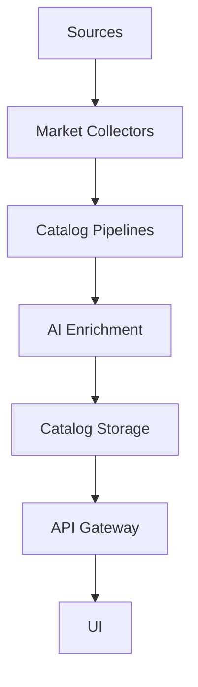

# Monstrino

[](https://www.python.org/) [](https://fastapi.tiangolo.com/) [](https://www.sqlalchemy.org/) [](https://www.postgresql.org/) [](https://min.io/) [](https://www.typescriptlang.org/) [](https://nextjs.org/) [](https://react.dev/) [](https://mui.com/) [](https://www.docker.com/) [](https://kubernetes.io/) [](https://www.stackit.de/)

[](https://wakatime.com/badge/user/48c32c80-1ac5-49d5-a08c-e802fc739940/project/dcae8000-f0fa-471f-81d7-ddc589dbf188)

🌐 [Official Website](https://monstrino.com) · 📖 [Documentation](https://documentation.monstrino.com)

**Monstrino** is an automated collector platform for the **Monster High
universe**.

The system continuously discovers, parses, enriches, and stores
structured data about Monster High releases from multiple sources.

Its goal is to create the **most complete structured catalog of Monster
High releases** while demonstrating **production‑grade backend
architecture**.

---

# Table of Contents

-   [Overview](#overview)
-   [Key Features](#key-features)
-   [Architecture](#architecture)
-   [Domains](#domains)
-   [Services](#services)
-   [Technology Stack](#technology-stack)
-   [Repository Structure](#repository-structure)
-   [Development Environment](#development-environment)
-   [Running the Platform](#running-the-platform)
-   [Documentation](#documentation)
-   [Design Principles](#design-principles)
-   [Roadmap](#roadmap)

---

# Overview

The collector ecosystem has several problems:

| Problem | Description |
| --- | --- |
| Fragmented information | Release data is scattered across many websites |
| Unstable images | Images disappear when original sites change |
| Price volatility | Market prices constantly change |
| Manual cataloging | Collectors maintain catalogs manually |

Monstrino solves this by building a **fully automated ingestion
platform**.

---

# Key Features

## Automated Catalog Generation

The platform automatically collects:

-   releases
-   characters
-   pets
-   series
-   release metadata
-   descriptions
-   images

Sources include collector websites, stores, and other public resources.

---

## Media Ingestion Pipeline

External images are automatically processed:


Benefits:

-   permanent image storage
-   consistent media formats
-   metadata extraction

---

## Market Price Tracking

Monstrino tracks:

-   MSRP (original retail price)
-   secondary market prices
-   regional pricing

Collectors can observe **price evolution over time**.

---

## AI Data Enrichment

AI models are used for:

-   extracting structured data
-   classifying releases
-   detecting characters and pets
-   validating parsed data

---

# Architecture

Monstrino follows a **microservice architecture**.



Key architectural patterns:

-   Domain Driven Design
-   Event-driven pipelines
-   Clean Architecture
-   Service isolation

---

# Domains

## Catalog

Stores canonical catalog entities:

-   releases
-   characters
-   pets
-   series

Relationships between them are normalized.

---

## Media

Responsible for:

-   downloading images
-   metadata extraction
-   normalization
-   object storage hosting

---

## Market

Tracks:

-   newly discovered releases
-   secondary market prices
-   price history

---

## AI

AI services perform:

-   text processing
-   enrichment
-   classification
-   validation

---

# Services

## Catalog Services

| Service | Responsibility |
| --- | --- |
| catalog-importer | Imports parsed catalog data |
| catalog-data-enricher | Enhances catalog records |
| release-catalog-service | Public release catalog API |

---

## Media Services

| Service | Responsibility |
| --- | --- |
| media-rehosting-subscriber | Receives media ingestion events |
| media-rehosting-processor | Processes ingestion jobs |
| media-normalizator | Normalizes images |
| media-rehosting-service | Hosts media assets |

---

## Market Services

| Service | Responsibility |
| --- | --- |
| market-release-discovery | Detects new releases |
| market-price-collector | Collects market prices |

---

## AI Services

| Service | Responsibility |
| --- | --- |
| llm-gateway | Gateway to LLM models |
| ai-orchestrator | Coordinates AI workflows |

---

# Technology Stack

## Backend

-   Python
-   FastAPI
-   SQLAlchemy
-   PostgreSQL

## Infrastructure

-   Kubernetes
-   Docker
-   Kafka
-   Traefik

## Storage

-   PostgreSQL
-   MinIO / S3

## AI

-   Ollama
-   LLM models
-   Vision models

## Observability

-   Prometheus
-   Grafana

---

# Repository Structure

``` text
monstrino/

docs/                → documentation
services/            → microservices
libs/                → shared libraries

    monstrino-core
    monstrino-models
    monstrino-contracts
    monstrino-repositories
    monstrino-infra

deploy/              → kubernetes manifests
dev-notes/           → development notes
adr/                 → architecture decisions
```

---

# Development Environment

The platform runs in Kubernetes.

| Environment | Purpose |
| --- | --- |
| local | development |
| test | integration testing |
| prod | production |

Each environment runs in a separate namespace.

---

# Running the Platform

## Requirements

-   Docker
-   Kubernetes
-   Make
-   Python 3.11+

## Typical Workflow

``` bash
make build
make push
make deploy
```

---

# Documentation

Documentation lives in:

- `docs/`
- `dev-notes/`
- `adr/`

Documentation includes:

-   architecture diagrams
-   pipelines
-   service documentation
-   design decisions

---

# Design Principles

### Automation First

All catalog data should be collected automatically.

### Source Independence

Different sources are normalized into a canonical schema.

### Event‑Driven Pipelines

Pipelines operate asynchronously.

### Scalability

Services scale horizontally.

---

# Roadmap

Planned improvements:

-   full catalog coverage
-   price history analytics
-   public developer API
-   advanced search
-   collector tools

---

# Project Status

🚧 Active development.

The project serves both as:

-   a collector platform
-   an advanced backend architecture project