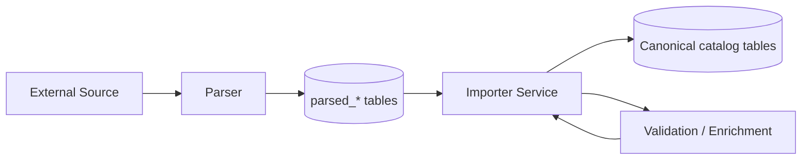

# ADR-A-001 — Separate Ingest from Canonical Catalog through Parsed Tables and Importer

| Field     | Value                                          |
| --------- | ---------------------------------------------- |
| **Status**  | Accepted                                       |
| **Date**    | 2025-06-15                                     |
| **Author**  | @monstrino-team                                |
| **Tags**    | `#architecture` `#ingestion` `#data-boundary`  |

## Context

External source data entering Monstrino is inconsistent, incomplete, and varies significantly between providers. Source schemas change without notice, field semantics differ across platforms, and data quality ranges from well-structured JSON to loosely formatted HTML.

Writing directly into canonical catalog tables would:

- **Couple source formats** to internal storage, making provider changes break production schema.
- **Prevent safe iteration** — any schema refactor on the canonical side risks corrupting already-ingested data.
- **Eliminate auditability** — there would be no record of what the source originally provided vs. what was normalized.

:::warning Business Risk
Without this boundary, adding a new source provider or changing an existing parser could silently corrupt live catalog data with no rollback path.
:::

## Options Considered

### Option 1: Direct Write to Catalog Tables

Parsers write normalized data directly into canonical `characters`, `releases`, and related tables.

- **Pros:** Simpler pipeline, fewer moving parts, lower initial development cost.
- **Cons:** Tight coupling to source format, no audit trail, dangerous schema migrations, no replay capability, impossible to re-import from raw data.

### Option 2: Parsed Tables as Intermediate Layer ✅

External data is first stored in `parsed_*` staging tables, then a dedicated **importer service** transforms and loads it into canonical tables.

- **Pros:** Hard boundary between raw and canonical data, full auditability, safe replay, independent schema evolution on both sides.
- **Cons:** Additional tables and processing step, slightly higher infrastructure complexity.

### Option 3: Event-Sourced Ingestion Log

All source data is appended to an immutable event log (e.g., Kafka topic), and canonical state is rebuilt from projections.

- **Pros:** Full history, event replay, fits event-driven architecture well.
- **Cons:** Significant infrastructure overhead at current scale, adds operational complexity disproportionate to the team size and project stage.

## Decision

> We adopt **parsed tables as an intermediate ingestion layer**. External source parsers write into `parsed_*` tables only. A dedicated importer service reads parsed records, applies validation and transformation rules, and writes into normalized canonical catalog tables.

This creates a **hard architectural boundary** between untrusted external data and business-ready canonical entities.

## Consequences

### Positive

- **Auditability** — raw source data is preserved and can be inspected at any time.
- **Replayability** — parsed records can be re-imported after schema changes without re-scraping sources.
- **Safety** — canonical tables are protected from malformed or unexpected source data.
- **Independent evolution** — parsed and canonical schemas can evolve on separate timelines.
- **Multi-source support** — different sources can write to the same parsed tables with source-specific parsers.

### Negative

- **Additional storage** — parsed tables duplicate some data that also exists in canonical form.
- **Processing latency** — two-step pipeline adds a small delay between collection and availability.
- **Operational surface** — importer service must be monitored and maintained separately.

### Risks

- Parsed table schemas may still need periodic redesign as new sources reveal unexpected data shapes.
- Importer logic could become a bottleneck if transformation rules grow overly complex — consider decomposing into smaller, composable transformation steps.

## Related Decisions

- [ADR-A-002](./adr-a-002.md) — Processing state as workflow mechanism (governs how parsed records flow through the pipeline)
- [ADR-DI-001](../data-ingestion/adr-di-001.md) — Parsed model design for heterogeneous sources
- [ADR-DI-003](../data-ingestion/adr-di-003.md) — Idempotency enforcement on ingested records
