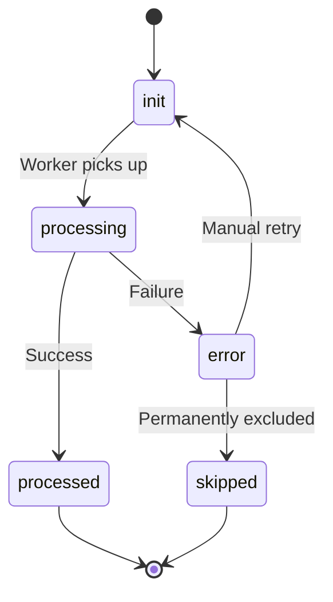

# ADR-A-002 — Use Database `processing_state` as the Core Ingestion Workflow Mechanism

| Field     | Value                                            |
| --------- | ------------------------------------------------ |
| **Status**  | Accepted                                         |
| **Date**    | 2025-06-20                                       |
| **Author**  | @monstrino-team                                  |
| **Tags**    | `#architecture` `#workflow` `#state-machine`     |

## Context

Monstrino's ingestion pipeline involves multiple stages: collection, parsing, validation, importing, and enrichment. Each record progresses through these stages, and the system must handle partial failures, retries, manual intervention, and operational visibility.

Two fundamental approaches exist for orchestrating this workflow:

1. **Queue-driven orchestration** — each stage consumes from and produces to message queues, with ordering and retry semantics managed by the broker.
2. **Database state-driven orchestration** — each record carries a `processing_state` field (`init`, `processing`, `processed`, `error`) that explicitly tracks progress.

At the current project stage (single developer, homelab deployment, evolving pipeline), operational debuggability and control matter more than throughput optimization.

:::info Design Principle
The chosen mechanism prioritizes **inspectability and manual control** over theoretical throughput, which is appropriate for the current scale and team size.
:::

## Options Considered

### Option 1: Pure Message Queue Orchestration

Use Kafka (or similar) as the sole workflow driver. Each stage publishes events that trigger the next stage.

- **Pros:** Decoupled stages, natural async processing, scales horizontally.
- **Cons:** Debugging requires log correlation across topics, error visibility is poor, manual intervention requires custom tooling, harder to inspect "what is stuck and why."

### Option 2: Database `processing_state` Fields ✅

Each record has a `processing_state` column that acts as a lightweight state machine. Services query for records in specific states and transition them.

- **Pros:** Full visibility via SQL queries, trivial manual intervention, explicit error buckets, supports controlled retries, easy to build dashboards.
- **Cons:** Potential for polling overhead, less naturally async than queues, requires careful lock management for concurrent workers.

### Option 3: Hybrid — State Fields + Event Notifications

Database states drive the workflow, but state transitions optionally emit events for reactive processing.

- **Pros:** Best of both worlds — inspectability + reactive capability.
- **Cons:** Higher implementation cost, risk of state/event divergence.

## Decision

> We adopt **database `processing_state` fields** as the primary ingestion workflow mechanism. Records transition through explicit states (`init` → `processing` → `processed` | `error`), and services poll for actionable records by state.

Event-based notifications (e.g., via Kafka) may be layered on top in the future as an optimization, but the database state remains the **source of truth** for workflow progress.

## Consequences

### Positive

- **Operational visibility** — a single SQL query shows all stuck, failed, or in-progress records.
- **Controlled retries** — errored records can be reset to `init` individually or in bulk.
- **Separation of concerns** — broken records are isolated from the healthy pipeline.
- **Debuggability** — no need to reconstruct state from distributed logs or topic offsets.
- **Low infrastructure requirements** — no additional broker dependency for core workflow.

### Negative

- **Polling overhead** — workers must periodically query for new work (mitigated by appropriate intervals and indexes).
- **Concurrency management** — requires `SELECT ... FOR UPDATE SKIP LOCKED` or similar patterns to prevent double-processing.
- **Not event-reactive** — processing latency is bounded by poll interval rather than push notifications.

### Risks

- If the number of records grows substantially, polling queries must be optimized with proper indexing on `processing_state` columns.
- State transitions should be atomic (within a transaction) to prevent records from getting stuck in intermediate states.

## Related Decisions

- [ADR-A-001](./adr-a-001.md) — Parsed tables as ingestion boundary (defines what records are being processed)
- [ADR-A-005](./adr-a-005.md) — Unit of Work pattern (governs transaction boundaries around state transitions)
