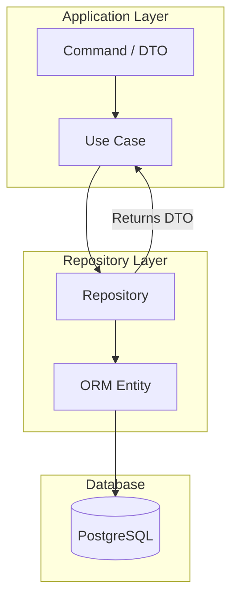

# ADR-A-004 — Restrict ORM Usage to Repository Layer and Use DTOs Elsewhere

| Field     | Value                                                  |
| --------- | ------------------------------------------------------ |
| **Status**  | Accepted                                               |
| **Date**    | 2025-07-05                                             |
| **Author**  | @monstrino-team                                        |
| **Tags**    | `#architecture` `#orm` `#clean-architecture`           |

## Context

SQLAlchemy ORM entities carry implicit behavior: lazy loading, change tracking, session binding, and relationship traversal. When these objects leak beyond the repository layer into application logic, use cases, or API handlers, several problems emerge:

- **Hidden I/O** — accessing a relationship attribute triggers a database query invisibly.
- **Session coupling** — passing an ORM entity outside its session scope causes `DetachedInstanceError`.
- **Testing friction** — unit tests for business logic require a database session or complex mocking.
- **Migration fragility** — schema changes in ORM models ripple through the entire codebase.

:::note Clean Architecture Principle
Dependencies should point inward. Application and domain layers must not depend on persistence infrastructure. ORM entities are persistence infrastructure.
:::

## Options Considered

### Option 1: Allow ORM Entities Everywhere

ORM entities are passed freely through all layers.

- **Pros:** Less boilerplate, no mapping code needed.
- **Cons:** All layers coupled to SQLAlchemy, lazy-loading side effects, hard to test without database, migration changes cascade everywhere.

### Option 2: ORM Entities Restricted to Repository Layer ✅

Repositories accept and return **DTOs** (dataclasses or Pydantic models). ORM-to-DTO and DTO-to-ORM mapping happens exclusively inside repository implementations.

- **Pros:** Clean layer boundaries, pure business logic, easy unit testing, safe ORM migrations.
- **Cons:** Mapping boilerplate, potential for mapping bugs, slight performance overhead from object conversion.

### Option 3: Use ORM Models as DTOs (Hybrid)

ORM models serve double duty — annotated for both SQLAlchemy and Pydantic.

- **Pros:** No separate DTO classes, reduced file count.
- **Cons:** Mixes concerns, limits flexibility, complicates validation vs persistence rules, SQLAlchemy 2.0+ makes this pattern increasingly awkward.

## Decision

> SQLAlchemy ORM entities may **only be used inside repository implementations**. All application, domain, and orchestration logic must use DTOs, commands, and domain data structures.

### Rules

1. **Repositories** accept DTOs/commands as input and return DTOs as output.
2. **ORM entities** are instantiated, queried, and mapped only inside repository methods.
3. **Application logic** never imports from `monstrino-models` directly — it uses `monstrino-core` DTOs.
4. **Mapping functions** live alongside the repository, typically as private methods or dedicated mapper modules.

## Consequences

### Positive

- **Testable business logic** — use cases can be unit-tested with plain DTOs, no database required.
- **Safe ORM migrations** — changing a column or relationship only affects the repository and its mapper.
- **No lazy-loading surprises** — DTOs are plain objects with no hidden I/O behavior.
- **Framework independence** — business logic is not coupled to SQLAlchemy and could theoretically work with any persistence backend.

### Negative

- **Mapping boilerplate** — every repository method needs ORM ↔ DTO conversion code.
- **Dual maintenance** — ORM models and DTOs must be kept in sync during schema changes.
- **Learning curve** — developers must understand and respect the boundary consistently.

### Risks

- Mapping bugs (field mismatch, missing conversion) can introduce subtle data loss — mitigate with comprehensive repository-level tests.
- Over-engineering risk: simple CRUD services may feel burdened by the pattern — but consistency across the codebase outweighs local convenience.

## Related Decisions

- [ADR-A-003](./adr-a-003.md) — Shared packages (defines where ORM models vs DTOs live)
- [ADR-A-005](./adr-a-005.md) — Standardized persistence stack (provides the repository abstractions where ORM is used)
- [ADR-A-007](./adr-a-007.md) — API boundary pattern (extends DTO usage to the transport layer)
