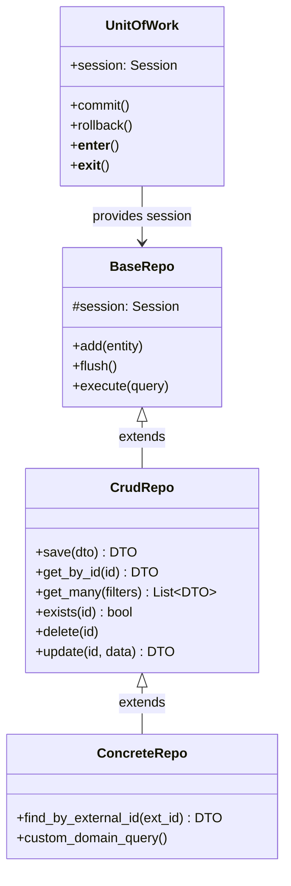

# ADR-A-005 — Standardize Persistence with Unit of Work, BaseRepo, and CrudRepo

| Field     | Value                                                       |
| --------- | ----------------------------------------------------------- |
| **Status**  | Accepted                                                    |
| **Date**    | 2025-07-10                                                  |
| **Author**  | @monstrino-team                                             |
| **Tags**    | `#architecture` `#persistence` `#unit-of-work`              |

## Context

As services multiplied, each developed its own approach to database session management and common repository operations:

- Some services used raw `Session` objects in use cases.
- Others wrapped sessions in custom context managers with inconsistent commit/rollback behavior.
- Common operations like `save`, `get_by_id`, `exists`, `get_many` were reimplemented with slight variations across every repository.

This led to:

- **Inconsistent transaction boundaries** — some flows committed too early, others too late.
- **Duplicated CRUD code** — the same 5-line `get_by_id` pattern appeared in dozens of repositories.
- **Rollback bugs** — error handling paths missed rollbacks or double-committed.

:::info Pattern Reference
The **Unit of Work** pattern (Martin Fowler, PoEAA) maintains a list of objects affected by a business transaction and coordinates writing out changes and resolving concurrency problems.
:::

## Options Considered

### Option 1: Raw Session Management per Service

Each service manages `Session` lifecycle directly.

- **Pros:** No abstraction overhead, full control.
- **Cons:** Inconsistent transaction handling, duplicated error management, no reusable patterns.

### Option 2: Django-Style Active Record

ORM models manage their own persistence (`model.save()`, `Model.objects.get()`).

- **Pros:** Familiar, concise.
- **Cons:** Violates separation of concerns, tightly couples models to persistence, not idiomatic SQLAlchemy.

### Option 3: Unified UoW + BaseRepo + CrudRepo Stack ✅

A layered persistence abstraction:

- **Unit of Work** — manages session lifecycle, commit, rollback, and repository instantiation.
- **BaseRepo** — low-level generic operations (execute query, add entity, flush).
- **CrudRepo** — higher-level reusable CRUD operations built on BaseRepo.

- **Pros:** Consistent transaction management, zero CRUD boilerplate, composable, testable.
- **Cons:** Initial abstraction investment, learning curve for the layered API.

## Decision

> All database access must follow a unified persistence stack: **Unit of Work** for transaction management, **BaseRepo** for low-level operations, and **CrudRepo** for standard CRUD patterns.



### Usage Pattern

```python
async with uow:
    character = await uow.characters.get_by_id(character_id)
    # ... business logic ...
    await uow.characters.save(updated_character)
    await uow.commit()
```

### Rules

1. **Never** create `Session` objects outside the Unit of Work.
2. **CrudRepo** covers standard operations — domain-specific queries go in concrete repos.
3. Every repository receives its session from UoW — no independent session creation.
4. Commit and rollback are **always** managed at the UoW level, not inside individual repositories.

## Consequences

### Positive

- **Zero CRUD boilerplate** — new repositories inherit `save`, `get_by_id`, `exists`, `get_many`, `delete` out of the box.
- **Consistent transactions** — UoW guarantees atomic commit/rollback across all repositories in a single operation.
- **Testable** — UoW can be substituted with in-memory implementations for unit testing.
- **Reduced bugs** — rollback paths and session cleanup are handled uniformly.

### Negative

- **Abstraction layer** — developers must understand the UoW/BaseRepo/CrudRepo hierarchy before contributing.
- **Flexibility constraints** — unusual query patterns may not fit the CrudRepo interface cleanly.
- **Performance considerations** — the abstraction may add minor overhead for high-frequency operations.

### Risks

- Over-abstraction: if CrudRepo tries to cover too many edge cases, it becomes a leaky abstraction. Keep it focused on the 80% use case.
- Session leaks: ensure UoW `__exit__` always closes/returns the session, even on unhandled exceptions.

## Related Decisions

- [ADR-A-004](./adr-a-004.md) — ORM restricted to repository layer (defines what lives inside repos)
- [ADR-A-003](./adr-a-003.md) — Shared packages (UoW and BaseRepo live in `monstrino-repositories`)
