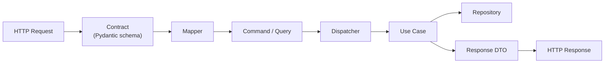

# ADR-A-007 — Use Contracts → Mapper → Command → Dispatcher → UseCase as API Boundary

| Field     | Value                                                       |
| --------- | ----------------------------------------------------------- |
| **Status**  | Accepted                                                    |
| **Date**    | 2025-07-20                                                  |
| **Author**  | @monstrino-team                                             |
| **Tags**    | `#architecture` `#api` `#clean-architecture` `#commands`    |

## Context

HTTP API endpoints must translate external requests into internal application operations. Without a structured boundary, transport-layer concerns (request parsing, validation, serialization) bleed into business logic:

- Handlers grow into monolithic functions mixing validation, mapping, orchestration, and persistence.
- Business logic becomes coupled to specific web frameworks (FastAPI, Flask, etc.).
- Testing requires HTTP-level setup even for pure domain logic validation.

A clear boundary pattern is needed to separate **what the API accepts** from **what the application does**.

## Options Considered

### Option 1: Direct Handler-to-Repository

API handlers interact directly with repositories, performing all logic inline.

- **Pros:** Minimal abstractions, fast to write.
- **Cons:** No separation of concerns, untestable business logic, framework-locked, grows into unmaintainable handlers.

### Option 2: Service Layer Pattern

Thin service classes that handlers call, containing business logic.

- **Pros:** Better than direct access, centralizes logic.
- **Cons:** Services tend to become God objects, no formal command/query separation, unclear responsibility boundaries.

### Option 3: Contracts → Mapper → Command → Dispatcher → UseCase ✅

A structured pipeline where each stage has a single responsibility:

- **Pros:** Clean separation, framework-independent business logic, testable at every level, supports CQRS evolution.
- **Cons:** More abstractions, initial boilerplate, learning curve.

## Decision

> External HTTP contracts must be mapped into internal commands through dedicated mappers, then dispatched to use cases through an application boundary.

### Component Responsibilities

| Component      | Responsibility                                                      |
| -------------- | ------------------------------------------------------------------- |
| **Contract**   | Pydantic model defining the API request/response shape              |
| **Mapper**     | Converts between contract and internal command/DTO                  |
| **Command**    | Immutable data object representing an application-level intention   |
| **Dispatcher** | Routes commands to their registered use case handlers               |
| **Use Case**   | Executes business logic, interacts with repositories, returns DTOs  |

### Rules

1. **Contracts** live in `monstrino-contracts` — they define the public API surface.
2. **Commands** live in `monstrino-core` — they are internal application-layer objects.
3. **Mappers** are service-specific — they bridge the gap between transport and application.
4. **Use cases** never import from contracts — they work exclusively with commands and DTOs.
5. **Dispatchers** are generic — they route by command type, not by HTTP verb or endpoint.

## Consequences

### Positive

- **Framework independence** — use cases don't know they're called from HTTP (could be CLI, queue, etc.).
- **Testability** — use cases can be tested with plain command objects, no HTTP overhead.
- **API stability** — contracts can evolve independently of internal command shapes.
- **CQRS readiness** — the pattern naturally separates commands (writes) from queries (reads).
- **Traceability** — each request follows a predictable, auditable path through the system.

### Negative

- **Boilerplate** — each endpoint requires a contract, mapper, command, and use case (mitigated by generators/templates).
- **Indirection** — more files and abstractions per feature compared to direct handlers.
- **Overhead for simple CRUD** — trivial endpoints still go through the full pipeline.

### Risks

- Mapper bugs can silently drop or mismap fields — mitigate with contract ↔ command test coverage.
- Dispatcher can become a bottleneck if it grows too complex — keep it a simple registry pattern.

## Related Decisions

- [ADR-A-004](./adr-a-004.md) — ORM restricted to repository layer (guarantees use cases work with DTOs)
- [ADR-A-003](./adr-a-003.md) — Shared packages (defines where contracts, commands, and core logic live)
