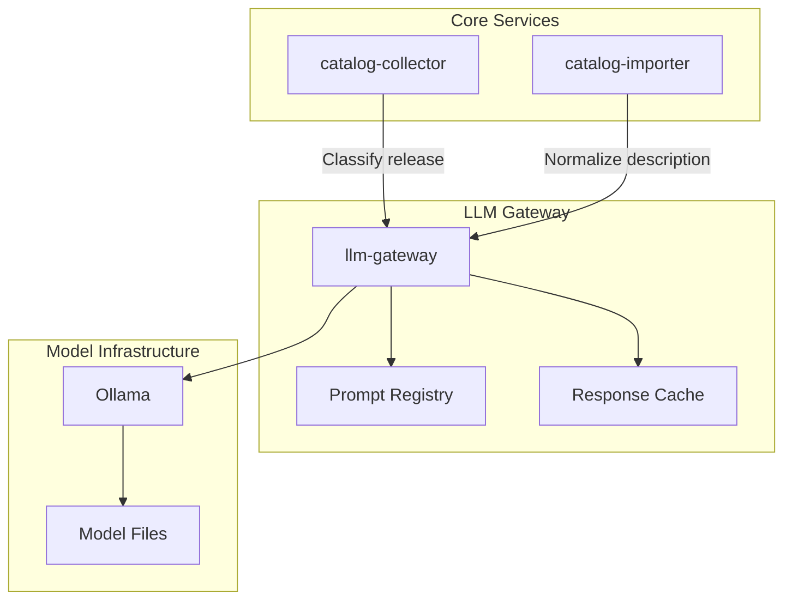

# ADR-A-008 — Isolate LLM Processing Behind `llm-gateway`

| Field     | Value                                                |
| --------- | ---------------------------------------------------- |
| **Status**  | Accepted                                             |
| **Date**    | 2025-08-01                                           |
| **Author**  | @monstrino-team                                      |
| **Tags**    | `#architecture` `#llm` `#gateway` `#isolation`       |

## Context

LLM capabilities proved useful for several Monstrino workflows:

- **Interpreting inconsistent release data** — source names, descriptions, and categories are unstructured and vary across providers.
- **Classifying product attributes** — determining doll line, wave, edition from free-text titles.
- **Enriching metadata** — generating normalized descriptions from raw source content.

However, LLM integration introduces unique challenges:

- **Model volatility** — model versions change, outputs are non-deterministic, prompt engineering evolves.
- **Infrastructure coupling** — self-hosted models (Ollama) have specific runtime requirements (GPU, memory).
- **Latency profile** — LLM inference is orders of magnitude slower than typical service operations.
- **Vendor lock-in risk** — embedding model-specific APIs into core services would make switching models expensive.

:::warning
Embedding LLM calls directly into collectors or importers would create **tight coupling** between core pipeline reliability and model availability. A model outage would halt data ingestion.
:::

## Options Considered

### Option 1: Inline LLM Calls in Services

Each service calls the LLM API directly when needed.

- **Pros:** Simple, no extra service to maintain.
- **Cons:** Every service coupled to model API, no centralized prompt management, model changes require updating every consumer, failure in LLM blocks the calling service.

### Option 2: Shared LLM Client Library

An LLM client package used by all services.

- **Pros:** Centralized client code, shared prompt templates.
- **Cons:** Still couples each service to model runtime availability, no request queuing, no centralized observability.

### Option 3: Dedicated `llm-gateway` Service ✅

A standalone service that owns all LLM interactions, exposes a stable internal API, and manages model communication, prompt engineering, and response caching.

- **Pros:** Full isolation, centralized prompt management, independent scaling, model-agnostic internal API, graceful degradation.
- **Cons:** Additional service to deploy and maintain, extra network hop.

## Decision

> All LLM-related processing must go through a dedicated **`llm-gateway`** service. No other service may communicate directly with model infrastructure (Ollama, OpenAI, etc.).

### Gateway Responsibilities

| Responsibility         | Description                                                |
| ---------------------- | ---------------------------------------------------------- |
| **Prompt management**  | Version-controlled prompt templates per use case           |
| **Model abstraction**  | Internal API doesn't expose which model is used            |
| **Response caching**   | Identical inputs return cached results without re-inference|
| **Fallback handling**  | Graceful degradation when model is unavailable             |
| **Observability**      | Centralized logging of inputs, outputs, latency, errors    |

## Consequences

### Positive

- **Model swappability** — switching from Ollama to OpenAI (or vice versa) requires changes only in `llm-gateway`.
- **Pipeline resilience** — core ingestion continues if the LLM is temporarily unavailable (enrichment is deferred).
- **Centralized prompt engineering** — all prompts are managed, versioned, and tested in one place.
- **Cost/resource control** — LLM usage can be monitored, throttled, and optimized centrally.
- **Caching** — repeated identical requests don't consume model resources.

### Negative

- **Additional service** — one more deployment to maintain, monitor, and scale.
- **Network latency** — extra hop between consumer service and model.
- **API design burden** — the gateway API must be generic enough for diverse use cases while specific enough to be useful.

### Risks

- Gateway becoming a bottleneck — mitigate with async processing and request queuing.
- Prompt versioning complexity — establish clear prompt naming and versioning conventions early.
- Cache invalidation — when prompts change, cached responses for old prompts must be invalidated.

## Related Decisions

- [ADR-DI-006](../data-ingestion/adr-di-006.md) — LLM-assisted normalization (primary consumer of the gateway)
- [ADR-A-001](./adr-a-001.md) — Parsed tables boundary (LLM enrichment operates on parsed data)
