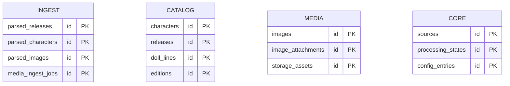

# ADR-A-009 — Structure Database by Domain Schemas

| Field     | Value                                                       |
| --------- | ----------------------------------------------------------- |
| **Status**  | Accepted                                                    |
| **Date**    | 2025-08-05                                                  |
| **Author**  | @monstrino-team                                             |
| **Tags**    | `#architecture` `#database` `#schemas` `#domain-design`     |

## Context

As the Monstrino data model grew, all tables initially shared a single PostgreSQL `public` schema. This created several problems:

- **Ownership ambiguity** — no clear indication of which domain a table belongs to.
- **Schema evolution conflicts** — migrations for unrelated domains could interfere with each other.
- **Security boundaries** — no ability to restrict service-level access to specific table groups.
- **Cognitive overload** — a flat list of 50+ tables is hard to navigate and reason about.

PostgreSQL natively supports multiple schemas within a single database, providing logical separation without the operational overhead of separate databases.

## Options Considered

### Option 1: Everything in `public` Schema

All tables in the default `public` schema.

- **Pros:** Simple, no schema management, all frameworks work by default.
- **Cons:** No domain boundaries, poor discoverability, no access control granularity, migration conflicts.

### Option 2: Separate Database per Domain

Each domain gets its own PostgreSQL database.

- **Pros:** Full isolation, independent backups, per-domain scaling.
- **Cons:** Cross-domain queries require foreign data wrappers or application-level joins, significantly higher operational complexity, connection management overhead.

### Option 3: Domain Schemas within Single Database ✅

Tables are organized into PostgreSQL schemas that mirror domain capability areas.

- **Pros:** Logical separation, schema-level permissions, cross-schema queries work natively, single backup/connection, aligns with service domains.
- **Cons:** Schema prefix management, search_path configuration, framework compatibility considerations.

## Decision

> Database tables must be grouped into **separate PostgreSQL schemas** that mirror the domain capability structure.

### Schema Mapping

| Schema     | Purpose                                    | Owner Services                           |
| ---------- | ------------------------------------------ | ---------------------------------------- |
| `ingest`   | Parsed/staging data from external sources  | catalog-collector, catalog-importer      |
| `catalog`  | Canonical, normalized domain entities      | catalog-api, catalog-admin               |
| `media`    | Image and media asset metadata             | media-subscriber, media-processor        |
| `core`     | Shared reference data, configuration       | platform services                        |
| `auth`     | User accounts, sessions, permissions       | auth service                             |

### Rules

1. Each table belongs to **exactly one schema** based on its domain ownership.
2. Services should primarily access tables in **their own schema**.
3. Cross-schema references use **explicit schema-qualified names** (e.g., `core.sources`).
4. Shared reference data (e.g., `sources`, `processing_states`) lives in `core` and is read-accessible by all schemas.
5. Migrations are organized per schema to minimize conflict surface.

## Consequences

### Positive

- **Domain clarity** — the database structure communicates architecture at the data layer.
- **Access control** — PostgreSQL grants can be applied per schema, supporting least-privilege service access.
- **Migration safety** — schema-scoped migrations reduce the risk of cross-domain interference.
- **Discoverability** — `\dt ingest.*` instantly shows all ingestion tables.
- **Alignment** — database schemas mirror service domain folders and documentation structure.

### Negative

- **ORM configuration** — SQLAlchemy models need explicit `__table_args__ = {"schema": "..."}` declarations.
- **Search path management** — connection configuration must include appropriate `search_path` settings.
- **Tool compatibility** — some DB tools and migration frameworks handle multi-schema setups less gracefully.

### Risks

- Schema proliferation: don't create schemas for every minor concern — reserve schemas for clear domain boundaries.
- Cross-schema foreign keys are supported by PostgreSQL but increase coupling — use them judiciously.
- Ensure migration tooling (Alembic) is configured to handle multi-schema migrations correctly.

## Related Decisions

- [ADR-A-006](./adr-a-006.md) — Domain-based service organization (mirrors this structure at the service layer)
- [ADR-A-001](./adr-a-001.md) — Parsed tables boundary (maps to `ingest` schema)
- [ADR-A-005](./adr-a-005.md) — Persistence stack (repositories are schema-aware)
