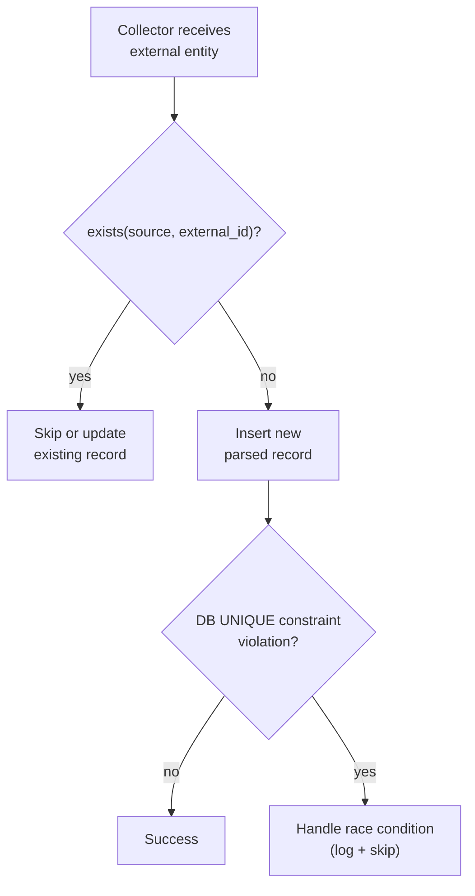

# ADR-DI-003 — Enforce Idempotency with `source + external_id`

| Field     | Value                                                       |
| --------- | ----------------------------------------------------------- |
| **Status**  | Accepted                                                    |
| **Date**    | 2025-08-14                                                  |
| **Author**  | @monstrino-team                                             |
| **Tags**    | `#data-ingestion` `#idempotency` `#deduplication`          |

## Context

Data collection runs repeatedly — scheduled collectors re-fetch source pages, manual re-runs occur during debugging, and error recovery may replay entire batches. Without explicit idempotency guarantees, each run risks creating **duplicate parsed records** that pollute downstream processing:

- Duplicate imports create multiple canonical entries for the same real-world entity.
- Counting queries return inflated numbers.
- Media processing downloads the same images multiple times.
- Operational dashboards show misleading ingestion volumes.

Idempotency must be enforced **before persistence**, not cleaned up after the fact.

:::tip Core Invariant
A parsed record for a given `(source, external_id)` pair must exist **at most once** in the system. This is the foundational deduplication invariant for the entire ingestion pipeline.
:::

## Options Considered

### Option 1: Application-Level Deduplication Only

Check for existing records in application code before inserting.

- **Pros:** Flexible, no schema constraints.
- **Cons:** Race conditions under concurrent collection, no database-level guarantee, bypass-able by direct SQL.

### Option 2: Database UNIQUE Constraint ✅

A database-level `UNIQUE (source, external_id)` constraint prevents duplicate insertion at the storage layer, combined with application-level pre-checks for user-friendly error handling.

- **Pros:** Irrefutable guarantee, survives application bugs, works under concurrency, standard SQL.
- **Cons:** Requires conflict handling (ON CONFLICT or exception catching), application must be aware of the constraint.

### Option 3: Upsert-Only Pattern

All inserts use `INSERT ... ON CONFLICT DO UPDATE`, always overwriting existing records.

- **Pros:** No duplicate errors, latest data always wins.
- **Cons:** Silently overwrites data without audit, loses history, may overwrite manually-corrected records.

## Decision

> Ingested records must be unique by `(source, external_id)`. This is enforced through a **database UNIQUE constraint** combined with **application-level pre-check** before insertion.

### Implementation Strategy

### Enforcement Layers

| Layer            | Mechanism                                          | Purpose                                |
| ---------------- | -------------------------------------------------- | -------------------------------------- |
| **Database**     | `UNIQUE (source, external_id)` constraint          | Irrefutable last line of defense       |
| **Repository**   | `exists_by_source_and_external_id()` pre-check     | Avoid unnecessary insert attempts      |
| **Collector**    | Skip known external_ids from in-memory seen set    | Reduce database queries during batch   |

### Rules

1. Every parsed table **must** have a `UNIQUE (source, external_id)` constraint.
2. Collectors **must** check for existence before attempting insertion.
3. Constraint violations **must** be caught and logged, not raised as unhandled exceptions.
4. Updates to existing records (re-collection) must be **explicit and intentional**, not accidental overwrites.

## Consequences

### Positive

- **Zero duplicates** — the database guarantees uniqueness regardless of application behavior.
- **Safe retries** — collectors can be re-run without creating duplicate records.
- **Pipeline reliability** — downstream services (importers, media processors) consume deduplicated data.
- **Concurrent safety** — multiple collector instances won't create duplicates.

### Negative

- **Conflict handling** — application code must handle constraint violations gracefully.
- **Update complexity** — re-collecting updated data requires explicit upsert logic rather than simple inserts.
- **Index overhead** — the unique constraint creates an index that adds minor write-time cost.

### Risks

- If `external_id` selection is poor (too volatile), legitimate updates may be treated as duplicates — this is mitigated by [ADR-DI-002](./adr-di-002.md).
- Bulk imports without pre-checks may generate excessive constraint violation logs — implement batch deduplication for bulk operations.

## Related Decisions

- [ADR-DI-002](./adr-di-002.md) — External reference identifiers (defines what makes up `external_id`)
- [ADR-DI-001](./adr-di-001.md) — Parsed model design (schema where the constraint lives)
- [ADR-A-002](../architecture/adr-a-002.md) — Processing state workflow (idempotency interacts with state transitions)
