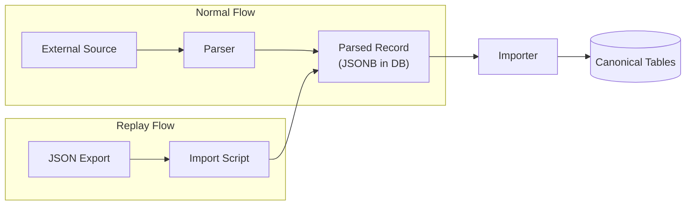

# ADR-DI-004 — Store Parsed Content as Replayable JSON References

| Field     | Value                                                       |
| --------- | ----------------------------------------------------------- |
| **Status**  | Accepted                                                    |
| **Date**    | 2025-08-18                                                  |
| **Author**  | @monstrino-team                                             |
| **Tags**    | `#data-ingestion` `#replay` `#json` `#resilience`          |

## Context

During active development, Monstrino's schemas evolve frequently. Each schema change potentially invalidates previously imported data, requiring re-ingestion from external sources. However, re-scraping sources is:

- **Fragile** — source pages may have changed, been removed, or restructured.
- **Rate-limited** — excessive requests may trigger blocking or throttling.
- **Slow** — re-fetching hundreds of pages takes time and delays development iteration.
- **Non-reproducible** — the same page scraped at different times may return different content.

Without stored raw data, schema migrations require a full re-crawl with no guarantee of identical results.

## Options Considered

### Option 1: Always Re-Scrape from Source

When schema changes, re-collect everything from external sources.

- **Pros:** Always fresh data, no storage overhead.
- **Cons:** Slow, fragile, rate-limited, non-reproducible, source may be unavailable.

### Option 2: Store Raw HTML/Response Bodies

Cache the raw HTTP responses (HTML, JSON) as files or blobs.

- **Pros:** Full source preservation, byte-identical replay.
- **Cons:** Large storage footprint, requires re-parsing, not queryable, format-coupled.

### Option 3: Store Parsed Content as Replayable JSON ✅

Parsed output is stored as structured JSONB in the database and/or exportable JSON files. This intermediate representation can be re-imported without hitting external sources.

- **Pros:** Queryable, compact, schema-independent intermediate format, fast replay, version-controllable.
- **Cons:** Loses raw HTML fidelity, requires parser to produce consistent output.

## Decision

> Parsed external content must be stored in a **replayable format** (JSONB in database + exportable JSON files) so that data can be replayed, backed up, corrected manually, and re-imported without re-scraping sources.

### Replay Workflow

### Storage Strategy

| Layer              | Format     | Purpose                                           |
| ------------------ | ---------- | ------------------------------------------------- |
| **Database**       | JSONB      | Primary queryable storage, fast access             |
| **Export files**    | JSON/JSONL | Backup, version control, manual review             |
| **Git (optional)** | JSON       | Tracked fixtures for development and testing       |

### Capabilities Enabled

- **Schema migration** — change canonical tables, then re-import from parsed records without re-scraping.
- **Local development** — seed local databases from exported JSON without source access.
- **Manual correction** — edit JSON exports to fix source data errors, then re-import.
- **Testing** — use exported records as golden fixtures for integration tests.
- **Auditing** — compare what the source provided vs. what was imported into canonical tables.

## Consequences

### Positive

- **Development velocity** — schema changes don't require re-crawling, saving hours per iteration.
- **Reproducibility** — the same JSON input always produces the same parsed record.
- **Offline capability** — development and testing work without external source access.
- **Debugging** — parsed JSON can be inspected, diffed, and manually corrected.

### Negative

- **Storage cost** — JSONB data duplicates some information already in typed columns.
- **Export maintenance** — export/import scripts must be kept in sync with parsed schema evolution.
- **Not a true source-of-record** — JSON reflects what was parsed, not necessarily the latest source state.

### Risks

- JSON exports can become stale — establish a regular export cadence or trigger exports on schema changes.
- Large JSONB fields can impact query performance — use JSONB-specific indexes for frequently accessed paths.

## Related Decisions

- [ADR-DI-001](./adr-di-001.md) — Parsed models design (defines the structure that gets stored as JSON)
- [ADR-A-001](../architecture/adr-a-001.md) — Parsed tables boundary (replay targets the ingest layer)
