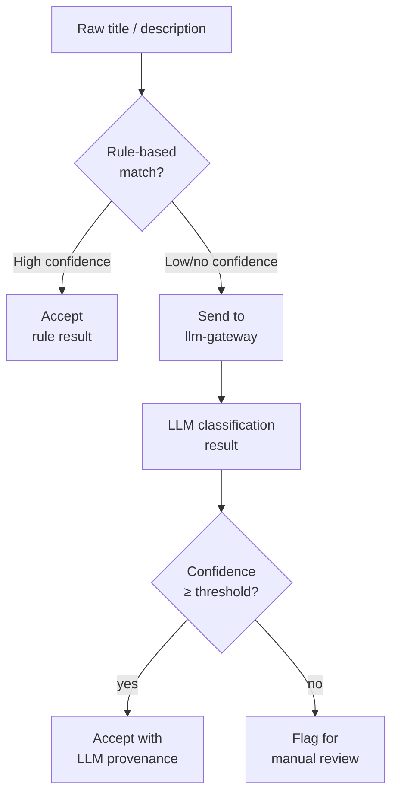

# ADR-DI-006 — Use LLM-Assisted Normalization for Unstructured Release Data

| Field     | Value                                                        |
| --------- | ------------------------------------------------------------ |
| **Status**  | Accepted                                                     |
| **Date**    | 2025-08-25                                                   |
| **Author**  | @monstrino-team                                              |
| **Tags**    | `#data-ingestion` `#llm` `#normalization` `#classification`  |

## Context

Monstrino's canonical catalog requires structured, normalized metadata for each release:

- **Doll line** (e.g., "Skulltimate Secrets", "Reel Drama", "G3 Budget")
- **Character name** (e.g., "Draculaura", "Frankie Stein")
- **Edition type** (e.g., "Collector", "Playline", "Exclusive")
- **Wave / series** identifiers

However, source data provides this information as **free-text titles and descriptions** with no consistent structure:

```
"Monster High Draculaura Skulltimate Secrets Neon Frights Doll"
"MH G3 Draculaura Fashion Doll w/ Pet"
"Monster High™ Haunt Couture Draculaura™ Doll"
```

Deterministic rule-based parsing (regex, keyword matching) works for the majority of cases but becomes brittle as:

- New doll lines are introduced with unpredictable naming conventions.
- Historical releases use inconsistent formatting.
- Source-specific abbreviations and formatting differ.
- Edge cases (bundles, multi-packs, exclusives) don't fit standard patterns.

:::info Scale of the Problem
With 500+ unique releases across 15+ doll lines and 30+ characters, maintaining a hand-tuned rule tree becomes a significant ongoing effort that scales poorly with catalog growth.
:::

## Options Considered

### Option 1: Pure Rule-Based Classification

Hand-written regex and keyword-matching rules for all classification tasks.

- **Pros:** Deterministic, fast, no model dependency, fully predictable.
- **Cons:** Brittle, high maintenance cost, poor generalization to novel inputs, rule tree grows exponentially with edge cases.

### Option 2: LLM-Assisted Classification ✅

Use an LLM (via `llm-gateway`) to classify and extract structured fields from unstructured text, combined with rule-based validation and human review for uncertain results.

- **Pros:** Handles novel inputs gracefully, reduces manual rule maintenance, improves coverage.
- **Cons:** Non-deterministic outputs, requires prompt engineering, model dependency, latency.

### Option 3: Machine Learning Classifier (Traditional ML)

Train a custom text classification model on labeled examples.

- **Pros:** Deterministic at inference time, fast once trained, no external dependency.
- **Cons:** Requires labeled training data (chicken-and-egg with a new catalog), model retraining for new categories, significant ML engineering investment.

## Decision

> For source data that cannot be reliably normalized with deterministic rules alone, Monstrino uses **LLM-assisted classification and extraction** through the `llm-gateway` service. LLM output is treated as a **suggestion** subject to validation and confidence thresholds.

### Hybrid Pipeline



### Classification Tasks

| Task                    | Input                           | Output                              |
| ----------------------- | ------------------------------- | ----------------------------------- |
| **Line detection**      | Product title                   | Doll line name (normalized)         |
| **Character extraction**| Product title                   | Character name(s)                   |
| **Edition typing**      | Title + description             | Edition category                    |
| **Attribute parsing**   | Full product description        | Structured attribute key-value pairs|

### Rules

1. **Rules first** — always attempt deterministic classification before invoking LLM.
2. **Confidence tracking** — every LLM result carries a confidence score and provenance marker.
3. **Human review queue** — low-confidence results are queued for manual verification.
4. **Caching** — identical inputs return cached results (via `llm-gateway`).
5. **Fallback gracefully** — if the LLM is unavailable, records are left unclassified, not blocked.

## Consequences

### Positive

- **Better coverage** — handles edge cases and novel releases that rules would miss.
- **Reduced maintenance** — fewer hand-tuned rules to maintain as the catalog grows.
- **Confidence-based workflow** — uncertain classifications are surfaced for human review rather than silently wrong.
- **Iterative improvement** — reviewed results can be fed back to improve prompts and future rule creation.

### Negative

- **Non-determinism** — the same input may produce different outputs across model versions.
- **Latency** — LLM inference adds processing time (mitigated by caching and async processing).
- **Model dependency** — classification quality depends on model capabilities.
- **Prompt maintenance** — prompts must be tuned and versioned as the classification taxonomy evolves.

### Risks

- Over-reliance on LLM: don't use LLM for easily deterministic classifications — it adds cost and non-determinism unnecessarily.
- Model hallucination: LLM may confidently produce incorrect classifications — always validate against known category values.
- Prompt drift: regularly review and test prompts against a validation dataset.

## Related Decisions

- [ADR-A-008](../architecture/adr-a-008.md) — LLM Gateway isolation (infrastructure for LLM calls)
- [ADR-DI-001](./adr-di-001.md) — Parsed model design (LLM enriches data stored in parsed models)
- [ADR-A-001](../architecture/adr-a-001.md) — Parsed tables boundary (LLM operates on parsed data, before canonical import)
