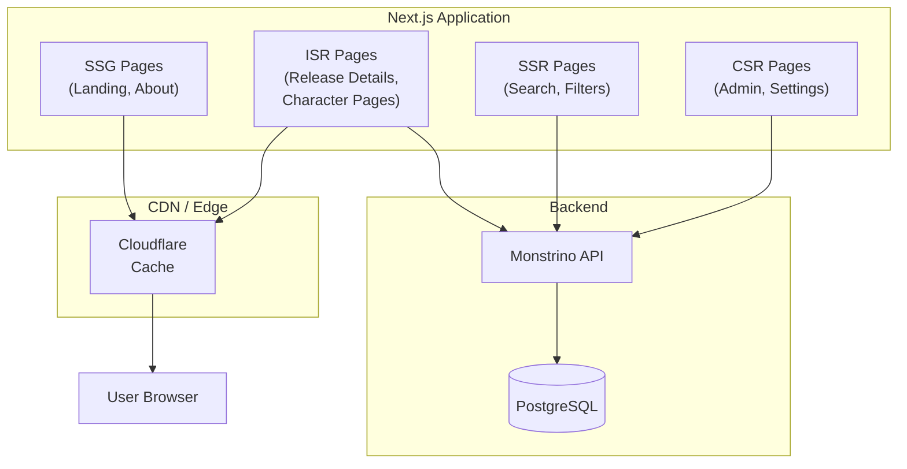

# ADR-FD-001 — Migrate Frontend from Vite SPA to Next.js for SEO and Server-Side Rendering

| Field     | Value                                                       |
| --------- | ----------------------------------------------------------- |
| **Status**  | Accepted                                                    |
| **Date**    | 2025-10-01                                                  |
| **Author**  | @monstrino-team                                             |
| **Tags**    | `#frontend` `#nextjs` `#seo` `#ssr` `#rendering`          |

## Context

Monstrino's initial frontend was built as a **Vite-powered React SPA** (Single Page Application). While this provided excellent developer experience and fast client-side navigation, it created a critical problem for the product's core use case:

**Release archive pages are not indexable by search engines.**

SPAs render content client-side via JavaScript. While Google's crawler can execute JavaScript, it does so inconsistently and with delays. Other search engines (Bing, DuckDuckGo) have more limited JavaScript rendering capabilities.

For a product whose primary value is a **publicly discoverable catalog**, search engine visibility is not optional — it's a core product requirement.

:::danger Core Problem
A release archive that search engines can't index is a release archive that collectors can't discover. Without SEO, the catalog exists only for users who already know about Monstrino.
:::

## Options Considered

### Option 1: Keep Vite SPA + Prerendering Plugin

Use a Vite prerendering plugin to generate static HTML for known routes at build time.

- **Pros:** Minimal migration cost, keeps existing codebase.
- **Cons:** Requires knowing all routes at build time (dynamic catalog pages make this impractical), prerendering doesn't work for user-specific or paginated content, hack-like solution.

### Option 2: Vite SPA + Separate SSR Service

Keep the SPA but add a headless browser-based rendering service (Rendertron, Puppeteer) to serve pre-rendered HTML to crawlers.

- **Pros:** No frontend migration, targeted fix for crawlers.
- **Cons:** Additional infrastructure (headless browser service), user-agent sniffing (fragile), divergent rendering paths, cloaking risk with search engines, significant operational complexity.

### Option 3: Remix

Migrate to Remix, a full-stack React framework with server-side rendering.

- **Pros:** SSR, good data loading patterns, React-based.
- **Cons:** Smaller ecosystem than Next.js, less community adoption, fewer deployment options, less battle-tested at scale.

### Option 4: Next.js ✅

Migrate to Next.js, the most widely adopted React framework with built-in SSR, SSG, ISR, and hybrid rendering capabilities.

- **Pros:** Industry-standard SSR/SSG/ISR, React-based (existing component reuse), massive ecosystem, excellent documentation, multiple rendering strategies per route, built-in image optimization, Vercel or self-hosted deployment.
- **Cons:** Migration effort from Vite setup, Next.js-specific patterns to learn, slightly more opinionated than bare React.

### Option 5: Astro

Content-focused framework with minimal JavaScript by default.

- **Pros:** Excellent for content sites, fast performance, framework-agnostic.
- **Cons:** Less mature for interactive applications, smaller React integration story, less familiar.

## Decision

> The product frontend must migrate from a Vite-based SPA to **Next.js** with support for multiple rendering strategies optimized for SEO and performance.

### Rendering Strategy per Route Type

| Route Type               | Rendering Strategy | Rationale                                    |
| ------------------------ | ------------------ | -------------------------------------------- |
| Release detail pages     | **ISR**            | Content changes infrequently, SEO critical   |
| Character pages          | **ISR**            | Relatively static, SEO critical              |
| Search / filtering       | **SSR**            | Dynamic query parameters, needs fresh data   |
| Admin / management       | **CSR (SPA)**      | No SEO needed, interactive UI                |
| Landing / marketing      | **SSG**            | Fully static, maximum performance            |

:::tip Rendering Strategy Guide
- **SSG** (Static Site Generation) — built at deploy time, fastest, ideal for pages that rarely change.
- **ISR** (Incremental Static Regeneration) — static pages that revalidate periodically, balances performance and freshness.
- **SSR** (Server-Side Rendering) — rendered on each request, necessary for dynamic/personalized content.
- **CSR** (Client-Side Rendering) — rendered in browser, appropriate for authenticated/interactive pages.
:::

### Architecture

### SEO Benefits

| Feature                      | SPA (Before)           | Next.js (After)             |
| ---------------------------- | ---------------------- | --------------------------- |
| Server-rendered HTML         | No                     | Yes                         |
| Open Graph meta tags         | Static (same for all)  | Dynamic per page            |
| Structured data (JSON-LD)    | Not possible           | Generated per release       |
| Sitemap generation           | Manual / external      | Built-in API routes         |
| Crawl budget efficiency      | Poor (requires JS)     | Excellent (plain HTML)      |
| Social media previews        | Generic                | Rich, per-page              |

## Consequences

### Positive

- **Search engine indexing** — release pages are rendered as HTML, immediately indexable by all crawlers.
- **Social sharing** — dynamic Open Graph tags generate rich previews on social media.
- **Performance** — ISR pages are served from CDN cache, sub-100ms TTFB.
- **Flexibility** — different rendering strategies per route optimize for each use case.
- **Component reuse** — existing React components can be migrated incrementally.

### Negative

- **Migration effort** — routing, data fetching, and build configuration must be rewritten for Next.js patterns.
- **Server requirement** — SSR/ISR need a Node.js runtime (unlike pure static SPA hosting).
- **Framework lock-in** — deeper coupling to Next.js patterns and APIs than bare React.
- **Complexity** — multiple rendering strategies increase cognitive load.

### Risks

- Migration scope creep: establish clear milestones (route-by-route migration) rather than "big bang" rewrite.
- Next.js version churn: the framework evolves rapidly (App Router vs Pages Router) — document the chosen approach and upgrade path.
- Self-hosting considerations: Next.js on self-hosted infrastructure requires careful caching and CDN configuration.

## Related Decisions

- [ADR-PS-002](../product-strategy/adr-ps-002.md) — Archive-first MVP (SEO is critical for archive discoverability)
- [ADR-IP-002](../infra-platform/adr-ip-002.md) — Cloudflared (frontend served through tunnel)
- [ADR-FD-002](./adr-fd-002.md) — Separate frontend repository (where the Next.js app lives)
