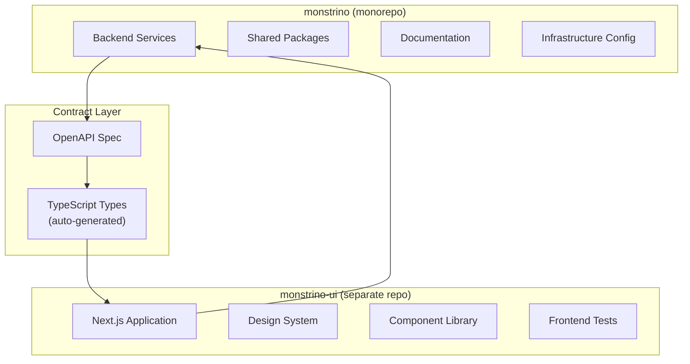

# ADR-FD-002 — Separate Frontend into Dedicated `monstrino-ui` Repository

| Field     | Value                                                       |
| --------- | ----------------------------------------------------------- |
| **Status**  | Proposed                                                    |
| **Date**    | 2025-11-01                                                  |
| **Author**  | @monstrino-team                                             |
| **Tags**    | `#frontend` `#repository` `#team-structure`                |

:::caution Status: Proposed
This ADR is currently **Proposed**, not yet Accepted. The separation should only be formalized when team structure and workflow justify dedicated frontend ownership. Premature separation adds coordination overhead without clear benefit.
:::

## Context

Monstrino's frontend (`monstrino-ui`) currently lives as a top-level directory within the monorepo. As the frontend becomes more substantial (Next.js migration, design system, component library), questions arise about repository topology:

- **Development workflow** — frontend and backend changes have different review cadences and CI needs.
- **Team boundaries** — if a dedicated frontend developer joins, they need a focused workspace.
- **CI/CD independence** — frontend builds (Node.js, webpack/turbopack) are fundamentally different from backend builds (Python, Docker).
- **Issue tracking** — frontend-specific issues may get lost in a backend-heavy issue tracker.

However, separation also introduces coordination costs that are justified only when team size warrants it.

## Options Considered

### Option 1: Keep in Monorepo

Frontend remains a directory within the main Monstrino repository.

- **Pros:** Single repo for everything, atomic cross-stack changes, simple versioning, no coordination overhead.
- **Cons:** Mixed CI pipelines, frontend changes trigger backend CI (without path filtering), shared issue tracker noise, different toolchains in one repo.

### Option 2: Separate Repository ✅ (When Ready)

Frontend lives in its own `monstrino-ui` repository with independent CI/CD, issues, and workflow.

- **Pros:** Focused workspace, independent CI, clear ownership boundary, tailored tooling, easier onboarding for frontend developers.
- **Cons:** Cross-repository coordination for API changes, separate version management, branch synchronization for full-stack features.

### Option 3: Git Subtree / Submodule

Frontend directory is a separate repo included in the monorepo via subtree or submodule.

- **Pros:** Appears integrated locally, separate remote for independent work.
- **Cons:** Subtree/submodule complexity, confusing git history, merge conflict potential, poor developer experience.

## Decision

> The frontend **should be separated into its own repository** (`monstrino-ui`) when the following conditions are met:

### Separation Triggers

| Trigger                                    | Status           |
| ------------------------------------------ | ---------------- |
| Dedicated frontend developer/contributor   | Not yet          |
| Next.js migration complete                 | In progress      |
| Frontend CI/CD pipeline established        | Not yet          |
| API contract stability (OpenAPI spec)      | Partially done   |

Until these conditions are met, the frontend remains in the monorepo.

### Separation Architecture (Future)



### Coordination Mechanisms

| Mechanism                      | Purpose                                                |
| ------------------------------ | ------------------------------------------------------ |
| **OpenAPI specification**      | Contract between backend API and frontend              |
| **Auto-generated TypeScript types** | Frontend types generated from OpenAPI spec        |
| **Shared design tokens**       | Colors, spacing, typography as a versioned package     |
| **Cross-repo CI triggers**     | Backend API changes trigger frontend compatibility tests|

### Repository Structure (When Separated)

```
monstrino-ui/
├── src/
│   ├── app/                # Next.js App Router pages
│   ├── components/         # React components
│   ├── lib/                # Utilities, API client
│   ├── styles/             # Global styles, design tokens
│   └── types/              # Auto-generated API types
├── public/                 # Static assets
├── tests/                  # Frontend tests
├── next.config.ts
├── package.json
└── tsconfig.json
```

## Consequences

### Positive (When Separated)

- **Ownership clarity** — frontend ownership is unambiguous with a dedicated repository.
- **Focused CI** — frontend builds run only on frontend changes, faster feedback.
- **Tailored workflow** — frontend-specific linting, testing, and deployment pipelines.
- **Onboarding** — frontend developers interact with a focused, relevant codebase.

### Negative (When Separated)

- **Coordination cost** — API changes require synchronization across repositories.
- **Version management** — frontend and backend versions must be tracked and compatibility ensured.
- **Full-stack features** — changes spanning frontend and backend require coordinating PRs in two repos.
- **Shared configuration** — environment variables, deployment configs may need duplication or shared tooling.

### Risks

- Premature separation creates overhead without benefit — don't separate until triggers are met.
- API contract drift: auto-generated types from OpenAPI spec help, but testing against the real API is essential.
- Repository proliferation: resist creating more repos unless clear organizational or technical benefits exist.

## Related Decisions

- [ADR-FD-001](./adr-fd-001.md) — Next.js migration (the application that would live in the separate repo)
- [ADR-A-007](../architecture/adr-a-007.md) — API boundary pattern (contract layer that enables safe separation)
- [ADR-A-003](../architecture/adr-a-003.md) — Shared packages (model for cross-boundary code sharing)
