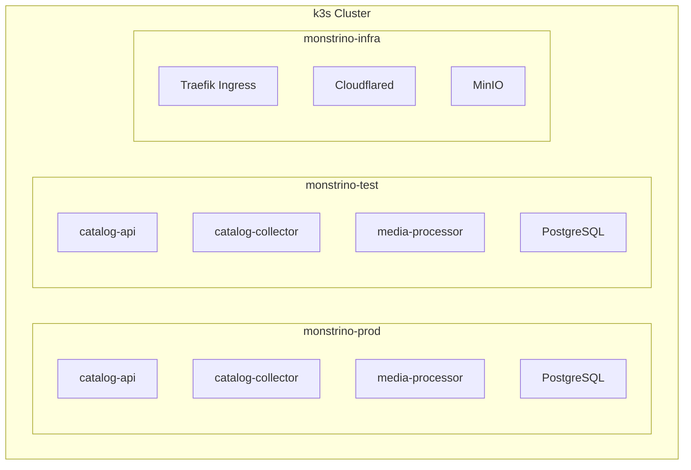

# ADR-IP-001 — Deploy on Single-Node k3s with Environment Separation by Namespaces

| Field     | Value                                                       |
| --------- | ----------------------------------------------------------- |
| **Status**  | Accepted                                                    |
| **Date**    | 2025-06-01                                                  |
| **Author**  | @monstrino-team                                             |
| **Tags**    | `#infra` `#kubernetes` `#k3s` `#homelab`                   |

## Context

Monstrino is self-hosted in a homelab environment with a single dedicated server. The project requires:

- **Container orchestration** — multiple services need coordinated deployment, health checking, and restart policies.
- **Environment separation** — production and test environments must coexist without interference.
- **Declarative infrastructure** — deployments should be reproducible from manifest files.
- **Reasonable complexity** — the infrastructure must be maintainable by a single developer.

The hosting constraint is one physical server — multi-node clusters are not justified at current scale.

## Options Considered

### Option 1: Docker Compose

Run all services using `docker-compose` with separate compose files per environment.

- **Pros:** Simple, familiar, minimal setup, good for development.
- **Cons:** No native health-based restarts, limited networking features, no declarative rollbacks, manual service discovery, environment separation requires careful port management.

### Option 2: Full Kubernetes (kubeadm / managed)

Deploy a standard Kubernetes cluster.

- **Pros:** Full Kubernetes API, ecosystem compatibility, production-grade features.
- **Cons:** Significant resource overhead for a single node, complex setup (etcd, control plane), overkill for current scale.

### Option 3: k3s — Lightweight Kubernetes ✅

Deploy k3s, a CNCF-certified lightweight Kubernetes distribution designed for edge and single-node deployments.

- **Pros:** Full Kubernetes API with minimal overhead (~512MB RAM), single-binary install, built-in Traefik ingress, SQLite backend (no etcd required), CNCF certified.
- **Cons:** Some advanced Kubernetes features may behave differently, single-node means no HA.

### Option 4: Nomad (HashiCorp)

Use Nomad for container orchestration.

- **Pros:** Simpler than Kubernetes, good for small deployments.
- **Cons:** Smaller ecosystem, less community support, tooling built around Kubernetes won't work.

## Decision

> Monstrino runs on a **single-node k3s cluster** in the homelab, with test and production environments separated by **Kubernetes namespaces**.

### Namespace Strategy

### Namespace Design

| Namespace           | Purpose                                    | Resources                              |
| ------------------- | ------------------------------------------ | -------------------------------------- |
| `monstrino-prod`    | Production workloads                       | Full replicas, production DB           |
| `monstrino-test`    | Test/staging environment                   | Reduced replicas, test DB              |
| `monstrino-infra`   | Shared infrastructure                      | Ingress, tunnels, storage              |

### Configuration Management

- **Kubernetes manifests** stored in `monstrino-configurations/kubernetes/`.
- **ConfigMaps** for environment-specific settings.
- **Secrets** for credentials (managed via sealed-secrets or external secret operator).
- **Resource limits** applied per namespace to prevent test workloads from starving production.

## Consequences

### Positive

- **Full Kubernetes API** — standard tooling (`kubectl`, Helm, Kustomize) works without modification.
- **Environment isolation** — namespaces provide logical separation with network policies.
- **Declarative deployments** — all infrastructure is version-controlled as YAML manifests.
- **Low overhead** — k3s uses ~512MB RAM for the control plane vs. ~2GB for full Kubernetes.
- **Migration path** — if scaling beyond one node, k3s supports multi-node clusters.

### Negative

- **Single point of failure** — one server means no high availability (acceptable for current stage).
- **Resource contention** — test and production share physical resources (mitigated by resource limits).
- **Operational burden** — Kubernetes still requires learning and maintenance, even in lightweight form.

### Risks

- Server failure takes down both environments — implement regular backups of database and configuration.
- k3s automatic updates could introduce breaking changes — pin versions in production.
- Resource exhaustion from growing service count — monitor and plan hardware upgrades proactively.

## Related Decisions

- [ADR-IP-002](./adr-ip-002.md) — Cloudflared for external access (ingress strategy on this cluster)
- [ADR-IP-003](./adr-ip-003.md) — S3-compatible storage (storage backend on this cluster)
