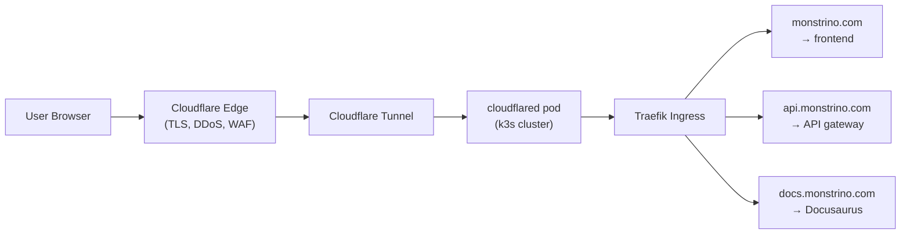

# ADR-IP-002 — Publish Homelab Services through Cloudflared

| Field     | Value                                                       |
| --------- | ----------------------------------------------------------- |
| **Status**  | Accepted                                                    |
| **Date**    | 2025-06-05                                                  |
| **Author**  | @monstrino-team                                             |
| **Tags**    | `#infra` `#networking` `#cloudflare` `#security`           |

## Context

Monstrino is hosted in a homelab behind a residential ISP connection. Making services publicly accessible requires solving several challenges:

- **Dynamic IP** — residential ISP may change the public IP without notice.
- **Port forwarding risks** — exposing ports directly to the internet creates attack surface.
- **TLS management** — self-managed certificates require renewal and configuration.
- **DDoS exposure** — direct exposure to the internet without any protection layer.
- **Domain routing** — multiple services need to be accessible under different subdomains.

:::warning Security Consideration
Directly exposing homelab services to the internet without any protection layer is a significant security risk. A single vulnerability in any exposed service could compromise the entire homelab network.
:::

## Options Considered

### Option 1: Direct Port Forwarding + Dynamic DNS

Open ports on the router, use a dynamic DNS service to track the changing IP.

- **Pros:** No third-party dependency, full control.
- **Cons:** Open ports on home network, manual TLS, no DDoS protection, dynamic DNS propagation delays, ISP may block common ports.

### Option 2: VPN-Based Access (WireGuard / Tailscale)

Expose services through a VPN mesh, only accessible to authenticated clients.

- **Pros:** Strong security, no public exposure, encrypted tunnels.
- **Cons:** Not suitable for public-facing web content, requires VPN client installation, user friction.

### Option 3: Reverse Proxy on VPS

Run a small VPS (cloud) as a reverse proxy that tunnels traffic to homelab via SSH or WireGuard.

- **Pros:** Stable public IP, custom configuration flexibility.
- **Cons:** VPS cost, maintenance of two environments, additional infrastructure to manage.

### Option 4: Cloudflare Tunnels (Cloudflared) ✅

Run the `cloudflared` daemon in the cluster, which creates outbound-only tunnels to Cloudflare's edge network. Public traffic reaches Cloudflare, which routes it through the tunnel to the homelab.

- **Pros:** No open ports, automatic TLS, DDoS protection, stable domain routing, free tier covers needs, outbound-only connections.
- **Cons:** Cloudflare dependency (vendor lock-in for edge), traffic inspectable by Cloudflare, some features require paid plans.

## Decision

> Public access to Monstrino environments must be exposed through **Cloudflare Tunnels** (`cloudflared`). No ports are opened on the homelab network.

### Architecture

### Tunnel Configuration

| Subdomain              | Target Service                | Environment |
| ---------------------- | ----------------------------- | ----------- |
| `monstrino.com`        | Frontend (Next.js)            | Production  |
| `api.monstrino.com`    | API Gateway                   | Production  |
| `docs.monstrino.com`   | Docusaurus                    | Production  |
| `testing.monstrino.com`| Frontend (Next.js)            | Test        |

### Deployment

- `cloudflared` runs as a Kubernetes Deployment in the `monstrino-infra` namespace.
- Tunnel credentials are stored as Kubernetes Secrets.
- Configuration is managed via ConfigMap, referencing Cloudflare tunnel ID and ingress rules.

## Consequences

### Positive

- **Zero open ports** — homelab has no inbound port exposure; all connections are outbound.
- **Automatic TLS** — Cloudflare handles certificate management at the edge.
- **DDoS protection** — Cloudflare's network absorbs volumetric attacks.
- **Stable routing** — domain routing works regardless of ISP IP changes.
- **Free tier** — current needs are covered by Cloudflare's free plan.

### Negative

- **Vendor dependency** — routing depends on Cloudflare's infrastructure and policies.
- **Traffic visibility** — Cloudflare can inspect unencrypted traffic between their edge and the tunnel endpoint.
- **Feature limitations** — some advanced features (e.g., custom page rules, advanced WAF) require paid plans.
- **Debugging complexity** — connection issues require checking both Cloudflare dashboard and local tunnel status.

### Risks

- Cloudflare policy changes could affect service (mitigate by keeping the VPS reverse proxy option as a documented fallback).
- Tunnel disconnections require automatic reconnection — `cloudflared` handles this natively but should be monitored.
- Cloudflare's terms of service regarding content types should be reviewed periodically.

## Related Decisions

- [ADR-IP-001](./adr-ip-001.md) — k3s deployment (cluster where cloudflared runs)
- [ADR-FD-001](../frontend-delivery/adr-fd-001.md) — Next.js frontend (public service exposed through tunnel)
