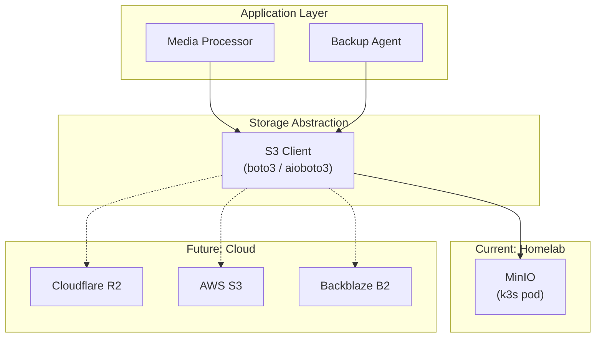

# ADR-IP-003 — Use S3-Compatible Object Storage across Environments

| Field     | Value                                                       |
| --------- | ----------------------------------------------------------- |
| **Status**  | Accepted                                                    |
| **Date**    | 2025-07-25                                                  |
| **Author**  | @monstrino-team                                             |
| **Tags**    | `#infra` `#storage` `#s3` `#minio` `#portability`         |

## Context

Monstrino's media pipeline requires object storage for:

- Rehosted product images (originals + responsive variants).
- Exported JSON backups of parsed data.
- Potential future asset types (PDFs, documents, user uploads).

The storage backend must work in the current homelab environment and be replaceable with a production-grade service in the future without application code changes.

## Options Considered

### Option 1: Local Filesystem Storage

Store files directly on the server's filesystem.

- **Pros:** Zero setup, fastest I/O, no additional service.
- **Cons:** Not accessible from other nodes, no built-in redundancy, no standard API, tightly coupled to host, no lifecycle policies.

### Option 2: PostgreSQL Large Objects / BYTEA

Store binary data directly in PostgreSQL.

- **Pros:** Single database for everything, transactional consistency.
- **Cons:** Database bloat, backup size explosion, poor streaming performance, not designed for large binary objects.

### Option 3: S3-Compatible Object Storage ✅

Use an S3-compatible API (MinIO for homelab, with portability to AWS S3, Cloudflare R2, Backblaze B2, etc.).

- **Pros:** Industry-standard API, rich ecosystem, drop-in provider swapping, built-in lifecycle policies, pre-signed URLs, versioning support.
- **Cons:** Additional service to deploy and maintain (MinIO), network overhead for local access.

### Option 4: Cloudflare R2 (Direct)

Use Cloudflare R2 as the primary storage from the start.

- **Pros:** S3-compatible, no egress fees, good CDN integration.
- **Cons:** Cloud dependency from day one, latency for development, monthly cost, less control for local testing.

## Decision

> Monstrino standardizes on **S3-compatible object storage interfaces**, using **MinIO** in the homelab/dev environment and preserving the option to switch to managed S3-compatible providers in production.

### Current and Future Architecture



### Configuration Approach

All storage interaction uses the `boto3` S3 client configured via environment variables:

```python
# Environment-based configuration — no code changes between providers
S3_ENDPOINT_URL=http://minio.monstrino-infra:9000  # MinIO (dev/homelab)
# S3_ENDPOINT_URL=https://s3.amazonaws.com          # AWS S3 (future)
# S3_ENDPOINT_URL=https://<id>.r2.cloudflarestorage.com  # R2 (future)
S3_ACCESS_KEY=...
S3_SECRET_KEY=...
S3_BUCKET_NAME=monstrino-media
```

### Bucket Organization

| Bucket               | Purpose                          | Lifecycle                    |
| -------------------- | -------------------------------- | ---------------------------- |
| `monstrino-media`    | Product images, variants         | Permanent                    |
| `monstrino-backups`  | JSON exports, database dumps     | 90-day retention             |
| `monstrino-temp`     | Processing intermediates         | 7-day auto-delete            |

## Consequences

### Positive

- **Provider portability** — switching from MinIO to R2 or S3 requires only configuration changes.
- **Standard tooling** — all S3 CLI tools, SDKs, and integrations work out of the box.
- **Feature-rich** — lifecycle policies, versioning, pre-signed URLs, multipart uploads available from day one.
- **Local development** — MinIO provides full S3 API locally, no cloud costs during development.

### Negative

- **MinIO maintenance** — additional pod in the cluster with persistent volume management.
- **Network overhead** — API calls introduce latency compared to direct filesystem access.
- **Storage limits** — homelab disk space constrains total storage capacity.

### Risks

- MinIO persistent volume backup must be included in the disaster recovery plan.
- S3 API surface differences between providers can cause subtle bugs — test against the target provider before migration.
- Ensure credentials are rotated and stored securely (Kubernetes Secrets, not ConfigMaps).

## Related Decisions

- [ADR-MP-002](../media-pipeline/adr-mp-002.md) — Image rehosting (primary consumer of object storage)
- [ADR-IP-001](./adr-ip-001.md) — k3s deployment (MinIO runs as a pod in the cluster)
