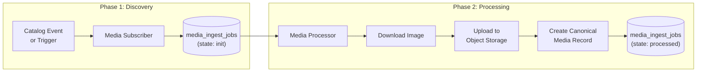

# ADR-MP-001 — Process External Media through Staged Ingestion Jobs

| Field     | Value                                                       |
| --------- | ----------------------------------------------------------- |
| **Status**  | Accepted                                                    |
| **Date**    | 2025-09-01                                                  |
| **Author**  | @monstrino-team                                             |
| **Tags**    | `#media-pipeline` `#ingestion` `#jobs` `#two-phase`        |

## Context

Media acquisition (downloading images from external sources, storing them, and registering canonical asset records) is fundamentally different from metadata collection:

- **Heavyweight** — downloading and storing images involves network I/O, disk I/O, and potentially image transformation.
- **Failure-prone** — external image URLs may timeout, return 404, or be rate-limited.
- **Resource-intensive** — concurrent image downloads can saturate network bandwidth and storage IOPS.
- **Decoupled timing** — images can be processed asynchronously after catalog metadata is already available.

Combining media download with metadata collection in a single operation creates a **fragile monolithic pipeline** where an image download failure can block or roll back metadata ingestion.

## Options Considered

### Option 1: Inline Media Download During Collection

Collectors download and store images as part of the metadata collection step.

- **Pros:** Simple, single-pass pipeline.
- **Cons:** Slow collection, image failures block metadata, no retry isolation, collector becomes I/O-bound.

### Option 2: Background Queue for Downloads

Push image URLs to a message queue, process asynchronously.

- **Pros:** Decoupled, async.
- **Cons:** No inspectable state, harder to track individual asset progress, retry logic lives in queue consumer.

### Option 3: Staged Ingestion Jobs ✅

A two-phase approach:
1. **Discovery phase** — create a `media_ingest_job` record for each media asset to be processed.
2. **Processing phase** — a dedicated processor picks up jobs, downloads assets, stores them, and creates canonical media records.

- **Pros:** Full visibility, independent retry, state tracking, resource isolation, clear separation of concerns.
- **Cons:** Additional database records, two-step pipeline for media.

## Decision

> Media acquisition must follow a **two-phase workflow**: first create a `media_ingest_job` record (discovery), then a dedicated processor downloads, persists, and registers canonical media assets.



### Job Lifecycle

| State          | Description                                              |
| -------------- | -------------------------------------------------------- |
| `init`         | Job created, awaiting processing                         |
| `processing`   | Processor has picked up the job                          |
| `processed`    | Image downloaded, stored, and canonical record created   |
| `error`        | Processing failed — includes error details for diagnosis |
| `skipped`      | Permanently excluded (e.g., invalid URL, duplicate)      |

### Job Record Schema

```sql
CREATE TABLE ingest.media_ingest_jobs (
    id               UUID PRIMARY KEY DEFAULT gen_random_uuid(),
    source           VARCHAR(50) NOT NULL,
    external_id      VARCHAR(255) NOT NULL,
    source_url       TEXT NOT NULL,
    media_type       VARCHAR(20) DEFAULT 'image',
    processing_state VARCHAR(20) DEFAULT 'init',
    error_message    TEXT,
    canonical_id     UUID REFERENCES media.images(id),
    attempts         INT DEFAULT 0,
    max_attempts     INT DEFAULT 3,
    created_at       TIMESTAMPTZ DEFAULT now(),
    processed_at     TIMESTAMPTZ,
    UNIQUE (source, external_id)
);
```

## Consequences

### Positive

- **Fault isolation** — image download failures don't affect metadata ingestion.
- **Retry control** — individual jobs can be retried without reprocessing the entire batch.
- **Visibility** — a SQL query shows all pending, failed, and completed media jobs.
- **Resource management** — processor concurrency can be tuned independently.
- **Progress tracking** — completion percentage is trivially calculable.

### Negative

- **Additional records** — each image creates a job record alongside the eventual media record.
- **Two-step latency** — images aren't immediately available after catalog collection.
- **Job table maintenance** — completed/old jobs need periodic cleanup or archival.

### Risks

- Job table growth: implement retention policies (archive processed jobs older than N days).
- Orphaned jobs: if the discovery phase creates jobs but the processor is down, jobs accumulate — monitor queue depth.

## Related Decisions

- [ADR-MP-002](./adr-mp-002.md) — Rehost images into owned storage (defines where processed images go)
- [ADR-MP-003](./adr-mp-003.md) — Subscriber/processor split (architecture of the two phases)
- [ADR-A-002](../architecture/adr-a-002.md) — Processing state workflow (job states follow the same pattern)
