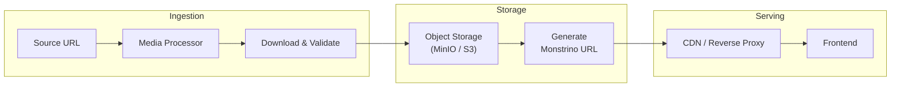

# ADR-MP-002 — Rehost External Images into Owned Object Storage

| Field     | Value                                                       |
| --------- | ----------------------------------------------------------- |
| **Status**  | Accepted                                                    |
| **Date**    | 2025-09-05                                                  |
| **Author**  | @monstrino-team                                             |
| **Tags**    | `#media-pipeline` `#images` `#storage` `#reliability`      |

## Context

Monstrino's catalog pages display product images sourced from external platforms (Shopify CDNs, manufacturer sites, retailer galleries). Serving these images directly from third-party URLs creates several problems:

- **Availability risk** — external URLs can change, expire, or be taken down without notice.
- **Performance dependency** — page load times depend on third-party CDN performance.
- **Hotlinking restrictions** — some sources block cross-origin image requests or inject watermarks.
- **Legal/compliance exposure** — directly embedding third-party resources may conflict with terms of service.
- **No transformation control** — can't resize, optimize, or convert image formats for performance.

:::warning Observed Failures
During development, approximately 15% of scraped image URLs from older releases returned 404 within 6 months. Product images from discontinued lines are especially volatile.
:::

## Options Considered

### Option 1: Direct Hotlinking to Source URLs

Serve images directly from external CDN URLs.

- **Pros:** Zero storage cost, no download pipeline needed, always "fresh."
- **Cons:** Fragile, no control over availability, potential hotlinking blocks, performance dependency, no optimization.

### Option 2: Client-Side Proxy with Fallback

Proxy image requests through a Monstrino endpoint that fetches from source in real-time, with caching.

- **Pros:** Progressive approach, caches builds over time, no upfront download.
- **Cons:** First request is slow, cache invalidation complexity, still dependent on source availability for cold requests.

### Option 3: Full Rehosting into Owned Storage ✅

Download all external images proactively, store in Monstrino-controlled object storage, and reference only Monstrino-owned URLs in the product.

- **Pros:** Full availability control, optimization capability, no external dependency for serving, permanent preservation.
- **Cons:** Storage cost, download pipeline required, must handle source rate limiting.

## Decision

> Images from external sources must be **copied into Monstrino-managed object storage** and referenced through Monstrino-controlled URLs. External URLs are preserved as metadata but never used for serving.

### Storage Architecture



### Image Processing Pipeline

| Step                | Action                                                |
| ------------------- | ----------------------------------------------------- |
| **Download**        | Fetch original image from source URL                  |
| **Validate**        | Check dimensions, format, file size, integrity        |
| **Optimize**        | Convert to WebP, generate responsive sizes            |
| **Store**           | Upload to S3-compatible storage with structured keys  |
| **Register**        | Create canonical `media.images` record with Monstrino URL |
| **Link**            | Associate image with catalog entity via `image_attachments` |

### Storage Key Convention

```
media/images/{source}/{year}/{external_id}/{variant}.{format}
```

Example: `media/images/mattel-creations/2025/draculaura-skulltimate/original.webp`

### Responsive Image Variants

| Variant      | Max Width | Use Case                    |
| ------------ | --------- | --------------------------- |
| `original`   | As-is     | Full resolution, archival   |
| `large`      | 1200px    | Product detail page         |
| `medium`     | 600px     | Card / grid view            |
| `thumbnail`  | 200px     | Lists, search results       |

## Consequences

### Positive

- **Availability guarantee** — images are served from owned infrastructure, independent of source uptime.
- **Performance control** — optimized formats (WebP), responsive sizes, CDN caching.
- **Permanent archive** — historical product images preserved even after source removal.
- **Legal clarity** — images served from own domain, sourcing metadata tracked separately.

### Negative

- **Storage cost** — object storage capacity grows with catalog size (mitigated by compression and lifecycle policies).
- **Download pipeline** — requires building and maintaining the media processor.
- **Initial backfill** — existing catalog entries need a one-time image download pass.

### Risks

- Storage cost projection: estimate 500KB average per image × 4 variants × 2000 products ≈ 4GB. Manageable at current scale.
- Source rate limiting: implement polite download delays and retry backoff.
- Copyright considerations: document sourcing metadata and intended fair-use context.

## Related Decisions

- [ADR-MP-001](./adr-mp-001.md) — Staged ingestion jobs (the mechanism for downloading images)
- [ADR-MP-003](./adr-mp-003.md) — Subscriber/processor split (service architecture for rehosting)
- [ADR-IP-003](../infra-platform/adr-ip-003.md) — S3-compatible storage (infrastructure for image storage)
