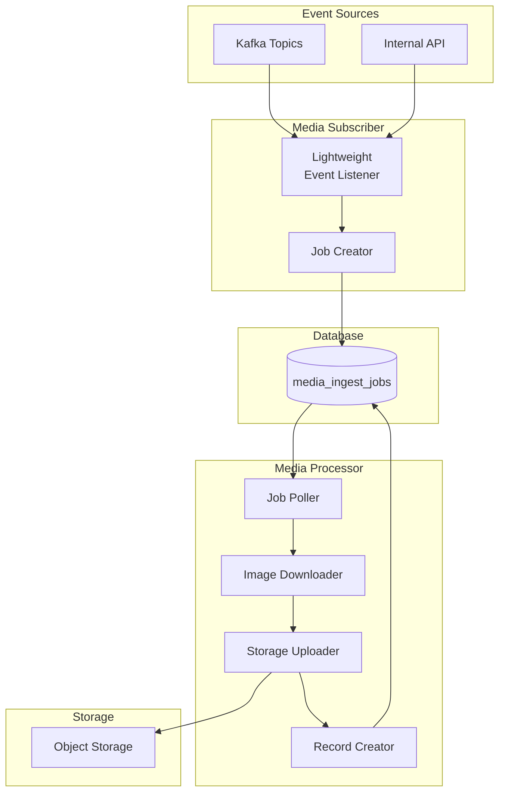

# ADR-MP-003 — Split Media Rehosting into Subscriber and Processor Services

| Field     | Value                                                              |
| --------- | ------------------------------------------------------------------ |
| **Status**  | Accepted                                                           |
| **Date**    | 2025-09-10                                                         |
| **Author**  | @monstrino-team                                                    |
| **Tags**    | `#media-pipeline` `#services` `#separation-of-concerns`           |

## Context

The initial media rehosting implementation was a single service that:

1. Listened for catalog events (new releases, updated images).
2. Created media ingest jobs.
3. Downloaded images from external sources.
4. Uploaded images to object storage.
5. Created canonical media records.

This monolithic approach combined **event handling** (lightweight, fast, always-on) with **heavy processing** (network I/O, image transformation, storage operations) in one service, creating operational problems:

- **Scaling mismatch** — event listening needs high availability but low resources; image processing needs high resources but can tolerate batch delays.
- **Failure blast radius** — a stuck image download could back up the event listener.
- **Deployment coupling** — changes to download logic required redeploying the event listener.
- **Resource contention** — concurrent image downloads competed with event processing for CPU and memory.

## Options Considered

### Option 1: Single Combined Service

Keep all media functionality in one service.

- **Pros:** Simple deployment, no inter-service communication for media flow.
- **Cons:** Scaling mismatch, failure coupling, resource contention, mixed responsibilities.

### Option 2: Thread/Process Pool within Single Service

Separate event handling and processing into different threads or processes within one deployment.

- **Pros:** Single deployment unit, shared memory.
- **Cons:** Complex concurrency management, shared fate on crashes, harder monitoring, doesn't solve deployment coupling.

### Option 3: Subscriber + Processor Split ✅

Two distinct services with clear responsibilities:
- **Media Subscriber** — listens for events, creates ingest jobs (lightweight).
- **Media Processor** — picks up jobs, downloads/stores/registers assets (heavyweight).

- **Pros:** Independent scaling, clear responsibilities, failure isolation, separate deployment lifecycle.
- **Cons:** Two services to deploy, inter-service coordination via database.

## Decision

> Media rehosting must be split into two services: a **media-subscriber** for event-driven job creation and a **media-processor** for heavy download/storage operations.

### Service Responsibilities

| Service              | Characteristics                              | Scaling Profile               |
| -------------------- | -------------------------------------------- | ----------------------------- |
| **media-subscriber** | Event-driven, lightweight, fast, always-on   | Low resource, high availability|
| **media-processor**  | Job-driven, heavyweight, batch-tolerant      | High resource, horizontal scale|

### Operational Characteristics

| Aspect         | Media Subscriber                  | Media Processor                     |
| -------------- | --------------------------------- | ----------------------------------- |
| **Trigger**    | Kafka events, API calls           | Database polling (jobs in `init`)   |
| **Latency**    | Sub-second acknowledgment         | Minutes per batch                   |
| **Failure**    | Job creation retried              | Individual job retried (3 attempts) |
| **Scaling**    | 1 replica sufficient              | Scale by adding replicas            |
| **Deploy**     | Simple, stateless                 | Requires storage access credentials |

## Consequences

### Positive

- **Independent scaling** — processor can be scaled horizontally during bulk backfills without affecting subscriber.
- **Failure isolation** — a stuck download doesn't prevent new job creation.
- **Deploy independence** — subscriber and processor can be updated separately.
- **Clear monitoring** — each service has focused, domain-specific metrics.
- **Batch optimization** — processor can be tuned for throughput (concurrent downloads, batch commits).

### Negative

- **Two deployments** — additional Kubernetes manifests, health checks, and monitoring.
- **Database as coordination layer** — inter-service communication happens through `media_ingest_jobs` table.
- **Potential job lag** — if processor is slow or down, jobs accumulate (but this is visible and manageable).

### Risks

- Job queue depth monitoring is essential — alert when pending jobs exceed a threshold.
- Processor concurrency must be tuned to avoid overwhelming external sources or object storage.
- Consider circuit breakers for repeated failures from the same source.

## Related Decisions

- [ADR-MP-001](./adr-mp-001.md) — Staged ingestion jobs (defines the job model that connects these services)
- [ADR-MP-002](./adr-mp-002.md) — Image rehosting strategy (defines what the processor does)
- [ADR-A-002](../architecture/adr-a-002.md) — Processing state workflow (jobs follow the same state model)
