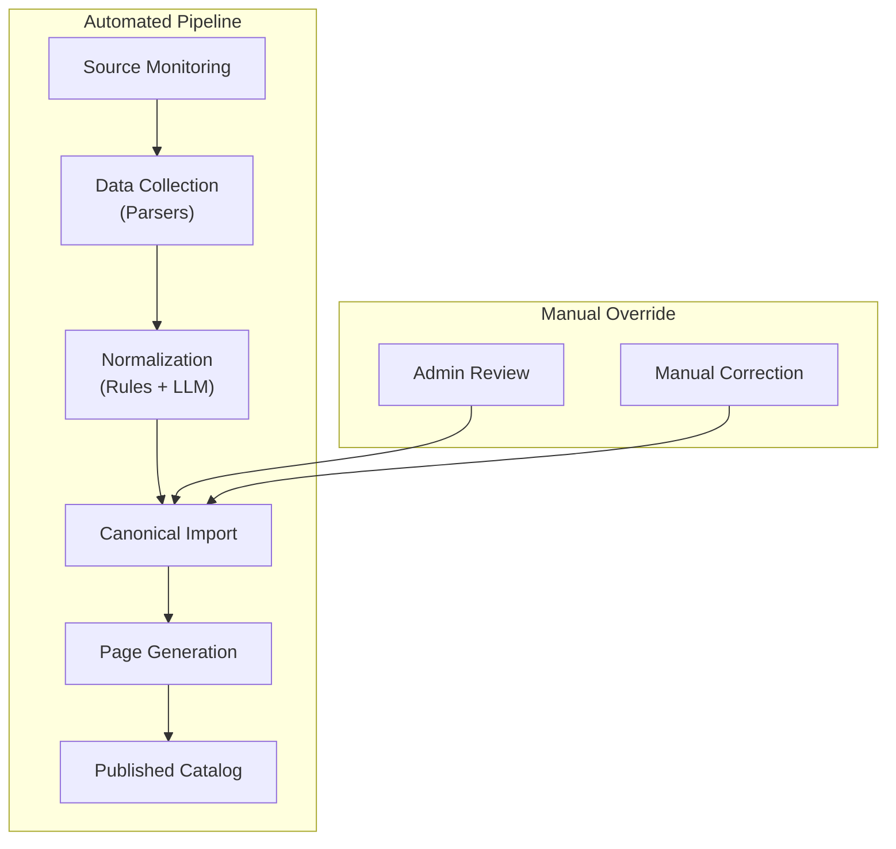

# ADR-PS-003 — Make Automated Data Acquisition the Core Product Capability

| Field     | Value                                                          |
| --------- | -------------------------------------------------------------- |
| **Status**  | Accepted                                                       |
| **Date**    | 2025-05-20                                                     |
| **Author**  | @monstrino-team                                                |
| **Tags**    | `#product-strategy` `#automation` `#competitive-advantage`    |

## Context

Existing collectible catalog sites in the Monster High space rely heavily on **manual editorial processes**:

- Volunteer editors research, verify, and manually enter release information.
- Image uploads require human curation from multiple sources.
- New releases are documented days or weeks after announcement.
- Historical data is incomplete due to limited volunteer capacity.

This creates a structural opportunity: a platform that **automates data collection, normalization, and page generation** can achieve broader coverage, faster updates, and more consistent quality than manually-maintained alternatives — with lower ongoing operational cost.

:::info Competitive Moat
Manual editorial processes create a **labor-cost ceiling**. The more releases exist, the more editors are needed. Automation inverts this: fixed infrastructure cost handles growing data volumes without proportional labor increase.
:::

## Options Considered

### Option 1: Manual-First with Automation Later

Start with a traditional editorial workflow, add automation incrementally.

- **Pros:** Lower initial technical investment, editorial quality control.
- **Cons:** Scales poorly, high ongoing labor cost, slow coverage growth, doesn't differentiate.

### Option 2: Community-Sourced Data (Wiki Model)

Build a wiki-style platform where the community contributes data.

- **Pros:** Distributed workload, community engagement, diverse knowledge.
- **Cons:** Quality inconsistency, vandalism risk, editorial conflicts, bootstrapping problem (empty wiki has no contributors).

### Option 3: Automation-First with Manual Override ✅

Build automated collection, normalization, and page generation as the primary data pipeline. Human review and manual corrections are available as an override layer, not the primary input.

- **Pros:** Scalable, fast updates, consistent quality, low operational cost, strong differentiator.
- **Cons:** Higher upfront engineering investment, requires robust parser infrastructure, may need LLM assistance for complex normalization.

## Decision

> Monstrino must be built around **automatic data collection, normalization, and page generation** as its primary operational model. Manual editorial entry is available as a correction mechanism, not the primary data source.

### Automation Stack

### Coverage Model

| Process          | Automation Role                         | Human Role                        |
| ---------------- | --------------------------------------- | --------------------------------- |
| **Discovery**    | Monitor sources for new releases        | Report missed releases            |
| **Collection**   | Parse product pages automatically       | Add data from non-parseable sources |
| **Normalization**| Rule-based + LLM classification         | Verify uncertain classifications  |
| **Image acquisition** | Automated download and rehosting  | Manual upload for rare cases      |
| **Quality control** | Automated validation rules           | Review flagged records            |

### Automation Targets

| Metric                  | Manual Baseline | Automation Target |
| ----------------------- | --------------- | ----------------- |
| New release detection   | Days-weeks      | < 24 hours        |
| Data entry per release  | 15-30 min       | < 1 min (automated) |
| Image acquisition       | Manual download | Fully automated   |
| Coverage over time      | Plateaus        | Grows with sources |

## Consequences

### Positive

- **Scalability** — automation handles growing catalog without proportional labor increase.
- **Speed** — new releases appear in the catalog within hours, not days.
- **Consistency** — normalized data follows the same rules across all releases.
- **Differentiator** — competitors can't match speed and coverage with manual processes.
- **Compound value** — each new parser/source integration permanently increases coverage.

### Negative

- **Engineering investment** — significant upfront development of parsers, normalizers, and pipeline.
- **Source dependency** — automation quality depends on source data availability and structure.
- **Edge cases** — some releases require manual intervention that automation can't handle.

### Risks

- Source changes (site redesigns, API deprecation) can break parsers — monitor and alert on parser failures.
- Over-automation: don't sacrifice accuracy for speed — uncertain results should be flagged for review.
- Legal considerations: ensure automated collection complies with source terms of service and robots.txt.

## Related Decisions

- [ADR-PS-001](./adr-ps-001.md) — Monster High focus (domain where automation provides the most value)
- [ADR-A-001](../architecture/adr-a-001.md) — Parsed tables boundary (core of the automation architecture)
- [ADR-DI-005](../data-ingestion/adr-di-005.md) — Centralized parsers (implementation of automated collection)
- [ADR-DI-006](../data-ingestion/adr-di-006.md) — LLM normalization (handling edge cases in automation)
