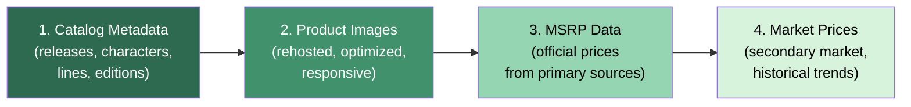

# ADR-PS-005 — Prioritize Catalog Completeness and Image Pipeline above Price Collection for MVP

| Field     | Value                                                       |
| --------- | ----------------------------------------------------------- |
| **Status**  | Accepted                                                    |
| **Date**    | 2025-09-15                                                  |
| **Author**  | @monstrino-team                                             |
| **Tags**    | `#product-strategy` `#mvp` `#priorities` `#content`        |

## Context

Monstrino's MVP must deliver a meaningful product within limited resources. Three major content dimensions compete for engineering effort:

1. **Catalog metadata** — release names, characters, doll lines, descriptions, classifications.
2. **Product images** — high-quality, rehosted images for every release.
3. **Price data** — MSRP at launch, current retail prices, secondary market values.

All three are valuable, but building all three simultaneously would delay the MVP. A prioritization decision is needed.

### Value Assessment

| Dimension          | User Value          | Engineering Cost    | Data Availability  | Urgency        |
| ------------------ | ------------------- | ------------------- | ------------------ | -------------- |
| **Catalog metadata** | Critical — core ID| Medium              | Good (sources)     | Highest        |
| **Product images** | High — visual appeal| High (pipeline)     | Good (sources)     | High           |
| **Price data**     | Medium — reference  | High (many sources) | Fragmented         | Lower          |

## Options Considered

### Option 1: Catalog + Prices First, Images Later

Focus on textual catalog data and pricing, defer media pipeline.

- **Pros:** Simpler pipeline (no media processing), price data adds practical value.
- **Cons:** Visually unappealing catalog pages, collectible catalogs without images feel incomplete, image URLs expire over time (data loss risk).

### Option 2: Catalog + Images First, Prices Later ✅

Focus on complete catalog metadata with high-quality rehosted images. Price collection is deferred.

- **Pros:** Visually rich product pages, image preservation prevents data loss, SEO benefits from image-rich pages, core catalog identity.
- **Cons:** No pricing reference in MVP, users must check prices elsewhere.

### Option 3: All Three Simultaneously

Build everything in parallel.

- **Pros:** Complete product.
- **Cons:** Scope too large, delays everything, quality compromised across all dimensions.

## Decision

> For the MVP, **image availability and canonical release pages** take precedence over broad pricing coverage. Price collection infrastructure is designed but implementation is deferred to post-MVP.

### Priority Order

### Rationale

- **Image URLs expire** — external image URLs have a known decay rate (~15% within 6 months). Deferring image rehosting means permanent data loss.
- **Visual identity** — a collectible catalog without images fails to convey the product's personality and appeal.
- **Price availability** — official MSRP data from Mattel sources remains available and queryable even if collection is delayed. The data won't disappear.
- **SEO impact** — image-rich pages rank significantly better in search engines, especially for product queries.

## Consequences

### Positive

- **Data preservation** — early image rehosting prevents permanent loss of visual assets.
- **Visual appeal** — release pages are immediately engaging with high-quality product images.
- **SEO advantage** — image-rich, content-complete pages perform well in search rankings.
- **Focused engineering** — media pipeline gets full attention rather than competing with price infrastructure.

### Negative

- **No price reference** — users must look up prices elsewhere until price collection is added.
- **Incomplete product feel** — some users may expect pricing on a catalog site.
- **Deferred pipeline** — price collection infrastructure still needs to be built post-MVP.

### Risks

- User expectation mismatch: communicate clearly that pricing is a planned future feature, not an omission.
- Image source availability: if sources restrict image access before rehosting is complete, data is lost — prioritize high-decay sources first.

## Related Decisions

- [ADR-PS-002](./adr-ps-002.md) — Archive-first MVP (this ADR specifies content priorities within the archive)
- [ADR-MP-001](../media-pipeline/adr-mp-001.md) — Staged media ingestion (mechanism for image acquisition)
- [ADR-MP-002](../media-pipeline/adr-mp-002.md) — Image rehosting (image preservation strategy)
- [ADR-PS-006](./adr-ps-006.md) — Mattel/Shopify as primary source (MSRP availability)
