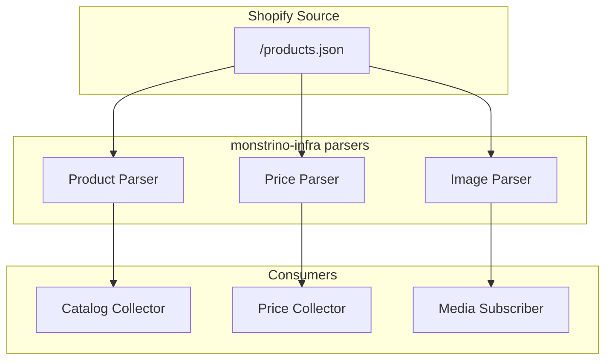

# ADR-PS-006 — Use Official Mattel / Shopify-Derived Sources as Primary MSRP Sources

| Field     | Value                                                        |
| --------- | ------------------------------------------------------------ |
| **Status**  | Accepted                                                     |
| **Date**    | 2025-09-20                                                   |
| **Author**  | @monstrino-team                                              |
| **Tags**    | `#product-strategy` `#data-sources` `#msrp` `#shopify`     |

## Context

When price collection is implemented (post-MVP), Monstrino needs reliable sources for official MSRP (Manufacturer's Suggested Retail Price) data. Several source categories exist:

- **Official Mattel properties** — Mattel Creations, regional Mattel stores, powered by Shopify.
- **Major retailers** — Amazon, Walmart, Target — carry Monster High but with variable pricing and availability.
- **Secondary market** — eBay, Mercari — reflect collector demand, not official MSRP.
- **Fan databases** — wikis, community spreadsheets — crowdsourced, often incomplete.

Mattel's own Shopify-powered stores provide the **highest quality structured product data** available:

- Full product JSON via Shopify's standard `/products.json` endpoint.
- Structured variants with prices, availability, and SKU codes.
- Official product descriptions, images, and tags.
- Consistent format across regional stores.

:::tip Data Quality Hierarchy
Official manufacturer sources provide the most authoritative pricing data. Retailer prices may include markups, discounts, or bundle pricing that doesn't reflect true MSRP.
:::

## Options Considered

### Option 1: Retailer-First Pricing (Amazon, Walmart)

Use major retailer listings as the primary price source.

- **Pros:** Broad coverage, actual purchase prices, availability information.
- **Cons:** Prices fluctuate (sales, markups), not true MSRP, multiple listings per product, data structure varies by retailer, API access restrictions.

### Option 2: Community-Sourced Pricing

Crowdsource pricing from community contributions.

- **Pros:** Broad coverage, community engagement.
- **Cons:** Quality inconsistent, verification burden, currency/region confusion, slow coverage.

### Option 3: Official Mattel / Shopify Sources ✅

Use Mattel's own Shopify-powered stores as the primary MSRP source, supplemented by major retailers for availability and regional pricing.

- **Pros:** Authoritative MSRP, structured Shopify API, consistent format, reliable product identification, includes official images and descriptions.
- **Cons:** Limited to products sold directly by Mattel, doesn't cover retailer exclusives sold only through third parties.

## Decision

> Official Mattel online properties, especially **Shopify-structured** sources, should be treated as the **primary source for official MSRP collection**. Retailer sources serve as secondary/supplemental data.

### Source Trust Hierarchy

| Tier | Source Type                    | Trust Level | Use Case                          |
| ---- | ------------------------------ | ----------- | --------------------------------- |
| 1    | Mattel Creations (Shopify)     | Highest     | Official MSRP, canonical product data |
| 2    | Regional Mattel stores         | High        | Regional pricing, availability    |
| 3    | Major retailers (Amazon, etc.) | Medium      | Street price, availability        |
| 4    | Secondary market (eBay)        | Reference   | Market value trends only          |
| 5    | Community contributions        | Low         | Gap-filling, verification         |

### Shopify Data Advantages

| Shopify Field              | Monstrino Use                                  |
| -------------------------- | ---------------------------------------------- |
| `product.handle`           | Primary `external_id` for deduplication        |
| `product.title`            | Release title (input for normalization)         |
| `product.body_html`        | Product description                             |
| `product.images`           | Official product images for rehosting           |
| `variant.price`            | Official MSRP                                   |
| `variant.sku`              | SKU code for cross-source matching              |
| `variant.available`        | Stock availability                              |
| `product.tags`             | Category hints for classification               |
| `product.published_at`     | Official publication date                       |

### Parser Architecture

## Consequences

### Positive

- **Authoritative data** — MSRP from the manufacturer is the most trustworthy price source.
- **Structured format** — Shopify's product JSON is well-documented, consistent, and parseable.
- **Multi-purpose** — single source provides catalog data, pricing, images, and product metadata.
- **Parser reuse** — one Shopify parser serves multiple collection workflows.

### Negative

- **Coverage gaps** — products not sold directly by Mattel (retailer exclusives) require alternative sources.
- **Regional fragmentation** — different Mattel stores may have different pricing and product availability.
- **Source dependency** — if Mattel changes their Shopify configuration or restricts access, the primary pipeline is affected.

### Risks

- Mattel may deprecate or restrict API access — monitor for changes and maintain fallback sources.
- Shopify rate limiting may constrain collection frequency — implement polite request patterns.
- Regional pricing differences require clear labeling (currency, region) to avoid user confusion.

## Related Decisions

- [ADR-DI-005](../data-ingestion/adr-di-005.md) — Centralized parsers in monstrino-infra (Shopify parsers live here)
- [ADR-DI-002](../data-ingestion/adr-di-002.md) — External references as identifiers (Shopify handle as external_id)
- [ADR-PS-005](./adr-ps-005.md) — Catalog and images over prices (prices deferred but architecture planned)
