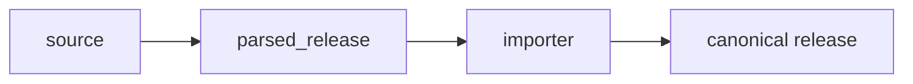
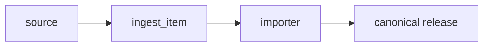
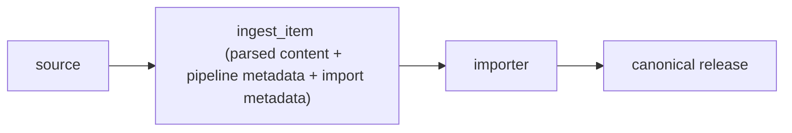

# ADR-DM-004 — Replace parsed_release with ingest_item as the ingest aggregate

| Field      | Value |
| ---------- | ------------------------------------------- |
| **Status** | Accepted                                    |
| **Date**   | 2026-03-11                                  |
| **Author** | @Aleks                                      |
| **Tags**   | `#domain-model` `#database` `#schemas`      |

## Context

The Monstrino ingest pipeline collects release information from multiple uncontrolled external sources and transforms it into a canonical domain model.

Historically the pipeline used a dedicated parsed layer. Parsed data extracted from external sources was stored in a table called `parsed_release`.

The original processing flow looked like this:

At the time this design made sense because multiple parsed entities existed:

- releases
- series
- characters
- pets

Each entity could exist independently inside the parsed layer before being reconciled into the canonical catalog.

However, the architecture of the ingest pipeline evolved.

The system now parses only **release** as the primary entity. Other entities such as series, characters, and pets are no longer collected independently from sources. Instead they are created automatically during the release import process.

Because of this change, the parsed layer no longer functions as a reusable model boundary. Downstream consumers almost always process the **entire release document**, not fragments of parsed entities.

As a result the `parsed_release` table gradually lost its architectural responsibility and effectively became a container holding a single release document before import.

Keeping this table separate introduces fragmentation:

- parsed content lives in `parsed_release`
- pipeline state lives elsewhere
- import decisions live elsewhere
- canonical mappings live elsewhere

This distributes the lifecycle of one ingest operation across multiple structures, increasing complexity for debugging, replay, and importer logic.

The system therefore requires a clearer architectural boundary for the ingest process.

---

## Options Considered

### Option 1: Keep `parsed_release`

Maintain the existing architecture where parsed content is stored separately from pipeline metadata.

- **Pro:** Preserves strict separation between parsed data and pipeline state.
- **Pro:** Minimal schema changes required.
- **Con:** Parsed release is no longer an independent domain artifact.
- **Con:** Pipeline state and parsed data remain fragmented across multiple entities.

---

### Option 2: Introduce a separate pipeline-state table

Keep `parsed_release` but introduce another table responsible for ingest workflow state.

- **Pro:** Maintains conceptual separation between parsed content and workflow state.
- **Pro:** Explicit pipeline-state tracking.
- **Con:** Requires multiple joins for importer and enrichment stages.
- **Con:** Makes debugging and replay more complex because a single ingest unit spans several tables.

---

### Option 3: Introduce `ingest_item` as the ingest aggregate ✅

Replace `parsed_release` with a unified record representing the entire lifecycle of one ingest operation.

More precisely:

Each `ingest_item` represents a single ingest unit:  
one release from one source passing through the entire ingest pipeline.

- **Pro:** One record represents one unit of ingestion.
- **Pro:** Pipeline state, parsed data, and import metadata live together.
- **Pro:** Simplifies importer, enrichment, replay, and debugging.
- **Con:** Parsed data is no longer stored as a standalone intermediate entity.

---

## Decision

We adopt **`ingest_item` as the primary ingest aggregate** because the parsed release no longer represents a meaningful architectural boundary.  
Storing parsed content together with pipeline state and import metadata creates a clearer transactional and semantic boundary for the ingest process.  
A single record now represents the full lifecycle of a release passing through the collector, enricher, and importer stages.

---

## Consequences

### Positive

- One record corresponds to one ingest processing unit.
- Fewer joins and simpler importer logic.
- Easier debugging and replay of ingest items.
- Pipeline state and parsed content are co-located.
- Clearer lifecycle tracking for each release ingestion.

### Negative

- Parsed data is no longer represented as a standalone reusable layer.
- The `ingest_item` schema becomes larger and must remain carefully structured.

### Risks

- `ingest_item` could become an unstructured “catch-all” table if field grouping is not enforced.  
  *Mitigation:* maintain clear logical field groups.
