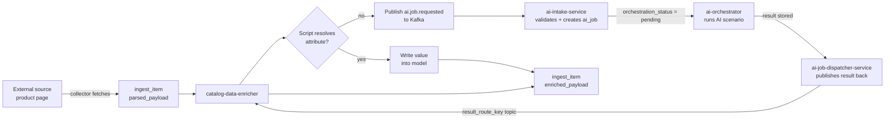

import Admonition from '@theme/Admonition';

# AI Features

Product pages on external stores are unstructured. A description might mention three
character names in free text, say "includes accessories" without listing them, or omit
pack type entirely. At thousands of releases, manual resolution is not viable.

Monstrino uses large language models to read those descriptions and convert them into
structured, queryable catalog data — automatically, at scale. AI handles interpretation
and enrichment only. Every other part of the platform runs on deterministic logic.

---

## The Problem

A typical product listing looks like this:

> *"This Walmart exclusive features Draculaura who is only available in this 3-pack.
> It also includes two previously released dolls, Clawdeen Wolf and Frankie Stein..."*

The catalog needs:

```json
{
  "characters": ["draculaura", "clawdeen-wolf", "frankie-stein"],
  "content_type": "doll",
  "exclusive_vendor": ["Walmart"]
}
```

Scripts handle deterministic cases — extracting a year from an MPN, normalizing a
region code from a URL. For semantic interpretation at scale, Monstrino uses AI.

---

## Three Design Principles

These are the architectural decisions that make AI safe to run in production.

### 1. Scripts first — AI is the last resort

Built-in scripts attempt every attribute before AI is ever invoked. AI is only
triggered when a script cannot resolve a value. This keeps AI usage bounded,
cost-efficient, and predictable.

### 2. Every result is validated before entering the catalog

AI never writes to the database directly. Results pass through the same validation
pipeline used for script-resolved values — structural correctness, consistency with
existing catalog data, and confidence thresholds. Malformed or inconsistent outputs
are rejected and flagged for administrator review. Nothing is written silently.

### 3. The platform is independent of AI availability

<Admonition type="info" title="Operational isolation">
If AI services are unavailable, ingestion, collection, import, media processing, and
public APIs continue unaffected. Enrichment pauses — no other pipeline depends on AI
availability.
</Admonition>

---

## How It Works



`catalog-data-enricher` and `ai-orchestrator` never call each other directly. The
enricher publishes a Kafka message and later consumes the result. Three dedicated AI
services handle the rest — each owning one phase of the lifecycle, with no knowledge
of the phases before or after it.

---

## Three Services, One Pipeline

| Service | What it does |
| --- | --- |
| `ai-intake-service` | Consumes `ai.job.requested` from Kafka, validates the request, deduplicates on `event_id`, creates internal `ai_job` and modality rows |
| `ai-orchestrator` | Claims pending jobs via `orchestration_status`, runs named AI scenarios, manages multi-step reasoning loops, stores normalized results |
| `ai-job-dispatcher-service` | Picks up completed jobs, promotes image assets to permanent storage, publishes results back to the requesting domain via `result_route_key` |

---

## What AI Enriches

| Attribute | What AI does |
| --- | --- |
| `characters` | Identifies character names from description, looks up canonical slugs |
| `pets` | Detects pet references in description |
| `series` | Classifies release into a catalog series |
| `content_type` | Classifies type — doll, playset, vehicle, etc. |
| `tier_type` | Identifies release tier |
| Images *(in progress)* | Detects visible items and accessories from product photos |

---

## Controlled by Design

The AI layer is bounded by explicit contracts at every step:

- **Input** — the enricher controls what context is sent and in which format; external services never write AI-domain tables directly
- **Execution** — named scenarios define which model, which actions, and which external lookups are allowed; a hard limit of 4 action calls per job prevents runaway loops
- **Output** — model responses are validated against scenario-specific schemas before any value is accepted; invalid responses are terminal failures, not retries
- **Retries** — transient failures (model errors, timeouts) retry automatically with backoff; structural failures do not retry regardless of remaining attempts
- **Audit** — every model call, action lookup, status transition, and dispatch attempt is logged to the database

The model is a reasoning component, not a system actor. All side effects remain in
deterministic backend code.

---

## Current Capabilities

| Capability | Status |
| --- | --- |
| Character inference from release description | Available |
| Pet inference from release description | Available |
| Series classification | Available |
| Content type and tier classification | Available |
| Image-based item detection | In progress |
| Vision-based accessory identification | Planned |
| User photo recognition (future UI feature) | Planned |

---

## Section Contents

<br/>

**[AI Strategy](/docs/ai-features/ai-strategy)**

The full responsibility model: where AI is used, where it is explicitly excluded,
controlled workflow design, source-of-truth rules, and validation policy.

**[AI Orchestrator](/docs/ai-features/ai-orchestrator)**

Internal architecture of the `ai-orchestrator` service: scenario-based execution
model, job claiming via state machine, prompt isolation, structured output parsing,
and multi-step command loop.

**[LLM Enrichment Walkthrough](/docs/ai-features/llm-enrichment-walkthrough)**

A step-by-step trace of a real enrichment run using the *Dawn of the Dance 3-Pack*
release — from raw parsed input through multi-step AI interaction to validated
structured output ready for import.
