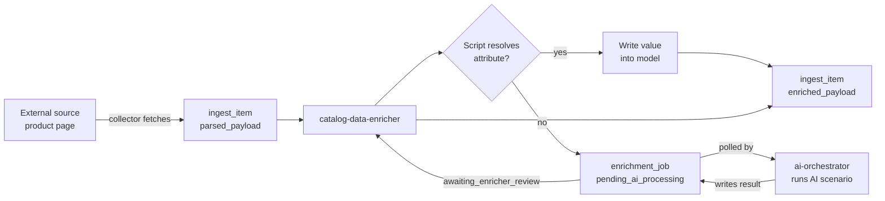

import Admonition from '@theme/Admonition';

# AI Features

Monstrino uses large language models to convert incomplete product descriptions
into structured, queryable catalog data. AI handles interpretation and
enrichment only — every other part of the platform runs on deterministic logic.

---

## How It Works



`catalog-data-enricher` and `ai-orchestrator` never call each other directly.
All coordination goes through the `enrichment_job` table state machine.
AI is invoked only when a built-in script cannot resolve an attribute.

---

## Two Services, One Boundary

| Service | What it does |
| --- | --- |
| `catalog-data-enricher` | Reads `parsed_payload` → runs scripts per attribute → creates `enrichment_job` for unresolved ones → validates results → persists `enriched_payload` |
| `ai-orchestrator` | Polls `enrichment_job` table → executes named AI scenarios → manages prompts and multi-step loops → writes structured result back to the table |

<Admonition type="info" title="If ai-orchestrator is unavailable">
Ingestion, collection, import, media processing, and public APIs continue
unaffected. Enrichment pauses — no other pipeline depends on AI availability.
</Admonition>

---

## What AI Enriches

| Attribute | What AI does |
| --- | --- |
| `characters` | Identifies character names from description, looks up canonical slugs |
| `pets` | Detects pet references in description |
| `series` | Classifies release into a catalog series |
| `content_type` | Classifies type — doll, playset, vehicle, etc. |
| `tier_type` | Identifies release tier |
| Images *(in progress)* | Detects visible items and accessories from product photos |

---

## Architectural Decisions

### Scenario-based execution

`ai-orchestrator` exposes named business scenarios — `ReleaseCharactersEnrichment`,
`ReleaseSeriesEnrichment`, `image-recognition` — not generic model endpoints.
Each scenario encapsulates its own prompt logic, model settings, and structured
response handling.

### Model abstraction

All AI clients implement a common `LLMClientInterface` Protocol defined in
`src/ports`. Switching the underlying model backend requires changes only inside
`ai-orchestrator` — no other service is affected.

### Multi-step command loop

When a model needs additional information during reasoning, it returns a
structured command rather than a final answer:

```json
{ "action": "request_action", "command": "lookup-character", "name": "Draculaura" }
```

The Use Case validates the command, calls the appropriate backend service,
injects the result, and continues. The model never calls services directly.

### Result validation before acceptance

Before any enriched value enters the catalog, `catalog-data-enricher` validates
it for structural correctness and consistency — through the same pipeline used
for script-resolved values. Failures are flagged for administrator review.

### Operational isolation

`ai-orchestrator` has no role in ingestion, collection, import, or media
processing. If unavailable, those pipelines continue unaffected.

---

## Current Capabilities

| Capability | Status |
| --- | --- |
| Character inference from release description | Available |
| Pet inference from release description | Available |
| Series classification | Available |
| Content type and tier classification | Available |
| Image-based item detection | In progress |
| Vision-based accessory identification | Planned |
| User photo recognition (future UI feature) | Planned |

---

## Section Contents

<br/>

**[AI Strategy](/docs/ai-features/ai-strategy/)**

The full responsibility model: where AI is used, where it is explicitly
excluded, controlled workflow design, source-of-truth rules, and validation
policy.

**[AI Orchestrator](/docs/ai-features/ai-orchestrator/)**

Internal architecture of the `ai-orchestrator` service: scenario-based
execution model, Job → Use Case → AIClient composition, prompt isolation,
structured output parsing, and multi-step command loop.

**[LLM Enrichment Walkthrough](/docs/ai-features/llm-enrichment-walkthrough/)**

A step-by-step trace of a real enrichment run using the *Dawn of the Dance
3-Pack* release — from raw parsed input through multi-step AI interaction to
validated structured output ready for import.
