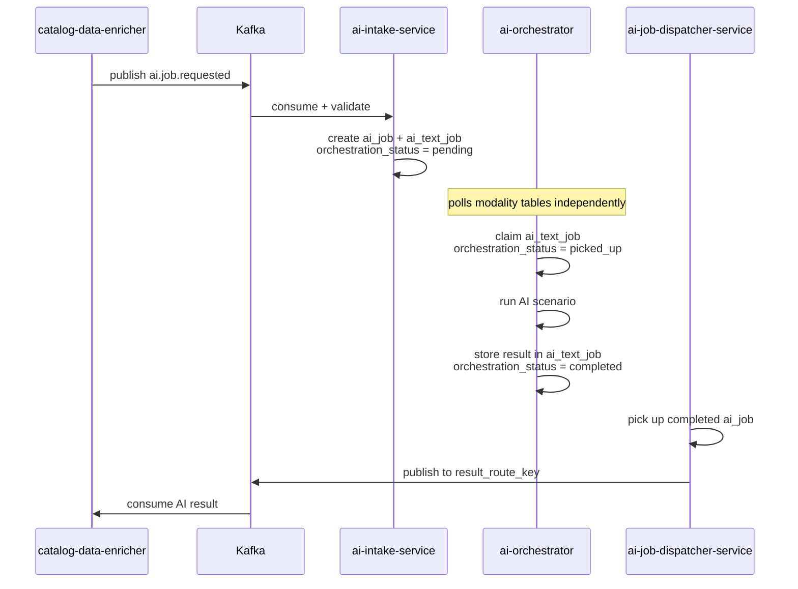
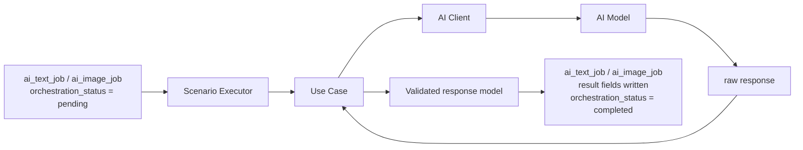
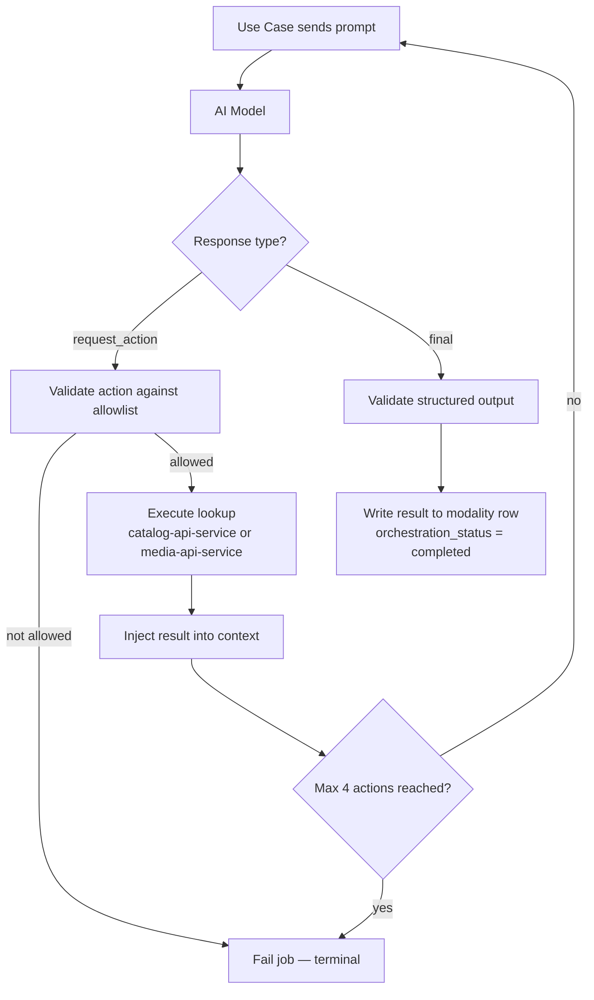

# AI Orchestrator

`ai-orchestrator` is the centralized AI execution service. It owns all prompt
logic, model configuration, and scenario execution. No other service in the
platform knows how AI is implemented.

---

## Position in the Pipeline

`ai-orchestrator` is the middle service in the AI pipeline. It does not
consume Kafka topics and does not publish results. It discovers work
exclusively through the `orchestration_status` state machine on modality
tables — activated by `ai-intake-service` and consumed downstream by
`ai-job-dispatcher-service`.



---

## Job Claiming

The orchestrator polls `ai_text_job` and `ai_image_job` for rows where
`orchestration_status = pending`. It uses `SELECT FOR UPDATE SKIP LOCKED`
to claim work without a coordinator, joining `ai_job` for priority ordering.

After claiming:

- `ai_text_job.orchestration_status = picked_up`
- `ai_job.execution_status = running`
- `ai_job.locked_by = <worker_instance_id>`
- `ai_job.execution_attempt_count` incremented

Stale locks (worker crash) are recovered by a scheduler that resets jobs
where `locked_at < now() - 15 minutes` back to `pending`.

---

## Internal Execution Model

Every AI scenario follows the same composition chain:



### Component responsibilities

| Component | Owns |
| --- | --- |
| **Scenario Executor** | Which AI client and model settings to use, which Use Case to instantiate |
| **Use Case** | Prompt loading, interaction logic, output validation, response parsing |
| **AI Client** | Transport to the model — sends requests, receives raw text |

The AI Client knows nothing about business rules. The Use Case is where all
scenario intelligence lives.

<!--  -->

---

## Scenario-Based Execution

`ai-orchestrator` executes named business scenarios — not generic model
endpoints. Calling services use domain vocabulary, not model vocabulary.

### Text scenarios

| `scenario_type` | Purpose |
| --- | --- |
| `character_resolution` | Identify characters from release description and match to catalog |
| `pet_resolution` | Detect pet references in release description and match to catalog |
| `series_classification` | Classify release into a catalog series |
| `content_type_classification` | Classify type — doll, playset, vehicle, etc. |
| `pack_type_classification` | Identify pack type |
| `tier_type_classification` | Identify release tier |

### Image scenarios

| `scenario_type` | Purpose |
| --- | --- |
| `image_generation` | Generate product images from release context |
| `image_recognition` | Detect items and accessories from product photos |

---

## Model Abstraction

All AI clients implement a common interface defined in `src/ports`:

```python
class LLMClientInterface(Protocol):
    async def generate(self, llm_client_request: BaseLLMClientRequest) -> str:
        ...
```

Use Cases depend on this interface, not on a concrete provider. The same Use
Case works with `OllamaClient`, any future local provider, or any future cloud
provider — as long as it implements the contract.


---

## Multi-Step Reasoning

In some scenarios the first AI response is not the final answer — the model
may request additional data before returning a result.



The model returns a structured action request — it never calls a service
directly. The Use Case validates the action name, executes the lookup, and
continues the loop. All side effects remain in deterministic backend code.

A maximum of **4 action calls** are permitted per job. Exceeding this sets
`failure_code = max_steps_exceeded`.

---

## External Service Calls During Reasoning

| Service | Used by scenarios | Purpose |
| --- | --- | --- |
| `catalog-api-service` | Text scenarios | Look up characters, pets, releases, release types, relationship types |
| `media-api-service` | Image scenarios | Save generated image bytes to temp storage, return `temp_path` |

All calls are allowlisted per scenario and logged to `ai_job_action_log`.

---

## Retry and Failure

Failed jobs are retried if `execution_attempt_count < max_attempts` and the
failure is non-structural. Backoff is 60 seconds fixed.

| `failure_code` | Retryable |
| --- | --- |
| `model_error`, `action_timeout`, `execution_timeout` | Yes |
| `invalid_model_output`, `action_not_allowed`, `max_steps_exceeded` | No — terminal |

### `no_result` vs `failed`

A job can reach three terminal execution outcomes, each dispatched differently:

| `execution_status` | Meaning | Dispatcher behavior |
| --- | --- | --- |
| `completed` | Valid result stored in modality row | Publishes `ai.text.result.completed` / `ai.image.result.completed` |
| `no_result` | Model returned a final response but result was empty or below confidence threshold | Publishes `ai.job.result.no_result` — requesting domain is unblocked with an empty result |
| `failed` | Terminal execution error, no retries remaining | Publishes `ai.job.result.failed` with `failure_code` |

`no_result` is not an error — it means the model completed normally but could
not produce a usable value. The requesting domain decides how to handle it.

---

## Prompt Organization

Prompts are stored in `src/domain/prompts/` and `src/domain/system-prompts/`
— separate from Use Case classes. This allows prompts to evolve independently
without changing execution logic.

- Use Cases define the execution logic
- Prompt files define the AI instructions
- Clients handle transport to the model

---

## Boundaries

`ai-orchestrator` does not:

- consume Kafka topics or publish results
- read or write to the database outside of the `ai` schema
- own canonical business state
- make final merge decisions for enriched data
- modify platform data silently

If additional data is needed during a scenario, it is requested through
controlled Use Case logic and approved service integrations only.
