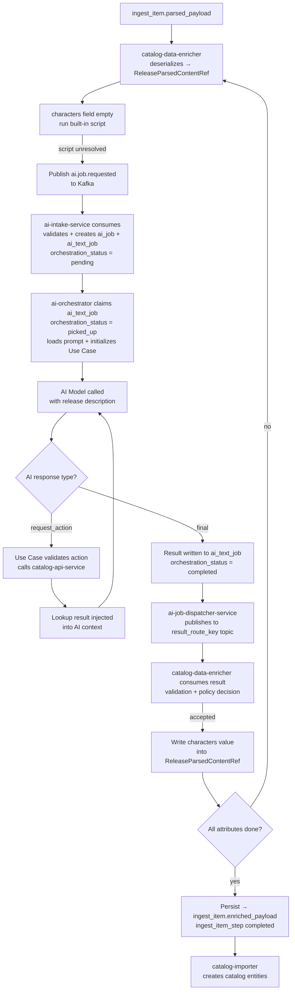

# LLM Enrichment Walkthrough

A step-by-step trace of the characters enrichment for the
*Dawn of the Dance 3-Pack* release — from raw parsed payload through
multi-step AI interaction to validated structured output.

---

## Full Flow at a Glance



---

## Input: `ingest_item.parsed_payload`

`catalog-data-enricher` reads this field and deserializes it into a
`ReleaseParsedContentRef` working model. All processing happens in-memory —
no database writes until all attributes are settled.

```json
{
  "title": "Dawn of the Dance 3-Pack",
  "mpn": "V7967",
  "year": 2011,
  "description": "This Walmart exclusive features Draculaura who is only available in this 3-pack. It also includes two previously released dolls, Clawdeen Wolf and Frankie Stein...",
  "characters": [],
  "pets": null,
  "series": [],
  "content_type": null,
  "exclusive_vendor": ["Walmart"]
}
```

The `characters` field is empty. The description contains the answer — in
unstructured text.

---

## Step 1 — Script Attempt

`catalog-data-enricher` sees the `characters` field is empty and attempts
resolution via a built-in script. Character names embedded in free-form text
require semantic interpretation — deterministic extraction is not reliable.
The script returns unresolved.

---

## Step 2 — AI Job Published to Kafka

The enricher does not call `ai-orchestrator` directly. It publishes an
`ai.job.requested` event to Kafka:

```json
{
  "event_id": "uuid",
  "event_type": "ai.job.requested",
  "event_version": 1,
  "occurred_at": "2026-03-15T10:00:00Z",
  "source_service": "catalog-data-enricher",
  "correlation_id": "uuid",
  "request": {
    "source_request_id": "uuid",
    "job_type": "text",
    "target_service": "catalog-data-enricher",
    "result_route_key": "catalog-enricher.attribute-result",
    "priority": "normal",
    "text_job": {
      "attribute_name": "characters",
      "scenario_type": "character_resolution",
      "input_context": {
        "title": "Dawn of the Dance 3-Pack",
        "description": "This Walmart exclusive features Draculaura...",
        "year": 2011,
        "existing_characters": []
      }
    }
  }
}
```

The enricher continues processing other attributes. `ai-intake-service`
handles the rest independently.

---

## Step 3 — Intake and Orchestrator Claim

`ai-intake-service` consumes the message, validates the contract and
`source_service` allowlist, then creates the internal job records in a single
transaction:

- `ai_job` with `execution_status = pending`
- `ai_text_job` with `orchestration_status = pending`

`ai-orchestrator` polls `ai_text_job` for `orchestration_status = pending`.
It claims the row (`orchestration_status = picked_up`), selects the
`character_resolution` scenario executor, initializes the Use Case and AI
Client, and calls the model with the release description and prompt.

---

## Step 4 — First AI Response: Request Action

The model identifies likely characters but requests a verification lookup
before returning a final result:

```json
{
  "status": "request_action",
  "is_final": false,
  "requested_action": {
    "action_name": "catalog_search_characters",
    "action_params": {
      "filters": { "search": "Draculaura" },
      "page": { "limit": 5, "offset": 0 },
      "context": { "locale": "en" }
    }
  }
}
```

AI is not calling a service. It is asking the orchestrator to perform the
next controlled step.

---

## Step 5 — Orchestrator Executes the Lookup

The Use Case validates the action (name in allowlist, params match contract),
then calls `catalog-api-service`:

```http
POST /api/v1/catalog/characters/search
```

```json
{
  "query": {
    "filters": { "search": "Draculaura" },
    "page": { "limit": 5, "offset": 0 }
  },
  "context": { "locale": "en" }
}
```

Result from `catalog-api-service`:

```json
{
  "data": {
    "items": [
      { "id": "uuid", "name": "Draculaura", "slug": "draculaura" }
    ],
    "total": 1
  }
}
```

The result is logged to `ai_job_action_log` and appended to the AI
conversation context.

---

## Step 6 — Final AI Response

With the lookup data available, the model returns a final result:

```json
{
  "status": "final",
  "is_final": true,
  "final_payload": {
    "characters": [
      { "name": "Draculaura", "slug": "draculaura" }
    ],
    "confidence": 0.96,
    "reasoning_summary": "Matched extracted names against catalog lookup results."
  }
}
```

`ai-orchestrator` validates the structured output, writes the result to
`ai_text_job.result_payload_json`, and sets `orchestration_status = completed`
and `ai_job.execution_status = completed`.

---

## Step 7 — Dispatcher Publishes Result

`ai-job-dispatcher-service` picks up the completed `ai_job` and publishes
the result to `result_route_key = "catalog-enricher.attribute-result"` via
`kafka-publisher`:

```json
{
  "event_id": "uuid",
  "event_type": "ai.text.result.completed",
  "event_version": 1,
  "source_service": "ai-job-dispatcher-service",
  "correlation_id": "uuid",
  "result": {
    "source_request_id": "uuid",
    "job_id": "uuid",
    "attribute_name": "characters",
    "scenario_type": "character_resolution",
    "payload": {
      "characters": [
        { "name": "Draculaura", "slug": "draculaura" }
      ]
    },
    "confidence": 0.96,
    "reasoning_summary": "Matched extracted names against catalog lookup results."
  }
}
```

`ai_job.dispatched_at` and `ai_job.finished_at` are set. The job is complete.

---

## Step 8 — Validation

`catalog-data-enricher` consumes the result from
`catalog-enricher.attribute-result` and validates it:

| Check | Result |
| --- | --- |
| Valid JSON in expected format | pass |
| Contract structurally correct | pass |
| Final payload not empty | pass |
| Characters list meaningful | pass |
| No uncontrolled prose | pass |

Validation failure → issue logged, enrichment step marked failed,
administrator notified. AI output is never written silently.

---

## Step 9 — Accepted, Model Updated

The `characters` value is written into the in-memory `ReleaseParsedContentRef`.
No database write happens yet.

After all attributes are settled:

```text
ReleaseParsedContentRef (all attributes resolved)
  → serialized → ingest_item.enriched_payload
  → ingest_item_step marked completed
  → catalog-importer picks up next step → creates catalog entities
```

---

## Output

```json
{
  "title": "Dawn of the Dance 3-Pack",
  "mpn": "V7967",
  "characters": [
    { "name": "Draculaura", "slug": "draculaura" }
  ]
}
```

The release is now a structured record that can be matched, displayed, and
processed elsewhere in the platform.

---

## Related Documents

- [AI Strategy](/docs/ai-features/ai-strategy)
- [AI Orchestrator](/docs/ai-features/ai-orchestrator)
- [AI Pipelines Overview](/docs/pipelines/ai-pipelines/overview)
