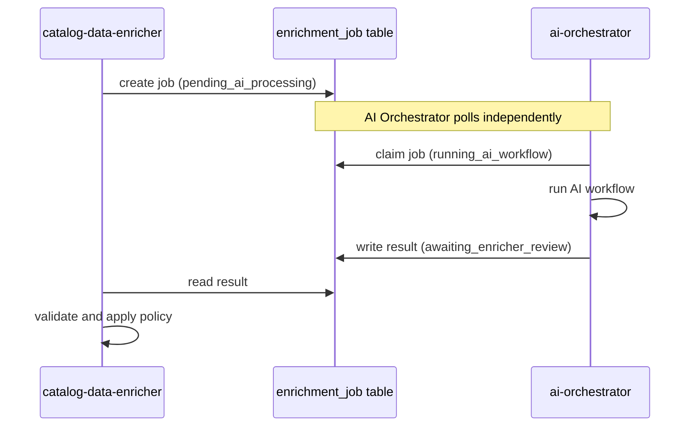
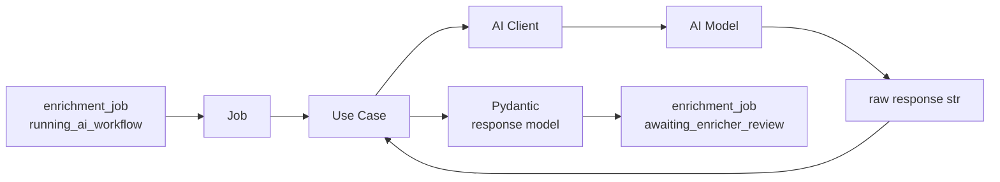
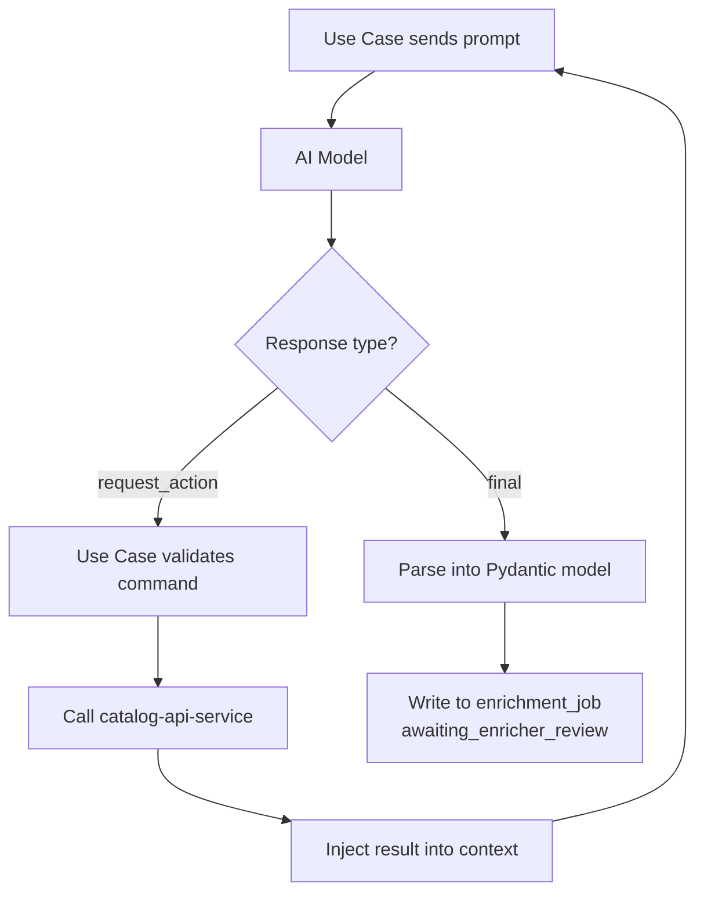

# AI Orchestrator

`ai-orchestrator` is the centralized AI execution service. It owns all prompt
logic, model configuration, and scenario execution. No other service in the
platform knows how AI is implemented.

---

## Coordination with Other Services

`ai-orchestrator` does not receive direct API calls from enrichment services.
All coordination happens through the `enrichment_job` table state machine.



If prompt logic, model settings, or AI provider changes, only `ai-orchestrator`
needs to be updated. The enricher remains unaware of AI implementation details.

---

## Internal Execution Model

Every AI scenario follows the same composition chain:



### Component responsibilities

| Component | Owns |
| --- | --- |
| **Job** | Which AI client and model settings to use, which Use Case to instantiate |
| **Use Case** | Prompt loading, interaction logic, output validation, response parsing |
| **AI Client** | Transport to the model provider — sends requests, receives raw text |

Jobs exist so that scenario wiring stays consistent and API routes stay thin.
The AI client knows nothing about business rules. The Use Case is where all
scenario intelligence lives.


---

## Scenario-Based Execution

`ai-orchestrator` exposes named business scenarios — not generic model
endpoints. Calling services use domain vocabulary, not model vocabulary.

| Scenario type | Purpose |
| --- | --- |
| `ReleaseCharactersEnrichment` | Identify characters from release description |
| `ReleaseSeriesEnrichment` | Classify release into a catalog series |
| `ReleasePackTypeEnrichment` | Identify pack type |
| `ReleaseTierTypeEnrichment` | Identify release tier |
| Image recognition scenarios | Detect items and accessories from product photos |

---

## Model Abstraction

All AI clients implement a common interface defined in `src/ports`:

```python
class LLMClientInterface(Protocol):
    async def generate(self, llm_client_request: BaseLLMClientRequest) -> str:
        ...
```

Use Cases depend on this interface, not on a concrete provider. The same Use
Case works with `OllamaClient`, any future local provider, or any future cloud
provider — as long as it implements the contract.


---

## Multi-Step Reasoning

In some scenarios the first AI response is not the final answer — the model
may request additional data before returning a result.



The model returns a structured command — it never calls a service directly.
The Use Case validates the command, executes the lookup, and continues the
loop. All side effects remain in deterministic backend code.


---

## Prompt Organization

Prompts are stored in `src/domain/prompts/` and `src/domain/system-prompts/`
— separate from Use Case classes. This allows prompts to evolve independently
without changing execution logic.

- Use Cases define the execution logic
- Prompt files define the AI instructions
- Clients handle transport to the model

---

## Vision Support

For image-based scenarios, requests include image payloads alongside text.
This enables accessory detection, release content identification, and future
user-facing photo recognition features.

---

## Boundaries

`ai-orchestrator` does not:

- read or write to the database directly
- own canonical business state
- make final merge decisions for enriched data
- modify platform data silently

If additional data is needed during a scenario, it is requested through
controlled Use Case logic and approved service integrations only.
