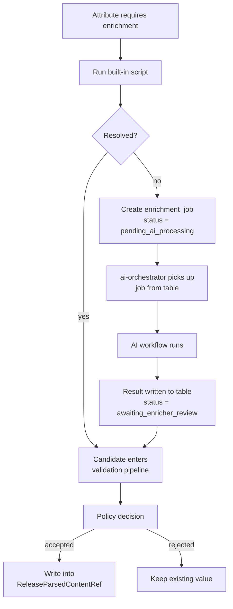

# AI Strategy

:::note In plain terms
Product pages on external stores are messy. A description might say
*"includes accessories"* without listing them, or mention three character
names where only one is actually inside the box.

Monstrino uses AI to read those descriptions and convert them into
structured, reliable catalog data — automatically, at scale.

AI is a **data quality multiplier**. The platform continues to function
without it — data is just less complete.
:::

---

## AI-Assisted vs AI-Free

| AI is used here | AI has no role here |
| --- | --- |
| Character and pet identification from descriptions | Data ingestion pipelines |
| Series and tier classification | Catalog storage |
| Content type and pack type tagging | Public APIs |
| Release image analysis | Page generation and media storage |
| Future: user photo recognition | Data synchronization |

---

## How Enrichment Works

Scripts run first. AI is the fallback — only for attributes that require
semantic interpretation.



Scripts handle deterministic cases: extracting a year from an MPN, mapping a
known type string, normalizing region metadata from a source URL.

---

## AI Boundaries

| AI can | AI cannot |
| --- | --- |
| Propose enriched data | Modify the database directly |
| Classify releases | Call other services |
| Interpret text descriptions | Execute workflows |
| Analyze images | Overwrite canonical data |
| Return structured suggestions | Act autonomously |

All AI activity runs through **controlled scenarios** defined in backend
services. The model is a reasoning component, not a system actor.

---

## Controlled Workflow

`catalog-data-enricher` and `ai-orchestrator` do not call each other.
Coordination is exclusively through the `enrichment_job` table state machine.

If the model needs additional data mid-reasoning, it returns a structured
command — not a free-form action:

```json
{
  "command": "get-more-info-about-characters",
  "characters": ["Draculaura"]
}
```

The AI Orchestrator then:

1. validates the command against an allowlist
2. calls the appropriate backend service (e.g. `catalog-api-service`)
3. injects the result into the AI context
4. continues the reasoning loop

All system actions remain in backend code.

---

## Source of Truth

AI-generated data is **never authoritative**. The primary source of truth is
**official Mattel data**. AI enrichment is treated as suggested data that must
pass validation. Conflicts with official data require administrator review.

---

## Validation

Before any AI result enters the catalog:

- structural correctness and completeness are checked
- consistency with existing catalog data is verified
- nonsensical or malformed values are rejected

Failures are logged and flagged for administrator review. Nothing is written
silently.

---

## Risks

| Risk | Mitigation |
| --- | --- |
| Hallucinated data | Validation pipeline rejects malformed results |
| Incorrect classifications | Administrator review for flagged records |
| Model unavailability | Only enrichment pauses — no other pipeline affected |
| Non-deterministic behavior | AI is isolated to one service; all results are validated |

---

## Infrastructure

AI models currently run locally on dedicated hardware — full model control,
no external API costs, no data privacy concerns.

Future paths: dedicated AI server, cloud GPU instances, or a hybrid of both.
The platform architecture keeps AI services isolated, making infrastructure
migration straightforward.

---

## Long-Term Vision

Future capabilities may include automatic release identification from images,
accessory recognition, and large-scale image analysis.

The core principle remains unchanged: **AI assists the platform, but never
replaces deterministic system logic.**
