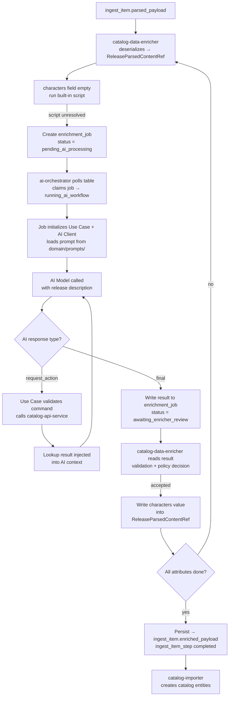

# LLM Enrichment Walkthrough

A step-by-step trace of the characters enrichment for the
*Dawn of the Dance 3-Pack* release — from raw parsed payload through
multi-step AI interaction to validated structured output.

---

## Full Flow at a Glance



---

## Input: `ingest_item.parsed_payload`

`catalog-data-enricher` reads this field and deserializes it into a
`ReleaseParsedContentRef` working model. All processing happens in-memory —
no database writes until all attributes are settled.

```json
{
  "title": "Dawn of the Dance 3-Pack",
  "mpn": "V7967",
  "year": 2011,
  "description": "This Walmart exclusive features Draculaura who is only available in this 3-pack. It also includes two previously released dolls, Clawdeen Wolf and Frankie Stein...",
  "characters": [],
  "pets": null,
  "series": [],
  "content_type": null,
  "exclusive_vendor": ["Walmart"]
}
```

The `characters` field is empty. The description contains the answer — in
unstructured text.

---

## Step 1 — Script Attempt

`catalog-data-enricher` sees the `characters` field is empty and attempts
resolution via a built-in script. Character names embedded in free-form text
require semantic interpretation — deterministic extraction is not reliable.
The script returns unresolved.

---

## Step 2 — `enrichment_job` Created

The enricher does not call `ai-orchestrator` directly. It writes a job record
to the table:

```json
{
  "id": "<uuid>",
  "ingest_item_id": "<uuid>",
  "attribute_name": "characters",
  "scenario_type": "ReleaseCharactersEnrichment",
  "status": "pending_ai_processing",
  "input_context": {
    "title": "Dawn of the Dance 3-Pack",
    "description": "This Walmart exclusive features Draculaura...",
    "year": 2011,
    "existing_characters": []
  }
}
```

The enricher continues processing other attributes. The AI Orchestrator picks
up this job independently via the state machine.

---

## Step 3 — AI Orchestrator Claims the Job

`ai-orchestrator` polls for `status = pending_ai_processing`. It claims the
job (`running_ai_workflow`), selects the `ReleaseCharactersEnrichment` scenario,
initializes the Job → Use Case → AI Client chain, and calls the model with
the release description and prompt.

---

## Step 4 — First AI Response: Request Action

The model identifies likely characters but requests a verification lookup
before returning a final result:

```json
{
  "status": "request_action",
  "is_final": false,
  "requested_action": {
    "command_name": "get_more_info_about_characters",
    "command_params": {
      "character_names": ["Draculaura", "Clawdeen Wolf", "Frankie Stein"]
    }
  }
}
```

AI is not calling a service. It is asking the orchestrator to perform the
next controlled step.

---

## Step 5 — Orchestrator Executes the Lookup

The Use Case validates the command (supported name, required params, safe for
this scenario), then calls `catalog-api-service`:

```json
{ "lookup_type": "characters_by_names", "character_names": ["Draculaura", "Clawdeen Wolf", "Frankie Stein"] }
```

Result:

```json
{
  "characters": [
    { "slug": "draculaura", "display_name": "Draculaura" },
    { "slug": "clawdeen-wolf", "display_name": "Clawdeen Wolf" },
    { "slug": "frankie-stein", "display_name": "Frankie Stein" }
  ]
}
```

This data is appended to the AI conversation context.

---

## Step 6 — Final AI Response

With the lookup data available, the model returns a final result:

```json
{
  "status": "final",
  "is_final": true,
  "final_payload": {
    "data": {
      "characters": [
        { "name": "Draculaura", "slug": "draculaura" },
        { "name": "Clawdeen Wolf", "slug": "clawdeen-wolf" },
        { "name": "Frankie Stein", "slug": "frankie-stein" }
      ],
      "matched_characters_count": 3,
      "confidence": 0.96
    }
  }
}
```

`ai-orchestrator` writes this to the `enrichment_job` table with
`status = awaiting_enricher_review`.

---

## Step 7 — Validation

`catalog-data-enricher` reads the result and validates it:

| Check | Result |
| --- | --- |
| Valid JSON in expected format | pass |
| Orchestration contract structurally correct | pass |
| Final payload not empty | pass |
| Characters list meaningful | pass |
| No uncontrolled prose | pass |

Validation failure → issue logged, enrichment step marked failed,
administrator notified. AI output is never written silently.

---

## Step 8 — Accepted, Model Updated

The `characters` value is written into the in-memory `ReleaseParsedContentRef`.
No database write happens yet.

After all attributes are settled:

```text
ReleaseParsedContentRef (all attributes resolved)
  → serialized → ingest_item.enriched_payload
  → ingest_item_step marked completed
  → catalog-importer picks up next step → creates catalog entities
```

---

## Output

```json
{
  "title": "Dawn of the Dance 3-Pack",
  "mpn": "V7967",
  "characters": [
    { "name": "Draculaura", "slug": "draculaura" },
    { "name": "Clawdeen Wolf", "slug": "clawdeen-wolf" },
    { "name": "Frankie Stein", "slug": "frankie-stein" }
  ]
}
```

The release is now a structured record that can be matched, displayed, and
processed elsewhere in the platform.

---

## Related Documents

- [AI Strategy](/docs/ai-features/ai-strategy/)
- [AI Orchestrator](/docs/ai-features/ai-orchestrator/)
