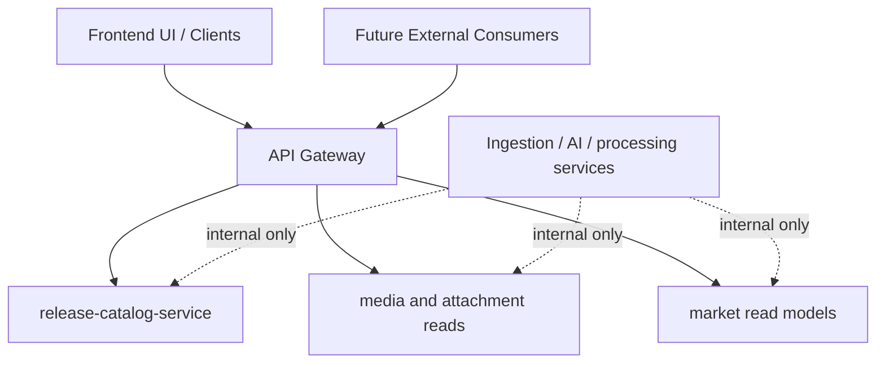

# API Overview

The Monstrino API layer is responsible for turning internal domain data into stable consumer-facing contracts.

:::note Core API rule
- External clients talk to a **single backend entrypoint**.
- Internal services keep **domain ownership and implementation freedom**.
- Delivery models may differ from persistence models.
- Ingestion, enrichment, and processing services are **not exposed** to public consumers.
:::

---

## Why This Layer Exists

Monstrino is not a single CRUD application. It is a platform with multiple architectural zones:

| Zone | Responsibility |
|---|---|
| Catalog ingestion and parsing | acquire raw external data |
| AI enrichment and normalization | transform and classify parsed data |
| Market discovery and price collection | observe commercial listings |
| Media ingestion and rehosting | store and serve assets |
| Canonical catalog storage | persist business truth |
| Frontend delivery and public consumers | serve structured responses |

Because of this, an explicit delivery layer is required to protect clients from internal changes.

---

## API Goals

1. provide a clean read model for the frontend
2. hide internal service topology from consumers
3. support aggregation across catalog, market, and media domains
4. enable future public API products without leaking internal schemas
5. keep room for independent evolution of internal services

---

## High-Level Model

---

## Scope of This Section

This API section documents:

- the role of the API Gateway
- internal service API boundaries
- recommended contract shapes
- versioning and compatibility rules
- authentication and authorization strategy
- error handling and observability expectations
- future public API direction

## What This Section Does Not Document

| Topic | Where it belongs |
|---|---|
| Database schemas | Domain model docs |
| Ingestion worker internals | Pipelines / dev-notes |
| AI orchestration internals | AI dev-notes |
| Scheduler implementation details | Dev-notes / infrastructure |
| ORM-level persistence models | Domain model docs |

---

## Related Pages

- [Architecture Overview](../architecture/01-architecture-overview.md)
- [Service Communication](../architecture/05-service-communication.md)
- [Security Boundaries](../architecture/06-security-boundaries.md)
- [Scalability Strategy](../architecture/07-scalability-strategy.md)
- [API Design Principles](../principles/04-api-design-principles.md)
