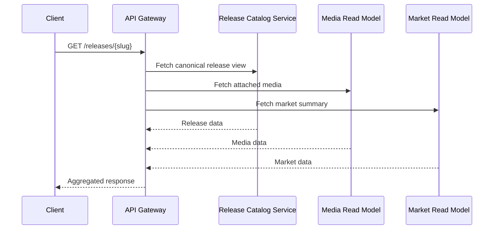

# API Architecture

The Monstrino API architecture follows a **delivery-oriented model**.

External consumers do not call domain services directly. Requests enter through a single gateway layer that performs request validation, routing, aggregation, response shaping, and policy enforcement.

---

## Architectural Position

The API sits between two worlds:

| Side | Who/What |
|---|---|
| **Upstream consumers** | frontend UI, documentation examples, future third-party API clients |
| **Downstream services** | release catalog, media read models, market read models, selected internal capabilities |

---

## Request Lifecycle

---

## API Layers Inside the Gateway

A professional gateway should be split conceptually into four layers:

### 1. Transport Layer
Responsible for:

- HTTP routing
- request parsing
- query, path, and header extraction
- status code mapping
- content negotiation if introduced later

### 2. Access Layer
Responsible for:

- auth checks
- permission checks
- rate limiting
- client identity extraction
- API token validation for public consumers

### 3. Orchestration Layer
Responsible for:

- calling downstream services
- combining multiple read models
- deciding which dependencies are required vs optional
- fallback behavior for partial data failures

### 4. Presentation Layer
Responsible for:

- shaping final response models
- hiding internal field names that should not leak
- sorting and grouping related data
- preserving stable contracts for clients

---

## Why Direct Service Exposure Is Avoided

:::warning
Direct service exposure would create four problems:

1. the frontend becomes tightly coupled to internal topology
2. service boundaries leak into UI logic
3. future refactors become expensive
4. public API stabilization becomes much harder
:::

---

## Delivery Model vs Domain Model

The gateway consumes canonical domain objects, but returns **consumer-oriented view models**, not raw service DTOs.

Public delivery contracts optimize for:

| Goal | Reason |
|---|---|
| readability | consumers are not database engineers |
| stability | consumers depend on field names not changing |
| pagination | the frontend shows pages not rows |
| discoverability | resources should be navigable |
| backwards compatibility | consumers cannot update on every deploy |

---

## Recommended Deployment Stance

| Component | Exposure |
|---|---|
| API gateway | public ingress |
| docs site | public ingress |
| internal services | cluster-internal only |
| worker services | no public ingress |
| AI and ingestion services | internal only |

---

## Related Pages

- [API Gateway](./02-api-gateway.md)
- [Internal Service APIs](./03-internal-service-apis.md)
- [Architecture Overview](../architecture/01-architecture-overview.md)
- [Service Communication](../architecture/05-service-communication.md)
