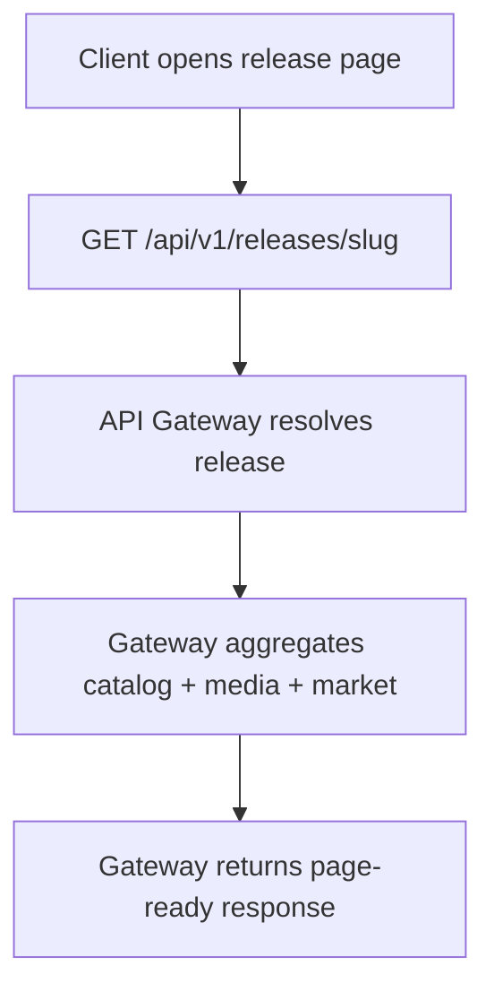

# Consumer Flows

This page documents how the API is expected to support the most important client journeys.

---

## 1. Release Page Rendering

The release page is the **most important delivery flow**.

Typical client need:

- release identity
- related characters and pets
- primary and gallery media
- series placement
- release type and exclusivity
- optional market summary

Typical API sequence:



Expected behavior:
- missing optional market data does not block the response
- missing optional media gallery does not block the response if a primary asset exists
- missing release data fails the request with `404`

---

## 2. Catalog Browsing

Typical client need:

- paginated results
- stable sorting
- filtering by year, series, character, type, exclusivity, or other supported dimensions
- lightweight cards rather than full detail payloads

Recommended endpoint posture:

```text
GET /api/v1/releases?page=1&pageSize=24&sort=year_desc
GET /api/v1/releases?series=dawn-of-the-dance
GET /api/v1/releases?character=draculaura
```

:::tip
Catalog list responses should return **card-oriented payloads**: title, slug, year, primary image, and key classification fields — not full detail aggregations.
:::

---

## 3. Character Page Rendering

Typical client need:

- character identity and summary
- associated releases
- primary image
- related pet information where applicable

The API should prefer one clear character detail response over many small calls.

---

## 4. Search

Search should be treated as **its own consumer flow**, not just a filter shortcut.

Typical client need:

- mixed resource results
- resource type labels
- canonical slugs for navigation
- relevance-oriented ranking

```text
GET /api/v1/search?q=draculaura
```

:::note
Search results benefit from having a `resourceType` field on each result (e.g., `release`, `character`, `series`, `pet`) so that frontend routing can navigate to the correct detail page.
:::

---

## 5. External Read-Only Integration

Future third-party clients will usually need:

- stable pagination
- predictable filtering
- authentication token support
- stronger quotas and versioning guarantees

| Requirement | Why |
|---|---|
| Token auth | third-party clients need identity-bound rate limiting |
| Versioned API path | breaking changes must not silently affect clients |
| Documented pagination | clients build their own pagination UIs |
| Explicit rate limits | prevents abuse and protects capacity |

That is why public API readiness should be treated as a **product milestone**, not just a route export.

---

## Related Pages

- [API Gateway](./02-api-gateway.md)
- [Public API Strategy](./04-public-api-strategy.md)
- [Response Shaping](./07-response-shaping.md)
- [API Contracts and Versioning](./06-api-contracts-and-versioning.md)
