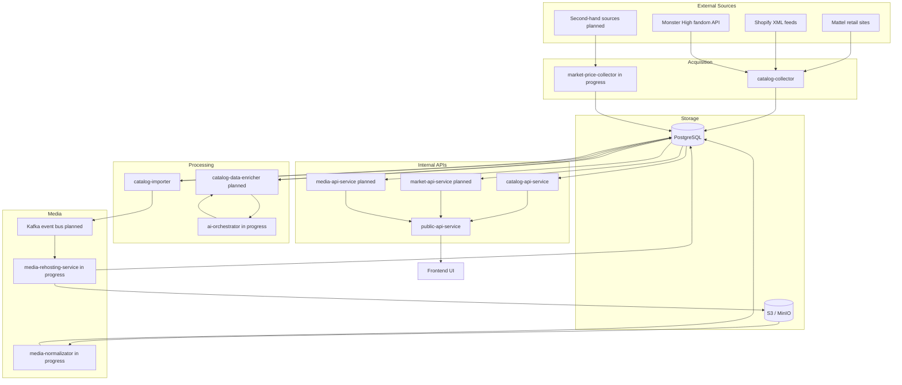

# Architecture Overview

Monstrino is a data platform for Monster High collectors. It aggregates release, character, pet, media, and pricing information from multiple external sources, transforms that data into a normalized domain model, and exposes it through a single public API for the frontend.

The system is designed as a service-oriented architecture with explicit responsibility boundaries. Its main goals are long-term maintainability, incremental evolution, operational reliability on modest homelab infrastructure, and practical domain depth without unnecessary complexity.

:::note
Complexity is introduced only where it improves traceability, queryability, maintainability, or future extensibility.
:::

## At a Glance

- **Domain**: Monster High collectible data platform
- **Users**: collectors and fans who need structured release and pricing information
- **Architecture style**: service-oriented, staged processing
- **External entry point**: `public-api-service` only
- **Core technical concerns**: acquisition, normalization, enrichment, media processing, public delivery
- **Main storage**: PostgreSQL + S3-compatible object storage

---

## System Purpose

### Why the system exists

Monstrino gives collectors one place where they can understand what a release is, what it contains, how it relates to characters, pets, and series, and how its pricing changes over time.

Today, Monster High data is fragmented across multiple websites, often incomplete, manually maintained, or outdated. Monstrino addresses this by collecting data automatically, normalizing it into a structured model, and making it available through a consistent public interface.

### In practical terms, the platform helps users

- understand release composition and relationships
- compare official and market pricing over time
- find structured release information in one place
- avoid overpaying when buying collectible dolls

:::info
Monstrino is an information platform, not a commerce platform.
:::

---

## Target Audience

**Primary audience**

- Monster High collectors and fans aged 12+
- users who treat dolls as collectible items rather than children's toys

**What the system therefore prioritizes**

- data accuracy
- detailed release structure
- source traceability
- historical and comparative pricing
- support for long-term catalog growth

---

## Core Problems the System Solves

### Main problems

- **Fragmented information** — release, character, pet, and media data is spread across different websites.
- **Incomplete or outdated references** — manually maintained sources often lag behind new releases.
- **Missing structured pricing history** — official and market prices are rarely preserved in a reusable structured form.
- **Lack of fair-price visibility** — collectors often lack a clear baseline for buying or selling decisions.
- **No unified source aggregation** — users currently need to manually combine official retailer data, fandom references, and market observations.

### Architectural answer

Automated collection and normalization allow Monstrino to make data available earlier and keep it more current than manually maintained references.

---

## Design Priorities

The architecture is shaped by a few explicit priorities:

- **Clear responsibility boundaries** — acquisition, normalization, media handling, market tracking, and public delivery are separated.
- **Incremental evolution** — new sources, new entities, and new processing steps should be addable without redesigning the whole system.
- **Reusable subsystems** — media processing is designed to be reusable beyond release images in the future.
- **Public/internal separation** — the frontend interacts with a single external facade, while internal service topology remains private.
- **Practical complexity** — schema and service complexity should exist for concrete value, not for architectural aesthetics.
- **Production-minded operation** — infrastructure, access rules, contracts, and storage choices are designed deliberately rather than ad hoc.

---

## High-Level Architecture

### Four major concerns

- **Acquisition** — collect raw data from external sources and store parsed forms.
- **Processing** — transform parsed records into normalized domain entities.
- **Media** — ingest, store, attach, normalize, and derive image variants.
- **Exposure** — expose normalized data to the frontend through a single public API facade backed by internal service APIs.

:::info Architecture boundary
`public-api-service` is the only service reachable by the frontend. All other services are intended to remain internal to the cluster.
:::

---

## Main Subsystems and Services

### Acquisition

- `catalog-collector` — **Ready**. Collects raw release data from external sources and stores parsed records.
- `market-price-collector` — **In Progress**. Collects pricing observations from official and, later, second-hand sources.

### Enrichment and Processing

- `catalog-data-enricher` — **Planned**. Enriches parsed records, including LLM-assisted attribute refinement.
- `ai-orchestrator` — **In Progress**. Internal gateway for LLM-backed enrichment tasks.
- `catalog-importer` — **Ready**. Converts parsed records into normalized domain entities and resolves relations.

### Media

- `media-rehosting-service` — **In Progress**. Accepts media work, stores originals, and creates media asset records.
- `media-normalizator` — **In Progress**. Produces derived formats and enhanced image variants.
- `media-api-service` — **Planned**. Internal read API for media data.

### Read APIs and Delivery

- `catalog-api-service` — **Ready**. Internal read API for catalog domain data.
- `market-api-service` — **Planned**. Internal read API for market and pricing data.
- `public-api-service` — **Ready**. Single external-facing facade for the frontend.

### Internal Tooling

- `testing-service` — **Internal**. Used to validate SQLAlchemy repositories and ORM behavior in isolation.

---

## Core Domain Model

The core domain is centered around collectible releases and their relationships.

### Entity groups

**Identity entities**

- `Character` — canonical Monster High character identity
- `Pet` — pet identity associated with one or more characters
- `Series` — named collection or line that groups releases

**Release entities**

- `Release` — a specific product release
- `ReleaseCharacter` — relation between a release and its character set
- `ReleasePet` — relation between a release and included pets
- `ReleaseItem` — items or components contained in a release
- `ReleaseMsrp` — official MSRP associated with a release

**Media entities**

- `MediaAsset` — stored media object
- `MediaAssetAttachment` — link between media and a domain entity

**Market entities**

- `MarketProductPriceObservation` — recorded price observation for a release at a given time and source

Additional supporting models are used for enrichment, exclusivity, external references, source tracing, and other domain-specific metadata.

---

## End-to-End Data Flow

### Pipeline summary

1. **Acquisition** — `catalog-collector` collects external source data, parses it into structured intermediate representations, and stores the parsed result in ingest-related storage.
2. **Optional enrichment** — planned enrichment components can refine selected parsed attributes through `ai-orchestrator` and write improved values back.
3. **Domain import** — `catalog-importer` reads parsed records, resolves relations, and writes normalized domain entities into the catalog model.
4. **Media handoff** — media-related work can be emitted for downstream handling. Kafka is planned as the transport for transient media processing events.
5. **Media rehosting and attachment** — `media-rehosting-service` stores original images in object storage and creates corresponding media asset and attachment records.
6. **Media normalization** — `media-normalizator` generates derived variants such as JPG, PNG, and WEBP, and can apply image enhancement or cleanup steps.
7. **Public delivery** — the frontend sends requests only to `public-api-service`, which validates the request, orchestrates calls to internal APIs, transforms responses into UI-ready DTOs, and returns the final payload.

### Why this staged model matters

- each stage can evolve independently
- parsed data stays separate from normalized domain data
- media processing stays separate from release import logic
- frontend delivery stays separate from internal service topology

For implementation-level details, resolver chains, and media processing stages, use dedicated subsystem pages.

---

## Source Systems

Monstrino uses a multi-source aggregation model.

### Active sources

- official Mattel retail websites
- Shopify XML data from official stores
- Monster High fandom API

### Planned sources

- second-hand marketplace sources

This source mix is central to the system design: Monstrino is not built around a single canonical upstream provider, but around aggregation, normalization, and reconciliation across multiple sources.

---

## Storage and Infrastructure

### Quick summary

- **Relational storage**: PostgreSQL
- **Object storage**: MinIO in test, Stackit S3 in production
- **Runtime**: Kubernetes + Docker in homelab
- **Ingress**: Cloudflare
- **Environment split**: same cluster, separate namespaces

### Storage model

Monstrino currently uses two PostgreSQL instances:

- one for **test**
- one for **production**

Within PostgreSQL, the data is logically separated into multiple schemas:

- `catalog`
- `core`
- `ingest`
- `media`
- `market`

This schema split reflects responsibility boundaries in the system and keeps parsed data, normalized domain data, media metadata, and market observations distinct.

### Object storage

- **Test** environment uses self-hosted **MinIO**.
- **Production** uses a **Stackit S3 bucket**.

Original media assets are stored in object storage, while relational metadata and attachments are tracked in PostgreSQL.

### Runtime infrastructure

Monstrino runs in a homelab environment using:

- Kubernetes
- Docker
- a local Docker image registry
- Cloudflare as ingress layer

At the moment, test and production run in the same Kubernetes cluster in separate namespaces. If the homelab expands, the plan is to separate them into distinct clusters.

:::note Infrastructure constraint
The system is designed to remain operable on modest self-hosted infrastructure while still supporting clear architectural boundaries and future growth.
:::

---

## Communication and Security Boundaries

### Internal communication

- all internal service-to-service communication is API-based
- Bearer tokens are used for protection
- `monstrino-api` standardizes API setup across services
- `monstrino-contracts` defines shared service contracts and helps prevent schema drift
- Kafka is part of the planned architecture for transient inter-service payloads where direct API calls or direct storage are not the right fit

### External access boundary

- only `public-api-service` should be reachable by the frontend
- internal services must not be directly exposed outside the cluster
- internal routes apply stricter internal-only rules
- public routes are limited to the facade layer intended for UI consumption

This boundary allows internal service topology and data composition to evolve independently from the frontend-facing contract.

---

## Architectural Principles

### Separation of concerns

Acquisition, parsed storage, domain import, media processing, market tracking, and public delivery are intentionally separated into distinct responsibilities. Each subsystem has a bounded role and avoids taking on responsibilities owned by other parts of the platform.

### Parsed-to-domain boundary

Raw and parsed source data is kept separate from normalized domain data. Import is an explicit transformation step rather than an accidental side effect of collection.

### Extensibility through staged processing

The system is built as a sequence of discrete stages. New sources, enrichment steps, entity relations, or downstream media handling can be added without rewriting the whole pipeline.

### Reusable media architecture

The media subsystem is intentionally designed as a reusable capability rather than a release-only implementation. This makes it possible to support future domains, including non-release media or user-facing media features, without redesigning the storage and processing model.

### Practical data complexity

The data model is allowed to be detailed where detail produces value: relationship tracing, source tracking, query flexibility, and price history. Complexity is not added for its own sake.

### Consistency through shared contracts

Internal APIs are standardized through shared contracts and shared API setup packages. This reduces divergence between services and improves long-term maintainability.

### Single external facade

The frontend communicates with one public service rather than multiple internal services. This simplifies frontend access, preserves internal boundaries, and allows internal services to evolve without exposing topology changes to clients.

---

## User-Facing Capabilities

### Current and planned user-facing views

- release pages
- character pages
- pet pages
- series pages
- release composition and relationships
- character and pet appearances across releases
- images for releases, characters, and pets
- market identifiers such as GTIN and MPN
- official pricing history
- planned second-hand pricing history
- source links to external references and stores
- planned price comparison across sources

---

## Out of Scope

The following are intentionally outside the current scope of the system:

- marketplace functionality
- product sales
- payment handling
- transaction processing
- social network behavior in the current implementation
- user-generated content in the current implementation

Social and community features may exist in the roadmap, but they are not part of the current architecture baseline.

---

## Future Evolution

The current architecture is designed to support future additions without radical redesign.

### Planned or in-progress directions

- second-hand market data ingestion
- full activation of Kafka-based event flow where appropriate
- completion of the enrichment pipeline through `catalog-data-enricher` and `ai-orchestrator`
- completion of the media subsystem, including media delivery APIs
- implementation of `market-api-service`
- possible separation of test and production into different Kubernetes clusters
- future public API access with token-based limits
- possible future community features beyond the current information-platform scope