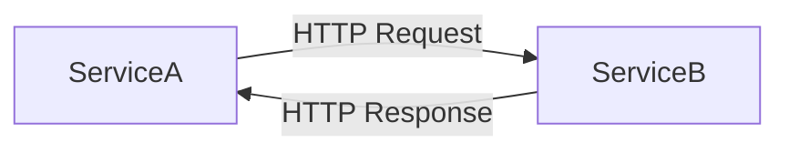
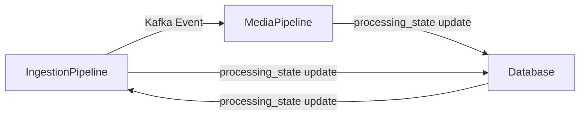
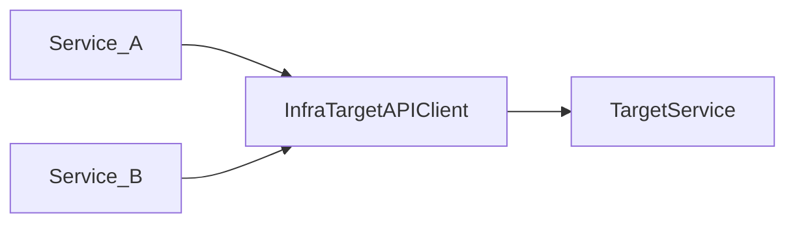
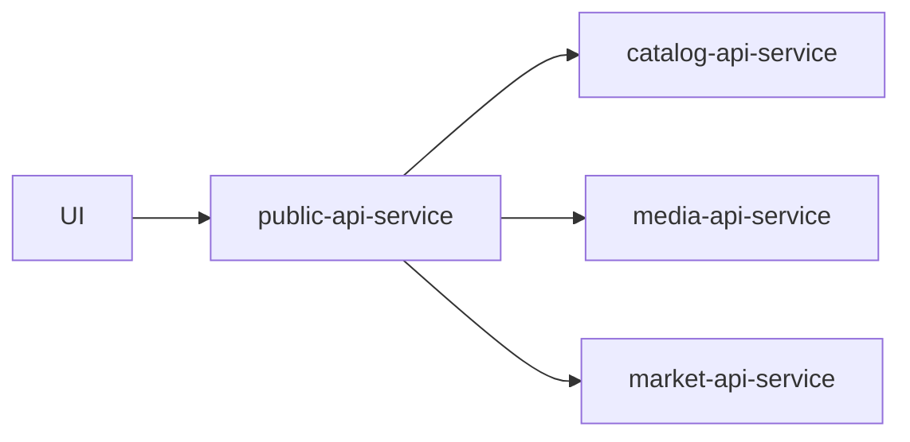
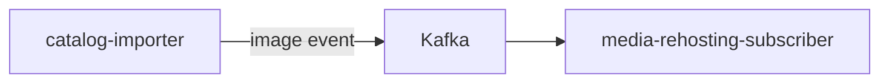
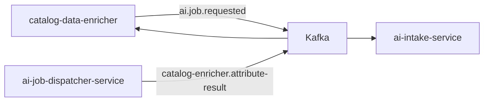
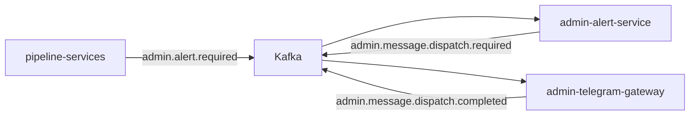
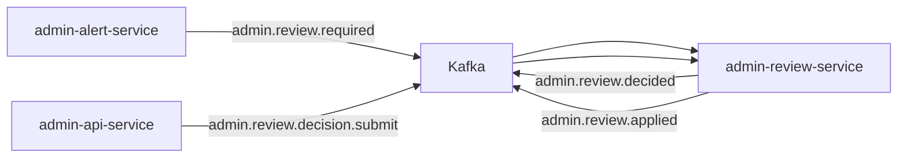

import Admonition from '@theme/Admonition';

# Service Communication

This document describes how services in the **Monstrino platform** communicate with each other.

Monstrino follows a **service-oriented architecture** where specialized services cooperate to collect, process, normalize, and serve catalog data.  
Communication between services is designed to be **predictable, standardized, and scalable**.

<Admonition type="info" title="Communication Model">
Monstrino combines **synchronous API calls** with **asynchronous pipelines** to ensure both fast data retrieval and scalable background processing.
</Admonition>

The platform currently uses:

- **HTTP APIs** for synchronous communication
- **Kafka events** for asynchronous pipelines
- **Database processing states** for pipeline orchestration
- **Redis caching** for UI performance
- **Shared contracts** to standardize API behavior

---

# Communication Types

Monstrino services communicate using two primary mechanisms.

## 1. Synchronous Communication

Synchronous communication is performed through **HTTP API requests** between services.

Typical use cases include:

- requesting data from another service
- triggering operations in another service
- retrieving catalog information

Example flow:



This pattern is mainly used by **API services** that require immediate responses.

---

## 2. Asynchronous Communication

Asynchronous communication is used for **background processing pipelines**.

Mechanisms used:

- **Kafka events**
- **database processing states**

Example pipeline communication:



This design allows ingestion and media processing workloads to scale independently.

---

# API-Based Service Communication

All internal service-to-service communication is implemented through **HTTP APIs**.

Each service exposes a set of endpoints that other services can call when needed.

Examples:

- requesting catalog entities
- triggering processing tasks
- collecting normalized data

<Admonition type="note" title="Service Isolation">
Services never directly access the internal logic of another service.  
All interactions occur through **defined API endpoints**.
</Admonition>

---

# API Contracts

All API contracts are centralized in the **`monstrino-contracts`** package.

This package defines:

- request schemas
- response schemas
- API interfaces
- shared data structures

Benefits:

- consistent API communication
- reduced duplication
- easier service evolution

---

# API Client Infrastructure

API clients used by services are implemented in the **`monstrino-infra`** package.

This architecture ensures:

- API clients exist in a **single location**
- services do not duplicate communication logic
- endpoint updates require changes **in only one place**



---

# Unified API Response Model

All Monstrino services return responses using a **standardized response structure** defined in the **`monstrino-api`** package.

The response schema includes:

- request metadata
- correlation identifiers
- response status
- service metadata
- response data
- error information

### Example Success Response

```json
{
  "status": "success",
  "request_id": "req_cee2f468f547",
  "correlation_id": "req_cee2f468f547",
  "trace_id": null,
  "data": {
    "items": [],
    "total": 0,
    "page": 1,
    "page_size": 10
  },
  "error": null,
  "meta": {
    "service": "catalog-api-service",
    "version": "v1",
    "timestamp": "2026-03-07T16:14:36.875306Z"
  }
}
```

### Example Error Response

```json
{
  "status": "error",
  "request_id": "req_518a4716dc52",
  "correlation_id": "req_518a4716dc52",
  "trace_id": null,
  "data": null,
  "error": {
    "code": "Internal Error",
    "message": "Internal server error",
    "retryable": true,
    "details": null
  },
  "meta": {
    "service": "catalog-api-service",
    "version": "v1",
    "timestamp": "2026-03-07T16:13:53.096787Z"
  }
}
```

Because every service follows this structure, clients can implement **consistent response handling logic**.

---

# Public API Layer

External clients never interact directly with internal services.

Instead, Monstrino exposes a single entry point:

**`public-api-service`**



The public API service:

- aggregates data from internal services
- exposes a stable API for the frontend
- isolates internal architecture from UI clients

---

# Internal Service APIs

All services except the public API expose **internal APIs**.

These APIs are intended only for internal platform communication.

Typical internal services include:

- catalog services
- ingestion services
- media services
- processing pipelines

---

# Event Communication

Monstrino uses **Kafka** for event-driven communication across multiple pipelines.

## Media ingestion



`catalog-importer` publishes image events after writing canonical entities. `media-rehosting-subscriber` consumes them to create media ingestion jobs.

## AI enrichment



`catalog-data-enricher` delegates unresolved attributes to the AI pipeline via Kafka. Results are returned through a dedicated result topic. There are no shared database tables between the catalog pipeline and the AI domain.

## Admin alert pipeline



## Admin review pipeline



---

# Caching Layer

Redis is used as a **caching layer**.

Primary purpose:

- caching responses requested by the UI

Benefits:

- faster API responses
- reduced database load

---

# Service Authentication

Internal service communication is secured using **JWT authentication tokens**.

Each service generates a unique token during startup using shared infrastructure from **`monstrino-infra`**.

Example header:

```http
Authorization: Bearer <token>
```

This ensures only authorized services can access internal APIs.

---

# Design Principles

Monstrino service communication follows several architectural principles.

### Standardized API Responses

All services use a shared response model.

### Shared Contracts

API schemas are defined centrally.

### Single API Client Source

API client logic exists in one shared package.

### Internal API Isolation

Internal APIs are not exposed publicly.

### Asynchronous Processing Pipelines

Data pipelines rely on asynchronous messaging.

---

The current communication architecture is designed to support these improvements without breaking existing integrations.