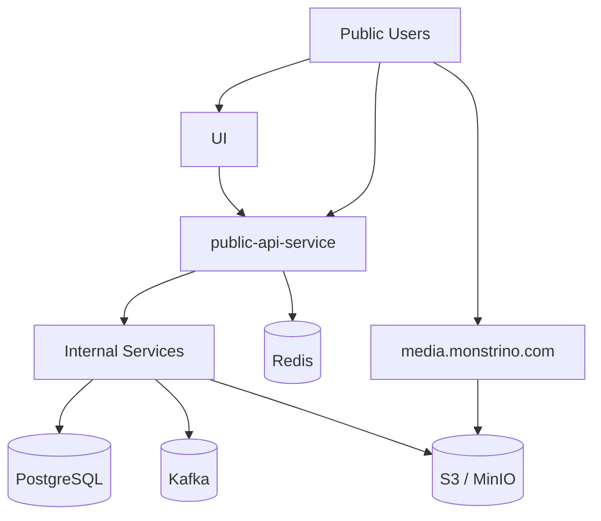
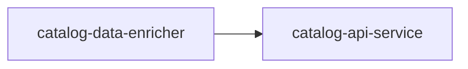

import Admonition from '@theme/Admonition';

# Security Boundaries

This document describes the main security boundaries of the Monstrino platform.

Monstrino is designed as a **self-hosted Kubernetes-based platform** where internal services, storage systems, and processing pipelines are isolated behind clearly defined trust boundaries. The goal of this model is to ensure that public traffic, internal service communication, storage access, and media delivery are separated by design.

<Admonition type="info" title="Security Model">
Monstrino separates **public entry points**, **internal service APIs**, **storage access**, and **pipeline communication** into distinct security zones.
</Admonition>

---

# Security Zones Overview

At a high level, Monstrino consists of the following security zones:

- public client access
- public media delivery
- internal service network
- internal data storage
- internal event processing



---

# Public Boundary

The public-facing boundary of Monstrino currently consists of two externally visible access points:

- **UI**
- **public-api-service**
- **media.monstrino.com** for images and their variants

These components form the outer trust boundary between Monstrino and the outside world.

## Public API Boundary

The primary public entry point for data access is:

**`public-api-service`**

This service is responsible for exposing public API routes and acting as the controlled interface between external consumers and internal services.

## Public Media Boundary

The public entry point for images is:

**`media.monstrino.com`**

This domain is used to serve media assets and processed image variants.

<Admonition type="note" title="Separate Public Paths">
Monstrino intentionally separates **data access** and **media delivery** into different public entry points.
</Admonition>

---

# Internal Service Boundary

All backend services run **inside the Monstrino Kubernetes environment** on a private server.

Internal services are not intended for direct public access. They communicate with each other through internal service APIs and are protected by service-level authentication.



This boundary ensures that internal service endpoints remain part of the trusted backend environment.

---

# Service-to-Service Trust Boundary

Internal service communication is protected using **JWT authentication with a shared secret model**.

Each service validates incoming bearer tokens and accepts requests only when they originate from:

- trusted internal services
- callers providing a valid administrative secret token

Example request header:

```http
Authorization: Bearer <token>
```

This creates a clear boundary between:

- trusted internal service traffic
- unauthorized traffic
- public traffic

---

# Storage Boundaries

Monstrino separates structured storage, object storage, caching, and event messaging into different protected boundaries.

## PostgreSQL Boundary

PostgreSQL stores structured platform data.  
Most backend services interact with the database because they either:

- insert new data
- update existing data
- read domain data required for processing

However, database access is **not unrestricted**.

Services are allowed to access only the schemas and tables required for their responsibilities.

Example:

- a collector service may only work with specific parts of **ingest** and **core**
- a service is not expected to have unrestricted access to all schemas

This limits the blast radius of service-level issues and keeps responsibilities separated.

## Object Storage Boundary

Object storage is used for images and image variants.

Access rules:

- **media services** can write new images and derived variants
- **media-api-service** is read-only
- public users access images through the public media domain

This separates media ingestion and transformation from public media delivery.

## Redis Boundary

Redis is currently used only by:

- **public-api-service**

Its role is limited to caching responses for UI-related traffic.

## Kafka Boundary

Kafka is currently used only by specific internal processing services.

At the moment, the main participating services are:

- **catalog-importer**
- **media-rehosting-subscriber**

Kafka is therefore part of the internal pipeline boundary, not the public request path.

---

# External Access Rules

Only a limited number of components are intended to be reachable from outside the internal backend network.

Externally exposed components include:

- UI
- public-api-service
- media.monstrino.com
- collector services that intentionally communicate with external platforms

Collector services form a special boundary because they initiate outbound communication to external sources.

Typical external sources include:

- official product websites
- community-maintained data sources

<Admonition type="warning" title="Outbound Collectors">
Collector services are internal components, but they interact with untrusted external systems. They should be treated as boundary-crossing services.
</Admonition>

---

# Trust Boundary Diagram

The following diagram illustrates the main trust boundaries of the platform.


---

# Boundary Rules

Monstrino currently follows these practical security rules.

### Public access is limited

Only dedicated public-facing components should be reachable from outside.

### Internal APIs are protected

Internal services require JWT bearer authentication.

### Storage access is scoped

Services may access only the database areas required for their role.

### Media write access is restricted

Only media-related services can write new image assets.

### Media delivery is separated

Public image access is routed through a dedicated media domain.

### Event processing is internal

Kafka is used only inside trusted backend pipelines.

---

# Public Media Access

At the current stage, all images are **publicly accessible**.

This means:

- original assets and variants are intended for public delivery
- no signed URL mechanism is currently required
- media access control is separated from internal media processing permissions

This model keeps public media delivery simple while still restricting who can create or modify stored assets.

---

# Architectural Security Intent

The purpose of these boundaries is not only access control, but also architectural clarity.

The Monstrino security model is designed to ensure that:

- public clients never interact directly with internal backend services
- service-to-service communication is authenticated
- storage access is constrained by service responsibility
- pipeline components remain isolated from public traffic
- media delivery and media processing are separated

This provides a stable foundation for future platform growth without exposing the full internal architecture to the outside world.