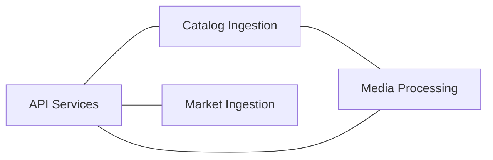
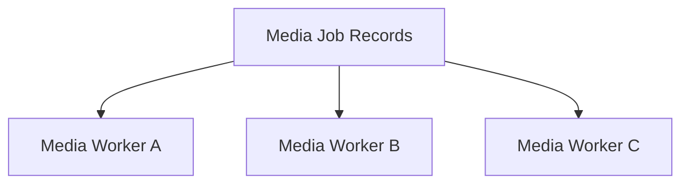

import Admonition from '@theme/Admonition';

# Scalability Strategy

This document describes how the Monstrino platform is designed to scale as the amount of data, processing workload, and platform complexity grow over time.

Monstrino is built as a long-lived platform intended to handle growing catalog size, expanding source coverage, increasing media volume, and larger background processing workloads without requiring fundamental architectural rewrites.

<Admonition type="info" title="Scalability Principle">
Monstrino is designed so that system growth should be handled by extension and independent scaling, not by rewriting existing architecture.
</Admonition>

---

# Purpose

The purpose of the Monstrino scalability strategy is to ensure that the platform can continue evolving as:

- the number of releases increases
- the number of data attributes increases
- the number of external sources increases
- the amount of price history grows
- the amount of background processing grows

The platform is intentionally structured so that growth in one part of the system does not require reworking unrelated parts.

---

# Primary Growth Dimensions

The main expected growth areas in Monstrino are:

- release count
- structured catalog data volume
- number of supported external sources
- number of observed prices per release
- number of background processing jobs

At the current stage, the most important growth dimensions are:

- more data
- more background processing

---

# Independent Scaling Areas

Monstrino is designed so that major workloads can scale independently.

The most important independently scalable areas are:

- media processing
- catalog ingestion
- market ingestion
- API services

This means that a rise in media workload should not require catalog ingestion to scale in the same way, and a rise in market ingestion should not directly affect media processing.

<Admonition type="note" title="Independent Workloads">
The platform treats ingestion, media processing, market processing, and API delivery as separate scaling concerns.
</Admonition>

---

# Scaling by Data Source Growth

When a new data source is introduced, the architecture should not require structural changes to the system.

Instead, scaling source coverage follows an extension model:

1. add a new parser to `monstrino-infra`
2. connect the parser to the appropriate collector service
3. register the parser under the correct parser port and source
4. configure the scheduler for that source

Examples:

- release-related sources are attached to `catalog-collector`
- price-related sources are attached to `market-price-collector`

Because collector services already use generic source-processing use cases, adding a new source is primarily a configuration and parser extension task rather than an architectural rewrite.

---

# Scaling by Data Type Growth

When a new type of data appears, the system is designed to absorb it without breaking existing structures.

The expected evolution path is:

1. extend `ReleaseParseContentRef` with a new nullable field
2. update the mapping logic from parsed source data into structured table data
3. extend downstream processing in:
   - `catalog-data-enrichter`
   - `catalog-importer`

This design allows new structured attributes to be introduced incrementally while preserving compatibility with older records and sources.

---

# Scaling Media Processing

Media growth is expected to be significant because every catalog entity may be associated with multiple images and image variants.

Monstrino is designed to handle this through isolated media processing workers.

Current media scaling model:

- each worker processes only one image at a time
- before processing starts, the worker marks the record as `claimed`
- once claimed, the same image cannot be taken by another replica

This approach supports horizontal scaling of workers without duplicate processing of the same asset.

<Admonition type="tip" title="Single-Record Processing">
A core scalability strategy in Monstrino is that major processing use cases operate on one record at a time.
</Admonition>

This model improves:

- work distribution
- concurrency safety
- horizontal worker scaling
- processing predictability

---

# Scaling API Workloads

If request traffic from the UI or public consumers increases, the primary scaling responsibility belongs to the API layer.

The system is intentionally designed so that:

- API services absorb client request growth
- processing workers remain focused on background tasks
- internal ingestion flows remain separated from public traffic

This prevents increased frontend activity from directly interfering with ingestion and processing pipelines.

---

# Architectural Decisions That Support Scaling

Monstrino already includes several architectural decisions that support long-term scalability.

### Domain Separation

Catalog, media, market, ingest, and core are separated into distinct domains.

### Worker Separation

Processing services are separated by responsibility.

### Pipeline-Oriented Processing

Heavy processing is handled in background flows rather than request/response paths.

### Centralized Parser Extension Model

New sources are integrated by adding parser implementations rather than rewriting collectors.

### Incremental Data Model Evolution

New structured attributes can be added through extension rather than replacement.

### Claimed-Record Processing

Processing state transitions prevent duplicate worker execution on the same record.

### API Layer Isolation

Public traffic is handled separately from internal processing workloads.

---

# Current Scalability Philosophy

At the current stage, Monstrino is already designed so that all major architectural areas can grow without requiring immediate redesign.

The system prefers:

- extending existing abstractions
- adding new parsers
- adding new workers
- evolving data structures incrementally

instead of rewriting core flows.

---

# Core Scalability Rule

The central scalability rule of Monstrino is:

**Major processing use cases should handle one record at a time.**

This rule supports:

- predictable concurrency
- safer retries
- easier worker scaling
- better control over processing state

It also ensures that scaling can be achieved by increasing the number of workers rather than redesigning internal logic.

---

# Architectural Intent

The purpose of this scalability strategy is to ensure that Monstrino can grow through:

- more releases
- more structured metadata
- more data sources
- more market observations
- more images
- more background jobs

without losing architectural clarity.

The platform is intentionally designed so that new growth should be addressed by **adding capacity, extending contracts, and reusing existing abstractions**, rather than by breaking apart previously working components.