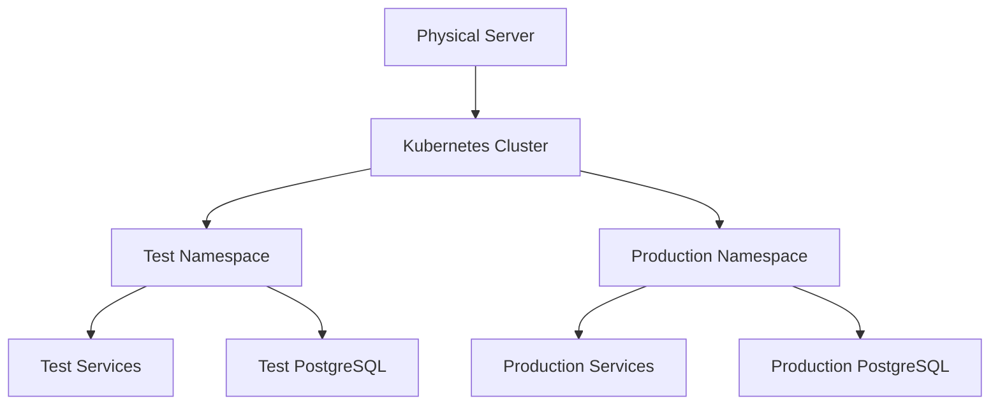
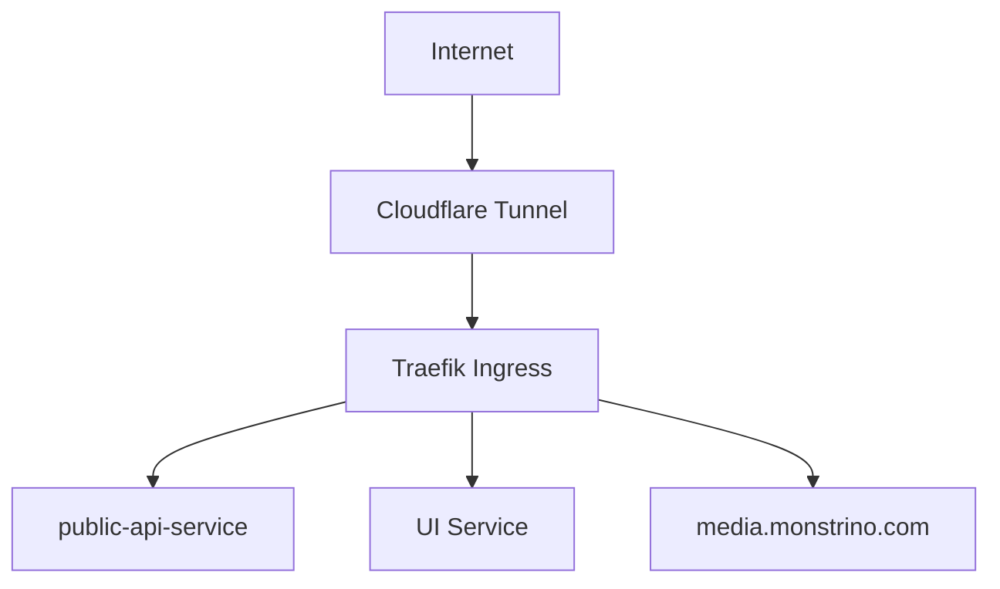

import Admonition from '@theme/Admonition';

# Deployment Architecture

This document describes how the Monstrino platform is deployed across environments and how its services are organized within the infrastructure.

Monstrino is designed as a fully containerized, Kubernetes-native platform.
All backend services run inside a Kubernetes cluster and communicate through internal cluster networking.

The architecture intentionally separates environments, isolates workloads, and allows the system to evolve toward larger multi-node deployments.

<Admonition type="info" title="Deployment Philosophy">
Monstrino is designed to be fully containerized, environment-isolated, and Kubernetes-native from the beginning.
</Admonition>

---

# Environments

Monstrino currently operates with three environments.

## Local

The local environment is used for development.

Characteristics:

- runs on the developer machine
- used for testing services and pipelines during development
- does not represent the full production infrastructure
- simplified dependencies

## Test

The test environment runs on the main server and represents a staging version of the platform.

Characteristics:

- runs inside the Kubernetes cluster
- uses a dedicated namespace
- has its own database instance
- processes test data

The purpose of this environment is to validate system behavior before deploying to production.

## Production

The production environment runs in the same Kubernetes cluster but in a separate namespace.

Characteristics:

- uses production data
- uses a dedicated PostgreSQL instance
- uses production object storage
- serves the live platform

Test and production are isolated at the namespace level.

---

# Current Infrastructure Layout

At the current stage, the entire platform runs on:

- one Kubernetes cluster
- one physical server
- inside a homelab environment

Both test and production environments share the same cluster but are separated through Kubernetes namespaces.

---

# Future Infrastructure Evolution

The deployment architecture is designed to evolve beyond the single-server setup.

The planned direction includes:

- moving the production cluster to a dedicated server
- running production workloads independently from test workloads
- replicating critical data across multiple servers
- allowing failover if one server becomes unavailable

This approach ensures that the platform can gradually evolve toward higher reliability and availability without redesigning the system architecture.

---

# Kubernetes Deployment Model

All Monstrino services are deployed as Kubernetes Deployments.

Each service runs in its own containerized pod.

Characteristics of the deployment model:

- services are containerized
- services run as Kubernetes Deployments
- services communicate through Kubernetes Services
- external routing is handled through ingress

Each domain service runs as an independent workload inside the cluster.

---

# Pipeline Execution Model

Many Monstrino services perform background processing tasks.

Instead of using Kubernetes CronJobs, the platform uses an internal scheduler model.

Each worker service starts with an embedded scheduler implemented using Python APScheduler.

This scheduler periodically triggers the processing logic of the service.

Advantages of this model:

- simple pipeline execution logic
- predictable worker lifecycle
- easier service deployment
- no dependency on Kubernetes CronJobs

Workers continuously process available records according to the configured schedule.

---

# Database Deployment

Monstrino uses PostgreSQL as the primary database system.

The database runs inside the Kubernetes cluster.

Separate database instances exist for each environment:

- one PostgreSQL instance for test
- one PostgreSQL instance for production

This separation ensures that test workloads cannot affect production data.

---

# Object Storage

Binary media files are stored outside the database using object storage.

Environment configuration:

- Test / local environments use MinIO
- Production uses Stackit S3 object storage in the cloud

This approach allows production media storage to scale independently of the cluster infrastructure.

---

# Redis

Redis is used as a caching layer within the platform.

Redis runs inside the Kubernetes cluster and is used primarily by API services.

Caching improves response performance for frequently requested data.

---

# Kafka

Kafka is deployed inside the Kubernetes cluster.

Kafka is currently used for communication between specific pipelines, particularly where event-driven handoffs between stages are required.

The event bus enables services to react to newly available data without tightly coupling pipelines.

---

# Public Entry Points

The Monstrino platform exposes only a small number of public entry points.

Currently these include:

- the UI
- the public-api-service
- the media domain endpoint (media.monstrino.com)

All other services remain internal.

This ensures that the majority of the platform is not directly exposed to the internet.

---

# Ingress and External Routing

External traffic enters the platform through two layers.

1. Cloudflare Tunnel — used to expose services from the homelab environment securely to the internet.

2. Traefik — used inside the Kubernetes cluster as the ingress controller responsible for routing requests to the appropriate services.

