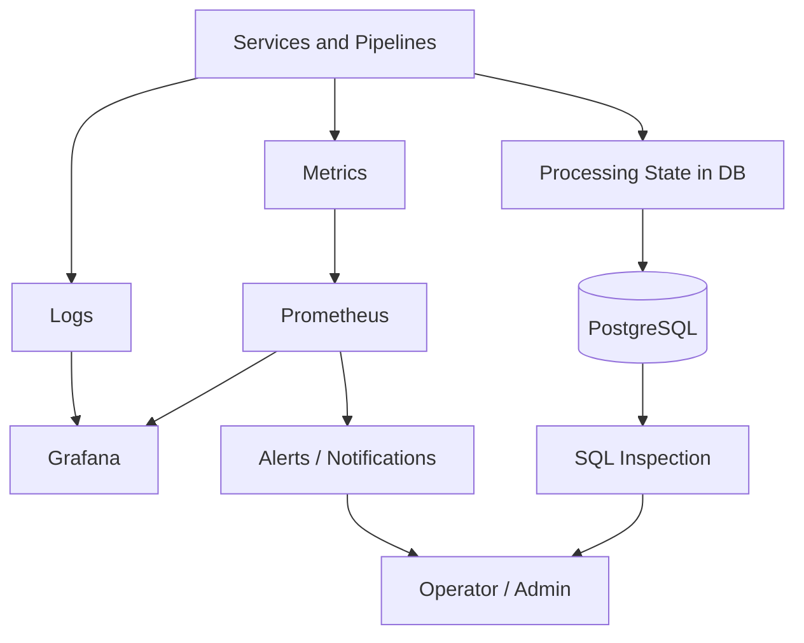

import Admonition from '@theme/Admonition';

# Observability

This document describes the observability approach used in the Monstrino platform.

In Monstrino, observability is not treated as a purely infrastructure-level concern. It is part of the platform architecture itself. This is especially important because Monstrino includes multiple background pipelines, asynchronous processing stages, and Kubernetes-based service execution without a direct user request for most operations.

The platform must make it possible to answer questions such as:

- what is currently being processed
- which stage is blocked
- which records failed
- whether processing is making progress
- whether human intervention is required

<Admonition type="info" title="Key Idea">
A core observability principle in Monstrino is that **processing state is part of the observable system model**, not only an internal implementation detail.
</Admonition>

---

# Why Observability Matters in Monstrino

Observability is especially important in Monstrino because the platform is built around:

- background pipelines without an active end user
- batch and scheduled processing
- multiple services running in Kubernetes
- asynchronous handoff between stages
- domain workflows that may require human intervention

In a system like this, the absence of visible user-facing errors does not mean the system is healthy.  
A pipeline may silently stop making progress, a worker may repeatedly fail on one type of record, or an enrichment stage may pause because it needs a human decision.

This means observability in Monstrino must support both:

- **technical diagnosis**
- **workflow-level visibility**

---

# Logs

Logs are the first layer of observability in Monstrino.

They are used to understand:

- what a service is currently doing
- what input it received
- which stage of processing it reached
- whether a record succeeded, failed, or paused
- whether manual intervention is required

## Log Formats

Monstrino uses different log formats depending on the environment.

### Local and Test Environments

In local and test environments, logs are currently written in **plain text** using a dedicated log configuration file.

This keeps development and debugging simple.

### Production

In production, logs are expected to use **structured JSON format**.

This makes logs easier to parse, filter, aggregate, and connect to operational tooling.

<Admonition type="note" title="Environment-Specific Logging">
Monstrino intentionally keeps local logging simple, while production logging is designed for machine-readable operational analysis.
</Admonition>

---

## What Logs Are Expected to Capture

At a minimum, logs in Monstrino should capture:

- service identity
- pipeline stage
- source being processed
- processing result
- exceptional conditions
- reason for pausing or failing a job
- whether admin action is required

In practice, the most important logs are produced by services that perform autonomous data processing.

These include stages such as:

- collection
- enrichment
- import
- media processing
- AI-assisted tasks

---

## Why Logs Matter Most in Enrichment

Logs are especially important in the **enrichment stage**.

This stage is operationally sensitive because it may encounter situations where the system cannot safely continue automatically.

Examples include:

- the system cannot confidently decide how to enrich a record
- a data conflict requires human judgment
- an unusual case does not match expected rules

In these cases, the correct system behavior is not to fail silently and not to invent a risky automatic decision.  
Instead, the job should:

1. log the situation clearly
2. mark the record as requiring intervention
3. pause that specific record
4. continue processing other records

This makes enrichment observability critical, because there is no direct UI action that would naturally expose such issues.

---

# Processing State as Observable Signal

One of the strongest observability mechanisms in Monstrino is the use of **`processing_state` as a first-class operational signal**.

This is an intentional architectural decision.

Instead of hiding pipeline progress only inside logs or monitoring systems, Monstrino makes processing state directly visible in the data model.

## Why This Matters

Because processing state is stored in the database, an operator can inspect system health immediately using direct queries.

This allows the platform to answer questions such as:

- how many records are waiting to be processed
- how many are currently claimed by workers
- how many are ready for import
- how many failed
- how many require admin intervention

This means that **SQL itself becomes a first-line observability tool**.

<Admonition type="tip" title="Architectural Strength">
This is not just a debugging convenience.  
It is a deliberate design choice to embed observability into the domain workflow itself.
</Admonition>

---

## Processing States

Processing states differ per pipeline object. Each domain uses its own state machine appropriate to its role.

**`ingest_item_step` (catalog enrichment stage)**
- `pending` — step created, not yet claimed
- `claimed_for_enrichment` — worker has claimed the step
- `running_enrichment` — enrichment in progress
- `completed` — enrichment finished, next step created

**Media ingestion jobs**
- `init` → `claimed` → `processing` → `completed` / `failed`

**AI pipeline — orchestration axis (`ai_job`)**
- `pending` → `running` → `completed` / `no_result` / `failed`

**AI pipeline — dispatch axis**
- `pending_dispatch` → `dispatched` / `dispatch_failed`

**AI pipeline — modality job axis (`ai_text_job` / `ai_image_job`)**
- `pending` → `picked_up` → `running` → `completed` / `failed`

Because these states are stored in the database, SQL queries are a first-line tool for inspecting pipeline health across all of these objects.

---

## Why This Is Valuable

Processing state observability is especially powerful in Monstrino because many services are continuously working in the background.

A simple query can reveal:

- backlog growth
- stuck jobs
- missing importer progress
- enrichment pauses
- admin-required records
- whether workers are actively claiming records

This is particularly useful before the full monitoring stack is introduced, but it remains valuable even after Prometheus and Grafana are added.

---

# Metrics

Metrics are the second major layer of observability in Monstrino.

While logs explain specific events, metrics help answer broader operational questions such as:

- is the system making progress
- is throughput increasing or dropping
- is one stage becoming a bottleneck
- is a specific subsystem falling behind

## Metrics That Make Sense for Monstrino

The most useful metrics for Monstrino include:

- number of new releases discovered over time
- number of release fields enriched over time
- number of new images processed
- pipeline throughput by stage
- count of records by `processing_state`
- enrichment success rate
- importer throughput
- media processing lag
- failed job count by pipeline
- average time spent in `claimed`
- number of records in `required-admin`
- source-specific parser failure count
- LLM task backlog
- LLM processing latency

These metrics are useful because they reflect both technical health and workflow health.

---

# Metrics Backend

At the current stage, metrics are not yet exported to a dedicated monitoring backend.

This is expected because Monstrino has not yet reached the full production release stage.

For the production platform, the planned target stack is:

- **Prometheus** for metric collection
- **Grafana** for dashboards and visualization

This is the intended future observability foundation for metrics-based monitoring.

---

# Alerting

Alerting in Monstrino should focus on situations that require real human action.

The purpose of alerting is not to report every unusual condition.  
It is to surface the specific cases where a person must intervene or where operational action is required.

## Admin Alert Pipeline as an Observability Mechanism

The admin alert pipeline (`platform-alerting-service` → `admin-alert-service` → `admin-telegram-gateway`) is itself a platform-level observability mechanism. Pipeline services call `platform-alerting-service` via HTTP when a failure or review-required condition occurs. The alert is materialized, delivered through Telegram, and tracked for confirmation.

This means operational failures surface to the operator in near real-time without requiring manual log inspection or dashboard monitoring. The admin pipeline is therefore part of the observability architecture, not just an operational tool.

## What Should Trigger Alerts

The most important alert-worthy cases include:

- a record enters `required-admin`
- a job stays in `claimed` too long
- an unexpected or non-standard processing error occurs
- media processing repeatedly fails
- AI-related tasks accumulate past a defined threshold
- the local AI execution environment must be started manually
- LLM gateway processing cannot continue because the AI server is unavailable

This last case is especially important in Monstrino’s current operating model, because AI processing depends on a manually started local machine.

In practice, this means the platform should notify the operator when enough AI work has accumulated and human action is needed to continue processing.

---

## What Should Not Trigger Alerts

Monstrino should avoid alerting on expected slow operations.

Slow work is not automatically a problem if progress is still being made.

The goal is to reduce noise and ensure that alerts correspond to real intervention points.

---

# Current State and Target State

Monstrino intentionally distinguishes between what is already implemented and what is part of the target production observability model.

## Current State

Currently implemented:

- plain-text logs in local and test environments
- JSON logs planned for production
- `processing_state` visible in the database across pipelines
- direct SQL inspection as an operational visibility tool
- domain-level workflow states such as `required-admin`

## Target State

Planned for production:

- Prometheus-based metric collection
- Grafana dashboards
- production-grade structured logging
- alerting based on workflow and operational thresholds
- better visibility into AI backlog and processing latency

<Admonition type="note" title="Maturity Through Honesty">
Separating current implementation from target architecture is intentional.  
A mature system design acknowledges both what already exists and what is planned next.
</Admonition>

---

# Observability Flow

The following diagram shows how observability signals move through the platform.

---

## Architectural Intent

The purpose of Monstrino observability is to make background processing visible, understandable, and operable.

The platform is designed so that observability does not depend on a single tool.
Instead, it combines:

- logs for event-level understanding
- processing state for workflow visibility
- metrics for system-level trends
- alerts for intervention points

The most distinctive part of this model is that observability is partially embedded into the domain workflow itself through processing states.
