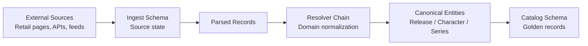

# The Catalog as a Master Data Problem

Monstrino collects product data from multiple external sources and transforms it into a single, queryable, normalized domain model.

On paper this is a familiar problem. In practice the constraint that makes it hard is this: **Monstrino controls none of its sources**.

---

## The upstream reality

Traditional approaches to product data consolidation assume some degree of upstream cooperation. Suppliers conform to a schema. Import templates define what fields are expected. Validation happens at intake. Malformed records can be rejected and resubmitted.

None of this applies here.

Every source is a web scrape: official retail pages, Shopify XML feeds, fandom API endpoints. No schema agreement. No negotiation. Sources change structure without notice. The same product is described differently across sources — and sometimes differently within the same source across regional variants.

Typical incoming record problems:

| Problem | Example |
|---|---|
| Incomplete records | character name missing, series not present |
| Naming inconsistency | "Clawdeen", "Clawdeen Wolf", "C. Wolf" — same entity |
| Embedded structured data | series name mixed into product title |
| Missing classification | pack type inferred from description text, not a field |
| Conflicting values | two sources disagree on release year |
| Locale variation | same product, different title and price per country |

This is the input the catalog must be built from.

---

## High-level pipeline

At a structural level the platform resolves messy upstream data into a canonical catalog through a multi-stage pipeline.



Each stage has a different responsibility:

- **Ingest** preserves exactly what the source provided.
- **Parsing** extracts structured hints from raw pages.
- **Resolvers** translate those hints into canonical domain entities.
- **Catalog** stores the normalized entities used by the platform.

---

## Separation of source state from canonical state

The first architectural response is a hard boundary between what sources say and what the platform decides is true.

The `ingest` schema stores **source state** — parsed representations of what was found on external pages. These records are allowed to be incomplete, inconsistent, and source-specific. They are never used directly as user-facing data. Their purpose is to preserve what was collected, not to represent domain truth.

The `catalog` schema stores **canonical state** — normalized entities with stable identities and explicit relationships. A canonical entity does not change identity when a source is re-crawled or a parser is updated. Its identity is durable.

Import is an explicit transformation step that crosses this boundary. It is not a migration from one version of the same model to another. It is a deliberate act of normalization.

:::note
Ingest stores what the source said.  
Catalog stores what the platform decided is true enough to publish.

These two things are never mixed.
:::

---

## Canonical identity and golden records

Each entity in the catalog — `Release`, `Character`, `Series`, `Pet` — has a stable internal identity that is independent of any source identifier.

Source IDs are preserved through dedicated external reference models (`ReleaseExternalReference`, `CharacterExternalReference`, and so on), but they are **not the canonical identity**. A release that appears in three sources under three different external IDs is still one canonical record.

This means:

- a source URL change does not invalidate the canonical record
- a re-crawl of the same source does not produce a duplicate
- merging two source pages into one canonical entry is structurally supported
- source provenance is preserved for traceability without polluting canonical identity

The canonical record is the golden record. External references provide the trace back to origin systems.

---

## Controlled vocabulary instead of free-text strings

Classification in the catalog is built on explicit reference tables rather than raw source strings.

| Domain concept | Model |
|---|---|
| Product form | `ReleaseType` — doll, set, fashion pack, playset |
| Packaging | `PackType` — single, multipack |
| Release tier | `TierType` — source-aware tier classification |
| Vendor exclusivity | `ExclusiveVendor` — normalized retailer identity |
| Character role in release | `CharacterRole` — main, secondary |
| Cross-release link type | `RelationType` — reissue, variant, related edition |

Incoming source values are resolved against these tables during import. A release is never classified as `"doll figure"` as a string — it is linked to the `ReleaseType` record whose code represents that classification. This keeps filtering, validation, and analytics stable regardless of how sources phrase the concept.

---

## Resolver chain instead of field mapping

This is the most structurally distinctive part of the import model, and it follows directly from the upstream constraints.

A field mapping assumes the source has the right fields in the wrong format. Extract, transform, load.

A resolver assumes the source may not have the right concept at all — only raw text or a partial hint that must be interpreted in domain context. The resolver takes that hint and produces a canonical entity link, creating the entity if it does not yet exist.

The import stage runs a chain of independent resolvers for each record:

- **Character resolver** — maps parsed character names (in any of their spelling variants) to canonical `Character` records and assigns roles
- **Series resolver** — maps parsed series text to canonical `Series`, preserving parent-child hierarchy where present
- **Content type, pack type, and tier type resolvers** — each applies source-aware classification rules and fallback logic independently
- **Exclusive resolver** — maps exclusivity claims to canonical `ExclusiveVendor` records
- **Pet resolver** — finds or creates canonical `Pet` entities and sets ordered membership on the release
- **Reissue relation resolver** — links new imports to related canonical releases
- **External reference resolver** — preserves source-specific identifiers against the canonical record without polluting its identity

Each resolver is isolated. It has its own logic, its own failure surface, and its own test coverage. Adding a new resolver does not affect existing ones. The chain is extensible by design.

The result is that attribute normalization is **domain-aware, not format-aware**. A format transformation can be automated generically; domain resolution requires understanding what the attribute represents and how to anchor it to the correct canonical entity.

---

## Example: from source record to canonical entity

The following simplified example illustrates how a real scraped record becomes a normalized catalog entry.

### Raw source page

```json
{
  "title": "Monster High Clawdeen Doll – Skulltimate Secrets",
  "url": "https://example.com/product/123",
  "price": "29.99",
  "description": "Clawdeen from the Skulltimate Secrets line."
}
```

### Parsed ingest record

```json
{
  "title": "Monster High Clawdeen Doll – Skulltimate Secrets",
  "characters_raw": ["Clawdeen"],
  "series_raw": "Skulltimate Secrets",
  "pack_type_raw": "single"
}
```

### Resolver output

```json
{
  "release": "uuid-release-123",
  "characters": [
    {
      "character_id": "uuid-clawdeen-wolf",
      "role": "main"
    }
  ],
  "series": "uuid-skulltimate-secrets"
}
```

### Canonical catalog entity

```json
{
  "release_id": "uuid-release-123",
  "title": "Clawdeen Wolf — Skulltimate Secrets",
  "series_id": "uuid-skulltimate-secrets",
  "characters": [
    {
      "character_id": "uuid-clawdeen-wolf",
      "role": "main"
    }
  ]
}
```

This transformation is not a direct field mapping. It is a domain-aware resolution process that anchors ambiguous source text to stable canonical entities.

---

## Attribute completeness and enrichment

Not all parsed records arrive with the same completeness. A source may provide a title and an image URL but nothing else. Character and series information may be absent entirely.

Before import, an enrichment stage runs against incomplete parsed records. For each missing or underdetermined attribute, a targeted enrichment use case is executed. This keeps enrichment responsibility separate from import responsibility — the importer works with the most complete data available, not with raw gaps.

The enrichment stage uses LLM-based inference for fields that cannot be derived through deterministic rules alone.

The key constraint:

**The LLM returns structured proposals, not direct writes.**

A validation layer evaluates each proposal before any persistence. Anomalous outputs are flagged for review rather than silently accepted.

This enforces a clean separation between **inference and authority**. Probabilistic systems can assist the catalog without ever becoming the source of truth.

---

## Source authority and value ownership

When multiple sources provide the same attribute — particularly pricing — the question of which value takes precedence is explicit rather than implicit.

For MSRP, each value carries a **source trust level** expressed as a numeric confidence score. The official manufacturer source holds the highest authority. Secondary sources hold lower authority. A value already owned by a high-authority source is not overwritten by a lower-authority one.

Every ownership change is recorded as an event. The current value is always the result of a traceable resolution sequence, not an opaque overwrite. This means the provenance of any catalog value can be reconstructed after the fact.

The same principle — that source authority should be explicit and ownership changes should be auditable — applies wherever multiple sources provide overlapping values for the same domain attribute.

---

## What this produces

A catalog where:

- canonical entities have stable identities independent of source structure
- classification uses controlled vocabulary, not raw strings
- relationships are explicit link entities, not hidden arrays or denormalized fields
- provenance to origin sources is preserved without polluting canonical identity
- completeness gaps are addressed through enrichment before import
- conflicting values are resolved through explicit authority rules, not arbitrary precedence
- the import pipeline is extensible by adding resolvers rather than rewriting transformation logic

Building a clean catalog from messy, uncontrolled sources is not a trivial problem. But it can be solved with a structured architecture that separates source state, domain resolution, and canonical identity.