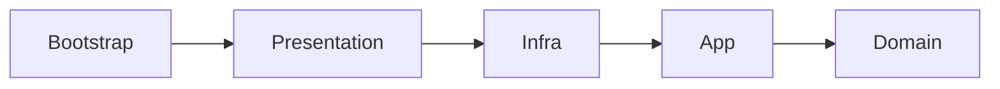
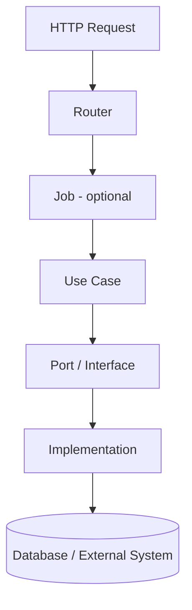

# Clean Architecture

Monstrino services are designed according to **Clean Architecture**
principles in order to keep business logic isolated, maintain clear
boundaries between layers, and support long-term platform evolution.

This approach is used deliberately across the platform because Monstrino
is intended to grow as an **enterprise-style system**, where
maintainability, scalability, and architectural consistency are more
important than short-term convenience.

The main goal is to ensure that future improvements to the platform do
not create structural problems or force large-scale rewrites.

------------------------------------------------------------------------

## Why Monstrino Uses Clean Architecture

As the number of services, pipelines, integrations, and internal
packages grows, architecture can easily become inconsistent.

Monstrino uses Clean Architecture to prevent that.

This architecture helps ensure that:

- domain logic remains isolated from infrastructure and frameworks
- service responsibilities stay clearly separated
- application logic can evolve without rewriting transport or
    persistence layers
- technical integrations do not leak into the domain
- platform-wide architectural rules remain consistent across services

In practice, this allows Monstrino services to stay easier to test,
easier to extend, and safer to refactor.

------------------------------------------------------------------------

## Service Layer Structure

Each Monstrino service contains the following layers inside its `src`
directory:

```text
src/
├── domain
├── app
├── infra
├── presentation
└── bootstrap
```

These layers are intentionally separated and have different
responsibilities.

------------------------------------------------------------------------

## Layer Responsibilities

### `domain`

The `domain` layer contains the pure business core of the service.

Typical contents include:

- domain entities
- domain dataclasses
- value objects
- enums
- business rules
- domain validation
- domain services
- orchestration rules that belong to the business model

The domain layer is the most protected layer in the service.

#### Rule

The `domain` layer **must not import anything from other service
folders**.

This means the domain stays independent from:

- infrastructure
- presentation
- bootstrap
- transport concerns
- framework details

------------------------------------------------------------------------

### `app`

The `app` layer contains the application logic that coordinates domain
behavior.

Typical contents include:

- use cases
- application services
- application-level interfaces
- service-specific ports
- orchestration of domain operations

In Monstrino, these components usually live in folders such as:

```text
app/use_cases
app/services
app/ports
app/interfaces
```

#### Rule

The `app` layer may import only:

- application-level packages
- the local `domain` layer

It must not depend directly on presentation or bootstrap concerns.

This keeps use cases focused on business execution rather than delivery
mechanisms.

------------------------------------------------------------------------

### `infra`

The `infra` layer contains technical implementations.

Typical contents include:

- repository implementations
- SQLAlchemy integrations
- HTTP clients
- Kafka / NATS integrations
- MinIO integrations
- schedulers
- logging
- tracing
- configuration adapters
- external service clients
- technical mappers and adapters

If an implementation is unique to a single service, it lives inside that
service's `infra` folder.

#### Rule

The `infra` layer may import almost anything needed for technical
implementation, but it must not import from:

-   `presentation`
-   `bootstrap`

------------------------------------------------------------------------

### `presentation`

The `presentation` layer exposes the service to the outside world.

Typical contents include:

-   API endpoints
-   route handlers
-   request parsing
-   response serialization
-   transport-specific adapters
-   presentation jobs that prepare use case execution

In some cases, a **Job** may exist between a router and a use case.\
This happens when additional setup is required before running the use
case.

Example flow:

```text
Router → Job → Use Case
```

------------------------------------------------------------------------

### `bootstrap`

The `bootstrap` layer is responsible for assembling the application.

Typical responsibilities include:

-   dependency wiring
-   container setup
-   application startup
-   configuration loading for runtime assembly
-   connecting implementations to interfaces

#### Rule

Because `bootstrap` is responsible for composition, it may import
anything needed to assemble the service.

It is the outermost layer and acts as the entry point for building the
running application.

------------------------------------------------------------------------

## Dependency Direction

Monstrino services use the following dependency direction:



------------------------------------------------------------------------

## Dependency Rules

### Domain rules

-   `domain` cannot import anything from other service folders

### Application rules

-   `app` may import only from application-level packages and the local
    `domain`

### Infrastructure rules

-   `infra` may import what it needs for technical implementation
-   `infra` must not import from `presentation`
-   `infra` must not import from `bootstrap`

### Bootstrap rules

-   `bootstrap` assembles the application
-   `bootstrap` may import from any layer as needed for wiring

------------------------------------------------------------------------

## Shared Packages and Clean Architecture

Clean Architecture in Monstrino is reinforced through internal shared
packages.

### Shared interfaces

If an interface is used in multiple services, it is placed in
`monstrino-core`.

Example:

-   `SchedulerPort`

### Service-specific interfaces

If an interface is unique to one service, it stays inside that service:

```text
app/ports
app/interfaces
```

------------------------------------------------------------------------

## Shared Implementations

If an implementation is reused across multiple services, it belongs in a
shared package.

| Concern | Shared Package |
| --- | --- |
| Repository implementations | `monstrino-repositories` |
| HTTP / external clients | `monstrino-infra` |
| API routers / middleware | `monstrino-api` |

If an implementation is service-specific, it stays in the service's
`infra` layer.

------------------------------------------------------------------------

## Request Flow

A typical Monstrino request flow looks like this:



------------------------------------------------------------------------

## What Counts as Domain Logic

In Monstrino, domain logic includes:

-   entities
-   dataclasses
-   value objects
-   business rules
-   domain validation
-   domain-oriented orchestration
-   domain services

------------------------------------------------------------------------

## What Counts as Infrastructure

Infrastructure includes:

-   SQLAlchemy
-   HTTP clients
-   Kafka
-   NATS
-   schedulers
-   MinIO
-   configuration loaders
-   logging
-   tracing
-   external API integrations

------------------------------------------------------------------------

## Summary

Monstrino applies Clean Architecture to ensure that:

-   domain logic is protected
-   application logic remains structured
-   infrastructure stays isolated
-   service assembly is explicit
-   shared packages reinforce architectural consistency

This architectural discipline allows Monstrino to evolve as a scalable
and maintainable enterprise-style platform.