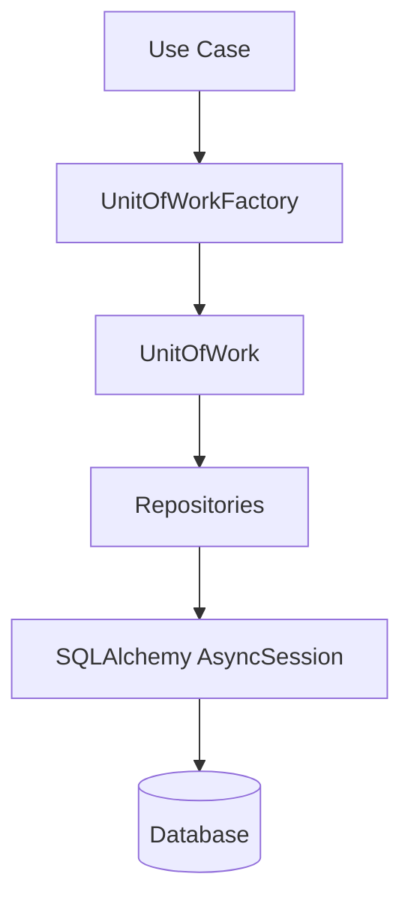

# Unit Of Work

Monstrino uses the **Unit Of Work** pattern to manage database transactions in a consistent and explicit way.

This pattern is a core part of the platform architecture because Monstrino aims to behave as an **enterprise-style system** where transactional safety, repository orchestration, and clear infrastructure boundaries are treated as first-class concerns.

In Monstrino, the Unit Of Work is not only a generic architectural idea.  
It is implemented as a reusable platform component and used consistently by application use cases.

---

## Why Monstrino Uses Unit Of Work

As the platform grows, services often need to coordinate multiple repository operations within a single transactional boundary.

Without a dedicated Unit Of Work layer, transaction handling tends to become:

- duplicated across use cases
- inconsistent between services
- tightly coupled to infrastructure details
- harder to test and reason about

Monstrino uses Unit Of Work to avoid that.

This gives the platform:

- transactional consistency
- explicit repository orchestration
- a clean separation between application logic and SQLAlchemy session management
- safer rollback behavior
- reusable transaction handling across services

---

## Architectural Role

In Monstrino, the Unit Of Work sits between the **application layer** and the **repository layer**.

A typical execution flow looks like this:



This means that application logic does not manage SQLAlchemy sessions directly.  
Instead, the use case works through a Unit Of Work abstraction.

---

## Placement in the Platform

Monstrino separates Unit Of Work contracts from Unit Of Work implementation.

### Interfaces

The shared interfaces live in `monstrino-core`.

Examples:

- `UnitOfWorkInterface`
- `UnitOfWorkFactoryInterface`

These abstractions allow use cases to depend on contracts instead of concrete SQLAlchemy implementation details.

### Implementation

The SQLAlchemy-based implementation lives in `monstrino-repositories`.

This is intentional because the Unit Of Work works directly with repositories and database session lifecycle.

---

## Implementation Overview

Monstrino uses a reusable implementation called `SqlAlchemyUnitOfWork`.

It is generic over the repository container type and is based on:

- `async_sessionmaker[AsyncSession]`
- a repository factory
- async context manager lifecycle
- automatic commit / rollback handling
- nested transaction savepoints

Its purpose is to create a fresh transactional context, initialize repositories for that transaction, and manage commit or rollback automatically.

---

## Factory-Based Creation

Use cases do not construct Unit Of Work instances manually.

Instead, each use case receives a `UnitOfWorkFactoryInterface` during initialization.

Typical application-level usage looks like this:

```python
async with self.uow_factory.create() as uow:
    ...
```

This design gives Monstrino several benefits:

- each use case gets a fresh Unit Of Work instance
- transaction scope stays explicit
- use cases do not need to know how sessions are created
- infrastructure wiring remains outside the application layer

---

## How Repositories Are Attached

Repositories are not stored globally and are not long-lived.

They are created for the active Unit Of Work when `uow_factory.create()` is called.

During bootstrap, Monstrino creates a repository builder that knows how to initialize repository implementations for a given SQLAlchemy session.

Typical setup includes:

- a mapper factory
- base SQLAlchemy repository adapters
- CRUD wrappers
- domain repository implementations

A `repo_factory` function is then passed into `UnitOfWorkFactory`, together with the SQLAlchemy async session factory.

This means that:

- repositories are created when a Unit Of Work starts
- repositories are tied to the active session
- repositories are discarded when the Unit Of Work finishes

This design keeps transaction scope and repository lifecycle aligned.

---

## Bootstrap Integration

The Unit Of Work is wired during the `bootstrap` phase of the service.

At bootstrap time, the service:

1. creates the async SQLAlchemy session factory
2. creates the repository builder
3. constructs `UnitOfWorkFactory`
4. injects that factory into use cases

This keeps application code free from infrastructure assembly concerns.

A typical use case therefore receives a dependency like this:

```python
uow_factory: UnitOfWorkFactoryInterface[Any, Repositories]
```

This is an important part of Monstrino's Clean Architecture approach:

- bootstrap assembles dependencies
- use cases receive abstractions
- infrastructure remains outside the application logic

---

## Transaction Lifecycle

The transaction lifecycle is managed by the Unit Of Work itself.

Monstrino uses `async with` context management to guarantee correct entry and exit behavior.

### On enter

When the Unit Of Work starts, it:

- creates a fresh `AsyncSession`
- initializes the repository container for that session
- exposes both the active session and repositories through the Unit Of Work object

### On exit

When the Unit Of Work exits, it checks the current transaction state and then decides how to finish.

Behavior is as follows:

| Condition | Action |
| --- | --- |
| No active transaction | Rollback |
| Exception occurred | Rollback |
| Successful exit | Commit |
| Always | Session closed in `finally` block |

This makes transaction completion centralized and consistent across services.

---

## Commit and Rollback Strategy

In Monstrino, `commit()` and `rollback()` are handled by the Unit Of Work itself.

Use cases do not need to manually commit transactions under normal circumstances.

This is important because it gives the platform:

- a single place for transaction-finalization rules
- consistent rollback behavior
- simpler application code
- reduced risk of partial transaction handling

Rollback is performed automatically on exception.

Commit is performed automatically when the Unit Of Work exits successfully.

Database-level errors are translated through repository-level error handling utilities before the final commit step completes.

---

## Savepoints

Monstrino's SQLAlchemy Unit Of Work also supports nested transaction savepoints.

Two helper context managers are available:

- `savepoint()`
- `savepoint_with_exception()`

These provide additional flexibility for more advanced transactional scenarios.

### `savepoint()`

Creates a nested transaction context using `begin_nested()`.

### `savepoint_with_exception()`

Creates a nested transaction and explicitly rolls back the nested transaction when an exception occurs, then re-raises the exception.

This is useful when a use case needs partial rollback behavior inside a larger transaction scope.

---

## Repository Access Pattern

Repositories are accessed through the Unit Of Work object, not injected independently into use cases.

Conceptually, the pattern looks like this:

```text
uow.repos.some_repository
```

This is an intentional design choice.

It ensures that repositories are always accessed within an explicit transactional boundary rather than being used as free-floating dependencies.

---

## Scope of a Unit Of Work

Monstrino uses **one Unit Of Work per main use case execution**.

That means:

- the use case receives a factory
- the use case creates a Unit Of Work when needed
- the Unit Of Work exists only for that execution scope
- repositories live only for that Unit Of Work scope

This design gives a clear and predictable lifecycle.

It also means that transaction boundaries are defined by application behavior, not by framework defaults.

---

## Read Operations

In Monstrino, all repository access goes through Unit Of Work.

There is no separate read-only path that bypasses the pattern.

This is a strict architectural choice.

It ensures that:

- all repository access follows the same abstraction
- transaction/session lifecycle stays consistent
- read and write behavior are handled through the same infrastructure boundary

---

## Relationship with Clean Architecture

The Unit Of Work pattern is one of the main ways Monstrino applies Clean Architecture in practice.

It supports Clean Architecture by ensuring that:

- use cases depend on interfaces from `monstrino-core`
- SQLAlchemy details stay in `monstrino-repositories`
- session management does not leak into application code
- dependency wiring stays in `bootstrap`
- repository lifecycle remains infrastructure-managed

This separation allows Monstrino services to stay maintainable even as repository count, database complexity, and service count continue to grow.

---

## Why This Matters for Monstrino

Monstrino is intended to evolve into a larger platform with multiple services, shared libraries, and increasingly complex data workflows.

In that environment, transaction handling cannot be left informal.

A reusable Unit Of Work implementation helps Monstrino:

- enforce transactional consistency across services
- keep use case code focused on business flow
- isolate persistence details from higher-level logic
- support more advanced transaction scenarios with savepoints
- strengthen the platform's enterprise-style architecture

This makes the Unit Of Work pattern one of the important building blocks of Monstrino's long-term maintainability.

---

## Summary

Monstrino uses Unit Of Work as a reusable transactional boundary for repository operations.

Key characteristics of the implementation are:

- interfaces live in `monstrino-core`
- SQLAlchemy implementation lives in `monstrino-repositories`
- use cases receive a factory, not a concrete implementation
- repositories are created when the Unit Of Work starts
- commit and rollback are handled by the Unit Of Work itself
- rollback happens automatically on exception
- savepoints are supported for nested transaction scenarios
- one Unit Of Work is used per main use case execution

This design keeps transaction handling explicit, reusable, and aligned with Monstrino's enterprise-style Clean Architecture approach.