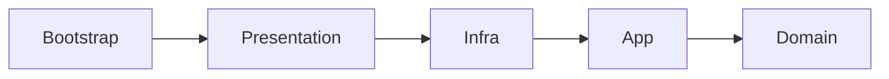
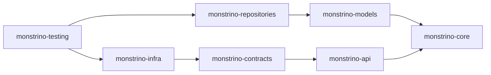

# Dependency Rules

Monstrino enforces strict dependency rules across both **service layers** and **shared platform packages**.

These rules are part of the platform architecture, not optional conventions.  
Their purpose is to prevent architectural drift, keep responsibilities isolated, and ensure that Monstrino can continue to evolve as an enterprise-style platform without accumulating unsafe cross-layer coupling.

---

## Why Dependency Rules Exist

As services and shared packages grow, unrestricted imports quickly lead to structural problems:

- business logic starts depending on infrastructure details
- transport concerns leak into application code
- repositories become tightly coupled to delivery layers
- package boundaries lose meaning
- refactoring becomes risky and expensive

Monstrino avoids this by defining explicit dependency rules and treating them as an architectural policy.

---

## Two Levels of Dependency Control

Dependency rules in Monstrino exist on two levels:

1. **within a service**
2. **between shared `monstrino-*` packages**

Both levels are important.

Service-layer rules protect the internal structure of each service.  
Package-level rules protect the overall platform architecture.

---

## Service Layer Dependency Rules

Each service follows the same internal layer structure:

```text
src/
├── app
├── bootstrap
├── domain
├── infra
└── presentation
```

These layers are not allowed to depend on each other arbitrarily.

---

## Allowed Dependency Direction

The practical dependency direction inside a service is:



This does not mean every layer must depend on every inner layer.  
It means outer layers may depend inward, while protected inner layers must remain isolated from outer technical concerns.

---

## Layer Rules

### `domain`

The `domain` layer is the most protected part of the service.

#### Allowed imports

- no imports from other service folders

#### Forbidden imports

- `app`
- `infra`
- `presentation`
- `bootstrap`

The domain must remain independent from transport, infrastructure, wiring, and framework details.

---

### `app`

The `app` layer contains use cases, services, ports, and application orchestration.

#### Allowed imports

- local `domain`
- `monstrino-core`
- `monstrino-models.dto`
- `monstrino-repositories.interfaces`

#### Forbidden imports

- `monstrino-infra`
- `monstrino-api`
- `monstrino-contracts`
- `monstrino-testing`
- local `infra`
- local `presentation`
- local `bootstrap`

This rule is especially important.  
Application logic may depend on shared abstractions and data shapes it needs to coordinate work, but it must not depend on infrastructure implementations or delivery-layer details.

---

### `infra`

The `infra` layer contains technical implementations.

#### Allowed imports

- local `app`
- local `domain`
- shared platform packages
- external libraries

#### Forbidden imports

- local `presentation`
- local `bootstrap`

Infrastructure is allowed to know about application and domain needs because it implements technical details for them.  
However, infrastructure must not depend on delivery-layer code or service assembly code.

---

### `presentation`

The `presentation` layer exposes the service to the outside world.

#### Allowed imports

- local `domain`
- local `app`

#### Forbidden imports

- local `infra`
- local `bootstrap`

This is a strict rule in Monstrino.

The presentation layer may coordinate requests and responses, but it must not pull infrastructure details into delivery code.  
This keeps transport logic thin and prevents route handlers from becoming infrastructure-aware.

---

### `bootstrap`

The `bootstrap` layer assembles the application.

#### Allowed imports

- any layer needed for wiring and startup

Because bootstrap is responsible for composition, it is intentionally allowed to import what it needs.

---

## Practical Examples Inside a Service

| Status | Dependency |
| --- | --- |
| Allowed | `presentation` → `app` |
| Allowed | `presentation` → `domain` |
| Allowed | `app` → `domain` |
| Allowed | `app` → `monstrino-core` |
| Allowed | `app` → `monstrino-models.dto` |
| Allowed | `app` → `monstrino-repositories.interfaces` |
| Allowed | `infra` → `app` |
| Allowed | `infra` → `domain` |
| Allowed | `bootstrap` → `presentation` |
| Allowed | `bootstrap` → `infra` |
| Allowed | `bootstrap` → `app` |
| **Forbidden** | `domain` → `app` |
| **Forbidden** | `domain` → `infra` |
| **Forbidden** | `domain` → `presentation` |
| **Forbidden** | `app` → `infra` |
| **Forbidden** | `app` → `monstrino-infra` |
| **Forbidden** | `app` → `monstrino-api` |
| **Forbidden** | `app` → `monstrino-contracts` |
| **Forbidden** | `presentation` → `infra` |
| **Forbidden** | `infra` → `presentation` |
| **Forbidden** | `infra` → `bootstrap` |

---

## Shared Package Dependency Rules

Monstrino also enforces strict boundaries between internal platform packages.

The dependency graph is:



Arrows indicate compile-time dependencies.

This means the arrow goes **from the package that depends** to **the package it depends on**.

Example:

```text
monstrino-repositories → monstrino-models
```

means that `monstrino-repositories` depends on `monstrino-models`.

---

## Package Rules

### `monstrino-core`

`monstrino-core` is the domain foundation package.

#### Allowed dependencies

- none of the other `monstrino-*` packages should be required by core

#### Forbidden dependencies

- `monstrino-models`
- `monstrino-repositories`
- `monstrino-infra`
- `monstrino-contracts`
- `monstrino-api`
- `monstrino-testing`

`monstrino-core` must remain the most stable and independent package in the platform.

---

### `monstrino-models`

`monstrino-models` contains ORM models and DTO-related persistence structures.

#### Allowed dependencies

- `monstrino-core`

#### Forbidden dependencies

- `monstrino-repositories`
- `monstrino-infra`
- `monstrino-contracts`
- `monstrino-api`
- `monstrino-testing`

---

### `monstrino-repositories`

`monstrino-repositories` contains repository implementations and repository interfaces.

#### Allowed dependencies

- `monstrino-models`

#### Forbidden dependencies

- `monstrino-infra`
- `monstrino-contracts`
- `monstrino-api`

`monstrino-repositories` must stay focused on persistence and repository concerns.

---

### `monstrino-infra`

`monstrino-infra` contains adapters, clients, scrapers, and auth/config-related infrastructure code.

#### Allowed dependencies

- `monstrino-contracts`

#### Forbidden dependencies

- `monstrino-models`
- `monstrino-repositories`
- `monstrino-api`

Infrastructure adapters must not depend on persistence packages or API-layer packages.

---

### `monstrino-contracts`

`monstrino-contracts` contains shared API contracts and schemas.

#### Allowed dependencies

- `monstrino-api`

#### Forbidden dependencies

- `monstrino-infra`
- `monstrino-models`
- `monstrino-repositories`
- `monstrino-testing`

Contracts must stay independent from infrastructure and persistence details.

---

### `monstrino-api`

`monstrino-api` contains the HTTP-layer shared utilities.

#### Allowed dependencies

- `monstrino-core`

#### Forbidden dependencies

- `monstrino-infra`
- `monstrino-models`
- `monstrino-repositories`
- `monstrino-testing`

The API package must not contain persistence logic or infrastructure-specific behavior.

---

### `monstrino-testing`

`monstrino-testing` is the only package allowed to import from anywhere it needs.

#### Allowed dependencies

- `monstrino-repositories`
- `monstrino-infra`
- and any other internal package required for testing

This is the explicit exception to normal dependency rules.

Because testing often needs to verify integration behavior across multiple layers, it is allowed to depend on packages that would otherwise remain isolated from each other.

---

## Special Boundary Rule

A particularly important Monstrino rule is the separation between:

- `monstrino-api`
- `monstrino-contracts`

and:

- `monstrino-infra`
- `monstrino-models`
- `monstrino-repositories`
- `monstrino-testing`

These package groups must not depend on each other in arbitrary ways.

In particular:

- `monstrino-api` must not import from `monstrino-infra`, `monstrino-models`, `monstrino-repositories`, or `monstrino-testing`
- `monstrino-contracts` must not import from `monstrino-infra`, `monstrino-models`, `monstrino-repositories`, or `monstrino-testing`
- the reverse direction is also forbidden, except for `monstrino-testing`, which may import anything

This rule helps preserve a clean separation between HTTP/contracts concerns and lower-level technical or persistence concerns.

---

## Practical Package Examples

| Status | Dependency |
| --- | --- |
| Allowed | `monstrino-models` → `monstrino-core` |
| Allowed | `monstrino-repositories` → `monstrino-models` |
| Allowed | `monstrino-infra` → `monstrino-contracts` |
| Allowed | `monstrino-contracts` → `monstrino-api` |
| Allowed | `monstrino-api` → `monstrino-core` |
| Allowed | `monstrino-testing` → `monstrino-repositories` |
| Allowed | `monstrino-testing` → `monstrino-infra` |
| **Forbidden** | `monstrino-core` → `monstrino-api` |
| **Forbidden** | `monstrino-core` → `monstrino-repositories` |
| **Forbidden** | `monstrino-api` → `monstrino-infra` |
| **Forbidden** | `monstrino-api` → `monstrino-models` |
| **Forbidden** | `monstrino-contracts` → `monstrino-repositories` |
| **Forbidden** | `monstrino-contracts` → `monstrino-infra` |
| **Forbidden** | `monstrino-infra` → `monstrino-repositories` |
| **Forbidden** | `monstrino-repositories` → `monstrino-api` |

---

## Architectural Intent

These rules are intentionally strict.

Monstrino is being built as an enterprise-style platform with multiple services, shared packages, and long-term architectural goals.  
That means package boundaries must remain enforceable and meaningful.

The purpose of these dependency rules is to ensure that:

- the domain remains protected
- application logic stays independent from implementations
- transport logic stays thin
- persistence concerns do not leak upward
- infrastructure remains controlled
- shared packages do not become an unstructured utility layer

---

## Summary

Monstrino uses strict dependency rules to protect both service-level architecture and package-level architecture.

Key principles are:

- `domain` is fully protected
- `app` depends only on approved abstractions and data shapes
- `presentation` depends only on `app` and `domain`
- `infra` may implement technical details but cannot depend on `presentation` or `bootstrap`
- `bootstrap` assembles everything
- shared packages follow explicit dependency boundaries
- `monstrino-testing` is the only intentional exception

These rules are a core part of how Monstrino prevents architectural drift and preserves long-term platform consistency.