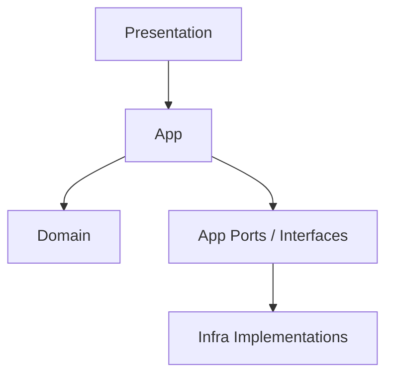
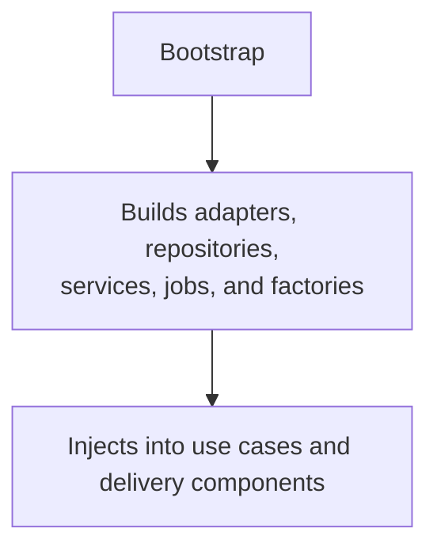

# Service Structure

Monstrino services follow a consistent internal structure designed to support Clean Architecture, strict dependency boundaries, and long-term maintainability.

This structure is intentionally standardized across services so that new services, new contributors, and future refactoring efforts all work within the same architectural model.

The goal is not only to keep code organized, but to make the internal role of each directory immediately clear.

---

## Why Service Structure Matters

In a platform with multiple services, architecture can quickly become inconsistent if each service evolves its own layout.

Monstrino avoids that by using a predictable service structure that:

- separates business logic from infrastructure
- makes application flow easier to understand
- keeps delivery concerns isolated
- supports shared architectural rules across services
- makes bootstrap and wiring explicit
- improves testability and long-term maintainability

This structure is one of the practical ways Monstrino applies Clean Architecture at the service level.

---

## Top-Level Service Layout

A typical Monstrino service contains the following top-level files and directories:

```text
.
├── Dockerfile
├── Makefile
├── README.md
├── pyproject.toml
├── pyproject.dev.toml
├── pytest.ini
├── uv.lock
├── src/
├── tests/
├── logs/
├── data/
└── additional local working directories
```

Not every service contains every auxiliary folder, but the overall structure remains similar.

The most important directories are:

- `src/` — production code
- `tests/` — automated tests
- `logs/` — local service logs
- `data/` or similar working folders — local development data and debugging artifacts

---

## The `src/` Directory

The `src/` directory contains the actual service implementation.

A typical structure looks like this:

```text
src/
├── app/
├── bootstrap/
├── domain/
├── infra/
├── presentation/
├── main.py
└── service-local supporting files
```

These folders represent the main architectural layers of the service.

---

## `domain/`

The `domain` folder contains the protected business core of the service.

Typical contents include:

- entities
- enums
- domain constants
- business-specific value objects
- domain rules

Example structure:

```text
domain/
├── entities/
└── enums/
```

This layer should remain independent from infrastructure, transport, and runtime assembly details.

It is the most stable part of the service and acts as the business foundation.

---

## `app/`

The `app` folder contains the application layer.

This is where business execution is coordinated.

Typical contents include:

- use cases
- application services
- ports
- interfaces
- commands
- jobs
- dispatchers
- gateways
- controllers

Example structure:

```text
app/
├── commands/
├── controllers/
├── dispatchers/
├── gateways/
├── interfaces/
├── jobs/
├── ports/
├── services/
└── use_cases/
```

### Typical Responsibilities

#### `use_cases/`

Contains main executable application scenarios.

Examples:

- parse flows
- authentication use cases
- publish flows
- entity-specific orchestration logic

This is usually the most important subfolder in the application layer.

#### `services/`

Contains reusable application-level coordination logic that does not belong directly inside a single use case.

#### `ports/`

Contains service-specific interfaces for external dependencies.

Examples may include:

- repository access contracts
- Kafka producer ports
- other technical abstractions required by the application layer

#### `interfaces/`

Contains service-level contracts and internal abstractions used by the application layer.

#### `commands/`

Contains command models used to represent application intent in an explicit structured way.

#### `jobs/`

Contains preparatory or executable jobs that may sit between transport-level triggers and use case execution.

In Monstrino, a job may prepare or configure a use case before the actual execution starts.

#### `dispatchers/`

Contains dispatching logic used to route application work to the correct domain-specific or scenario-specific execution path.

#### `gateways/`

Contains abstractions used by the application layer to communicate with other internal or external services without depending directly on infrastructure implementations.

---

## `infra/`

The `infra` folder contains technical implementations.

This is where the service interacts with real infrastructure and third-party systems.

Typical contents include:

- adapters
- config
- logging
- mappers
- parsers
- integration helpers

Example structure:

```text
infra/
├── adapters/
├── config/
├── logging/
├── mappers/
└── parsers/
```

### Typical Responsibilities

#### `adapters/`

Concrete implementations of ports defined in the application layer.

Examples:

- Kafka producer adapters
- external API adapters
- storage adapters
- queue adapters

#### `config/`

Infrastructure-specific runtime configuration.

Examples:

- Selenium configuration
- external client configuration
- environment-specific technical settings

#### `logging/`

Logging configuration and helper code.

Examples:

- JSON logging config
- Kubernetes-specific logging config
- logger setup helpers

#### `mappers/`

Translates technical or transport data into application-level models.

A common Monstrino pattern is mapping contracts into commands before use case execution.

#### `parsers/`

Technical parsing helpers and low-level parser implementations.

These are infrastructure concerns when they are tied to concrete input formats, external sources, or technical extraction logic.

---

## `presentation/`

The `presentation` folder contains the delivery layer of the service.

This is the external interface through which the service is exposed.

Typical contents include:

- API configuration
- dependency definitions
- CORS setup
- request schemas
- route handlers
- validators

Example structure:

```text
presentation/
├── api/
│   ├── deps/
│   ├── requests/
│   ├── routes/
│   └── validators/
├── api_config.py
├── app_config.py
├── cors.py
└── deps.py
```

### Typical Responsibilities

#### `api/routes/`

Defines HTTP routes and route handlers.

#### `api/requests/`

Contains transport request models and request parsing structures.

#### `api/validators/`

Contains request-level validation related to delivery concerns.

#### `api/deps/` and `deps.py`

Contains dependency providers used by the delivery layer.

#### `api_config.py` and `app_config.py`

Contain runtime configuration for exposing the service through HTTP.

The presentation layer must remain focused on transport concerns and should stay thin.

---

## `bootstrap/`

The `bootstrap` folder is responsible for assembling the application.

It is one of the most important structural parts of a Monstrino service because it makes dependency wiring explicit.

Typical contents include:

- builders
- configs
- container components
- dependency container setup
- wiring code

Example structure:

```text
bootstrap/
├── builders/
├── configs/
├── container_components/
├── container.py
└── wiring.py
```

### Typical Responsibilities

#### `builders/`

Contains factory and builder logic used to assemble application dependencies.

Examples:

- repository builders
- scheduler builders
- adapter builders
- service builders
- Unit Of Work factory builders
- validator builders
- job builders

This folder is especially important in Monstrino because service composition is explicit and layered.

#### `configs/`

Contains bootstrap-time configuration registry and startup-related configuration wiring.

#### `container_components/`

Contains grouped components prepared for dependency injection or container registration.

#### `container.py`

Defines the dependency container structure for the service.

#### `wiring.py`

Contains the actual assembly logic that connects built components, interfaces, and runtime configuration.

---

## `main.py`

`main.py` is typically the service entry point.

Its role is usually to:

- initialize bootstrap
- create the application
- connect runtime startup logic
- start the service process

It should remain relatively thin and delegate composition to `bootstrap`.

---

## Additional Directories Inside `src/`

Some services also contain additional local folders or files under `src/`, depending on service purpose.

Examples from existing Monstrino services include:

- `logs/` — local log files during development
- `data/` — local input or debug data
- `test.py` / `test.json` — temporary local service-level testing artifacts

These files may exist during development, but they are not part of the core architectural layers.

The main architectural structure is always centered around:

- `app`
- `bootstrap`
- `domain`
- `infra`
- `presentation`

---

## The `tests/` Directory

Monstrino services keep tests in a dedicated `tests/` directory.

A typical layout looks like this:

```text
tests/
├── conftest.py
├── fixtures/
├── files/
├── integration/
└── test support modules
```

### Typical Responsibilities

#### `conftest.py`

Shared pytest setup for the service.

#### `fixtures/`

Reusable test fixtures.

Examples:

- adapter fixtures
- registry fixtures
- mock dependency setup

#### `files/`

Static test input data.

Examples:

- JSON payloads
- HTML samples
- source-specific fixture files

This is especially useful in services that parse external data sources.

#### `integration/`

Integration test suites organized by concern.

Examples:

- parser integration tests
- adapter integration tests
- use case integration tests

This structure keeps test scenarios aligned with real service behavior.

---

## Supporting Top-Level Files

### `Dockerfile`

Defines the container image build for the service.

### `Makefile`

Provides common development and deployment commands.

### `pyproject.toml`

Defines Python package metadata and runtime dependencies.

### `pyproject.dev.toml`

Contains development-specific configuration when used.

### `pytest.ini`

Defines pytest behavior and test settings.

### `README.md`

Documents the service for developers.

### `uv.lock`

Locks dependency resolution for reproducible builds.

These files support the service lifecycle but are not part of the internal architecture itself.

---

## Architectural Interpretation

The service structure is not only organizational.  
It directly reflects Monstrino's architectural model.

### Mapping Between Structure and Architecture

| Directory | Architectural Role |
| --- | --- |
| `domain/` | Business core |
| `app/` | Application orchestration |
| `infra/` | Technical implementation |
| `presentation/` | Delivery layer |
| `bootstrap/` | Composition and wiring |
| `tests/` | Verification and safety layer |

This means the tree itself communicates architecture.

A developer can often understand how a Monstrino service works just by reading its directory structure.

---

## Practical Flow Through the Structure

A typical request or execution flow across the service structure looks like this:



At startup and assembly time, `bootstrap` connects all required pieces:



This separation is one of the key reasons Monstrino services remain understandable even when they contain many moving parts.

---

## Why This Structure Works Well for Monstrino

Monstrino services often include:

- parsing flows
- API endpoints
- infrastructure adapters
- external integrations
- schedulers
- repositories
- transaction management
- domain-specific orchestration

Without a strict service structure, these concerns would quickly become mixed.

The current structure works well because it:

- protects the business layer
- keeps transport code thin
- isolates infrastructure code
- makes dependency wiring explicit
- supports reusable patterns across services
- fits naturally with shared `monstrino-*` packages

---

## Summary

Monstrino uses a standardized service structure to make architecture visible and enforceable.

The core structure is:

```text
src/
├── app/
├── bootstrap/
├── domain/
├── infra/
└── presentation/
```

Around this core, each service also includes supporting files such as tests, configuration, containerization, and local working artifacts.

This structure helps Monstrino remain consistent, scalable, and maintainable as the platform continues to grow.