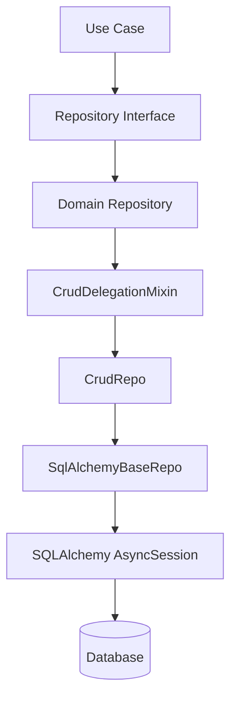
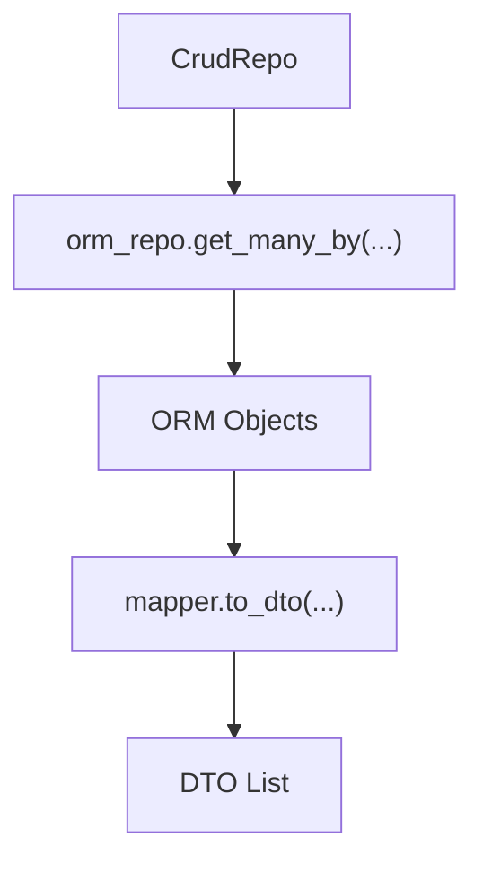
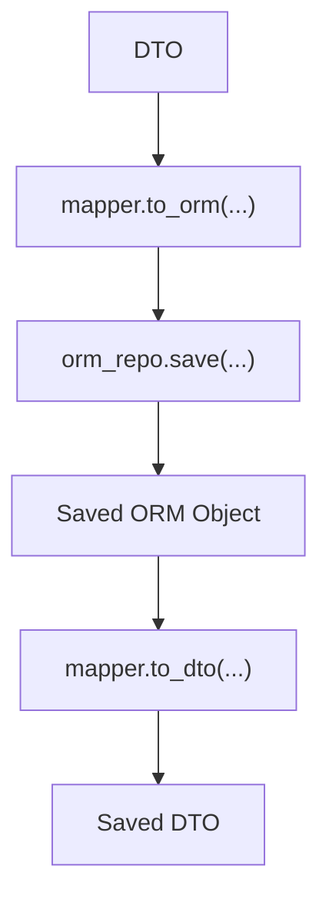
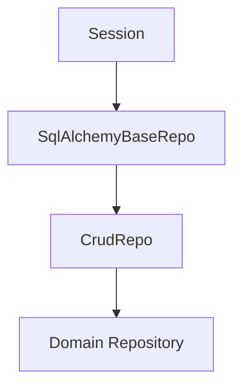
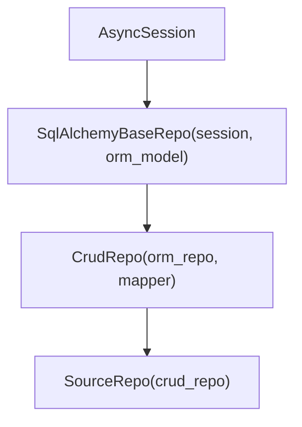
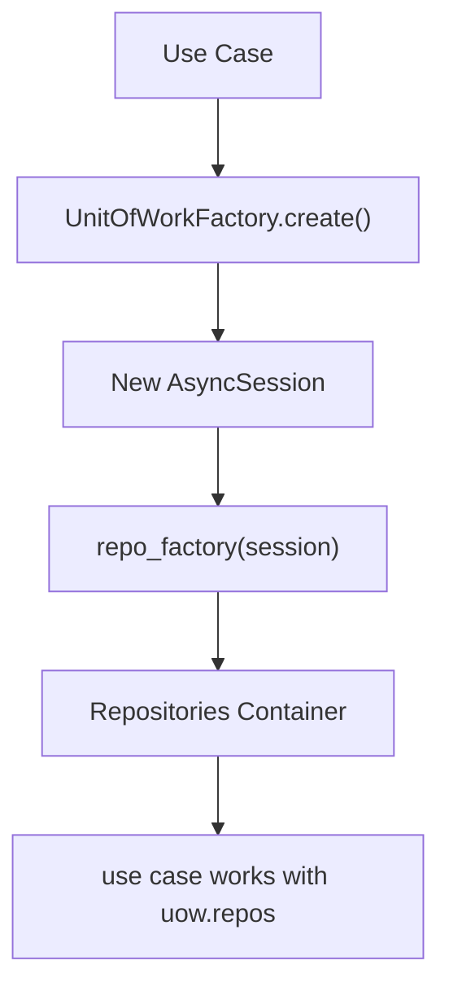
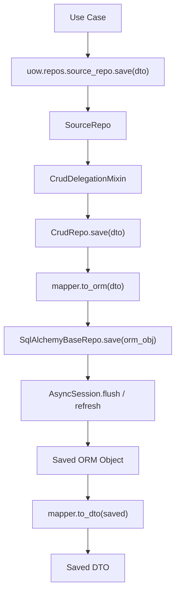
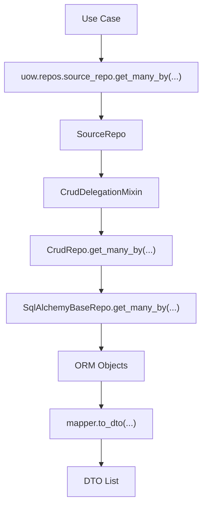

# Repositories

Monstrino uses a layered repository architecture that separates:

- application-facing repository contracts
- DTO-oriented CRUD behavior
- low-level ORM persistence
- mapping between ORM models and DTOs
- repository creation and assembly
- transactional orchestration through Unit Of Work

This design is intentionally structured to support Clean Architecture, repository reuse, strict dependency boundaries, and enterprise-style maintainability.

Rather than allowing use cases to work directly with SQLAlchemy or raw ORM repositories, Monstrino introduces multiple repository layers with clearly separated responsibilities.

---

## Why Monstrino Uses a Layered Repository Structure

In many codebases, repositories become too heavy because they mix multiple concerns:

- SQLAlchemy session handling
- ORM query construction
- DTO mapping
- application-facing contracts
- entity-specific repository logic
- transaction management

Monstrino avoids that by splitting the data-access layer into explicit layers.

This gives the platform:

- reusable CRUD behavior
- a stable application-facing repository interface
- clean isolation of SQLAlchemy-specific code
- mapper-based DTO/ORM conversion
- easy creation of domain repositories
- predictable integration with Unit Of Work

---

## Repository Architecture Overview

At a high level, the Monstrino repository stack looks like this:



Mapping is handled inside `CrudRepo`:


Repository construction is handled through `SqlAlchemyRepoFactory`, and repository lifetime is coordinated by Unit Of Work.

---

## Main Layers of the Repository System

Monstrino repositories are built from several layers.

### 1. Application-facing repository interfaces

These define the contracts visible to the application layer.

Example:

```python
class SourceRepoInterface(
    CrudRepoInterface[Source],
    Protocol
):
    ...
```

This means a concrete repository such as `SourceRepoInterface` inherits the full CRUD contract while remaining typed for a specific DTO or domain object.

These interfaces are designed for application use.

They work with:

- DTOs
- domain objects
- application-level filters
- typed repository methods

They do **not** expose SQLAlchemy internals.

---

### 2. Generic CRUD application contract

The common CRUD contract is defined through `CrudRepoInterface[DtoT]`.

Its purpose is to provide a DTO-facing repository API that contains:

- statement execution helpers
- read operations
- count operations
- save/update/delete operations
- existence checks
- batch operations
- filtered queries
- range filters
- ordering support

A key design rule in Monstrino is stated directly in this interface:

Application-level repository interface. Works exclusively with DTOs or domain objects. Contains no SQLAlchemy, no ORM, no infrastructure imports.

That is one of the core architectural properties of the repository layer.

---

## `CrudRepoInterface`

`CrudRepoInterface` is the generic contract that application-facing repositories inherit from.

It includes several categories of methods.

### Statement-based utility methods

Examples:

- `execute_stmt`
- `execute_stmt_one_or_none`
- `execute_stmt_all_scalars`
- `execute_stmt_one_scalar`
- `execute_stmt_all_rows`
- `execute_stmt_all_mappings`
- `execute_stmt_exec`

These methods expose controlled low-level execution capabilities while still keeping repository access inside the repository abstraction.

### Read operations

Examples:

- `get_all`
- `get_one_by`
- `get_one_by_or_raise`
- `get_many_by`
- `get_many_by_or_raise`
- `get_batch_by`
- `get_batch_by_or_raise`
- `get_id_by`
- `get_ids_by`
- `get_one_by_id`
- `exists_by`

### Count operations

Examples:

- `count_by`
- `count_all`

### Write operations

Examples:

- `save`
- `save_many`
- `update`
- `delete_by_id`
- `delete_by`

This contract gives all domain repositories a consistent behavior surface.

---

## Domain Repositories

A concrete repository such as `SourceRepo` represents a domain-specific repository implementation.

Example structure:

```python
class SourceRepo(
    CrudDelegationMixin[Source],
    SourceRepoInterface,
):
    ENTITY_NAME = "Source"

    def __init__(self, crud_repo: CrudRepo[SourceORM, Source]):
        self.crud = crud_repo
```

This is a very important Monstrino pattern.

A domain repository:

- is typed for a concrete DTO/domain object
- implements a concrete repository interface
- inherits generic CRUD behavior through delegation
- can later be extended with entity-specific methods if needed

This keeps domain repositories small, explicit, and easy to maintain.

---

## `CrudDelegationMixin`

`CrudDelegationMixin` is the layer that forwards CRUD operations to the underlying generic `CrudRepo`.

Its purpose is simple but important:

- avoid repeating the same CRUD method bodies in every domain repository
- preserve a typed domain repository class
- keep repository implementations thin
- allow domain repositories to add custom methods only when needed

In practice, this mixin delegates methods such as:

- `get_all`
- `get_one_by`
- `get_many_by`
- `get_batch_by`
- `get_id_by`
- `save`
- `save_many`
- `update`
- `delete_by_id`
- `delete_by`
- `exists_by`

This means that most domain repositories in Monstrino can remain extremely
 small while still exposing a rich repository API.

### Why this matters

Without the delegation mixin, each concrete repository would need to manually
 re-implement a large amount of repetitive forwarding logic.

With the mixin, Monstrino keeps repository inheritance compact and consistent.

---

## `CrudRepo`

`CrudRepo[OrmT, DtoT]` is the middle layer between:

- low-level ORM repository operations
- mapper-based conversion
- DTO-facing repository behavior

Its role is described directly in the code:

Infrastructure-level adapter between BaseRepoInterface (ORM driver), AutoMapper
(DTO \<> ORM conversion), and DTO-facing repository interface
(CrudRepoInterface). Nothing here uses SQLAlchemy directly.

That is the key architectural idea.

### Responsibilities of `CrudRepo`

`CrudRepo` is responsible for:

- calling the low-level ORM repository
- mapping ORM objects to DTOs
- mapping DTOs to ORM objects
- validating fields before filtered operations
- raising repository-level not-found behavior where needed
- exposing CRUD operations in a DTO-oriented form

### Read flow inside `CrudRepo`

A typical read operation looks like this:



### Write flow inside `CrudRepo`

A typical save operation looks like this:



This is one of the most important boundaries in the Monstrino data layer.

It ensures that the application-facing repository behavior is DTO-based while persistence remains ORM-based.

---

## Error and Validation Behavior in `CrudRepo`

`CrudRepo` also adds repository-level behavior that is not purely a raw persistence concern.

Examples include:

- field validation before applying filters
- converting empty results into `EntityNotFoundError` in `*_or_raise` methods

This means `CrudRepo` is not just a thin pass-through layer.  
It is the place where generic repository semantics are enforced for DTO-oriented application use.

---

## `SqlAlchemyBaseRepo`

`SqlAlchemyBaseRepo` is the lowest-level repository implementation in the Monstrino repository stack.

It directly uses:

- `AsyncSession`
- SQLAlchemy statements
- ORM models

Its responsibility is intentionally narrow.

It handles:

- low-level read/write operations
- SQLAlchemy statement execution
- update/delete/insert behavior
- count queries
- existence checks
- range filter application
- SQLAlchemy-level error translation
- field validation at the ORM model level

The code explicitly describes this role:

SQLAlchemy-based implementation of BaseRepoInterface. Responsibilities: low-level read/write operations, no DTO logic here, no domain logic, directly uses AsyncSession.

That is exactly how it is used in Monstrino.

---

## Responsibilities of `SqlAlchemyBaseRepo`

### Statement execution

It provides low-level helpers such as:

- `execute_stmt_all_scalars`
- `execute_stmt_one_scalar`
- `execute_stmt_one_or_none_scalar`
- `execute_stmt_all_rows`
- `execute_stmt_one_row`
- `execute_stmt_all_mappings`
- `execute_stmt_exec`

These methods are useful when repository code needs explicit statement-level behavior.

### Read operations

Examples:

- `get_all`
- `get_one_by`
- `get_many_by`
- `get_batch_by`
- `get_id_by`
- `get_ids_by`
- `exists_by`

### Count operations

Examples:

- `count_by`
- `count_all`

### Write operations

Examples:

- `save`
- `save_many`
- `update`
- `insert`
- `bulk_insert`
- `delete_by`
- `soft_delete`

### Utility behavior

Examples:

- `validate_fields`
- `apply_range_filters`
- `infer_entity_name`

This class is the SQLAlchemy execution engine of the repository system.

---

## Mapper Role

Mapping between ORM and DTO objects is handled through `AutoMapper`, created by `MapperFactory`.

This is a major architectural decision.

It means that persistence and application-facing objects remain separated.

The mapper is used in `CrudRepo` for:

- `to_dto`
- `to_orm`

This creates a clean transformation boundary:


This prevents the application layer from becoming ORM-aware and prevents low-level repositories from needing to understand application-facing DTO semantics.

---

## Repository Factory

Monstrino uses `SqlAlchemyRepoFactory` to build repositories in a consistent way.

Example:

```python
class SqlAlchemyRepoFactory:
    def __init__(self, mapper_factory: MapperFactory):
        self._mapper_factory = mapper_factory

    def create_crud(self, session, orm_model, dto_model):
        mapper = self._mapper_factory.create(dto_model, orm_model)
        orm_repo = SqlAlchemyBaseRepo(session=session, model=orm_model)
        return CrudRepo(orm_repo=orm_repo, mapper=mapper)

    def create_domain_repo(self, repo_impl_cls, session, orm_model, dto_model):
        crud = self.create_crud(session, orm_model, dto_model)
        return repo_impl_cls(crud)
```

### What the factory does

The factory assembles the repository chain automatically:



This is important because it centralizes repository construction logic.

Without this factory, every service would need to manually repeat:

- mapper creation
- ORM repo creation
- CRUD repo creation
- domain repo construction

The factory makes repository creation standardized and reusable.

---

## How a Concrete Repository Is Built

A typical concrete domain repository is assembled like this:



This gives Monstrino a repeatable and scalable pattern for adding new repositories.

To add a new repository, the service typically only needs:

- ORM model
- DTO model
- mapper registration
- concrete repository interface
- concrete repository class

The rest of the behavior is inherited from the generic repository stack.

---

## Integration with Unit Of Work

Repository lifetime is not managed globally.  
It is tied to Unit Of Work.

The flow is:



This means repositories are:

- created for the active transaction
- bound to the active session
- destroyed when the Unit Of Work ends

This is one of the key strengths of the Monstrino design.

It ensures that repository lifetime, session lifetime, and transaction lifetime are aligned.

---

## Repository Container Pattern

Inside a Unit Of Work, repositories are grouped into a repositories container.

Conceptually, the use case works with:

```text
uow.repos.source_repo
uow.repos.release_repo
uow.repos.series_repo
...
```

This makes repository access explicit and transaction-scoped.

It also keeps repository construction outside the use case while still allowing use cases to work with a fully typed repository set.

---

## Practical Flow Through the Repository Stack

A typical save flow looks like this:



A typical read flow looks like this:



These flows show how Monstrino keeps application-facing repository behavior clean while still using SQLAlchemy efficiently underneath.

---

## Why This Design Works Well

This repository structure works well in Monstrino because it gives each layer one job.

| Component | Responsibility |
| --- | --- |
| `CrudRepoInterface` | Defines the application-facing repository contract |
| Domain repository classes | Provide typed, entity-specific repository entry points |
| `CrudDelegationMixin` | Removes repetitive CRUD forwarding code |
| `CrudRepo` | Transforms between ORM and DTO layers and applies generic repository semantics |
| `SqlAlchemyBaseRepo` | Performs actual persistence work with SQLAlchemy |
| `SqlAlchemyRepoFactory` | Assembles the repository stack consistently |
| Unit Of Work | Controls repository lifetime and transaction boundaries |

Together, these parts create a repository architecture that is:

- reusable
- strongly structured
- easy to extend
- transaction-aware
- compatible with Clean Architecture
- suitable for large platform growth

---

## Architectural Benefits

Monstrino's repository architecture provides several important benefits.

| Benefit | Description |
| --- | --- |
| Clean separation of concerns | Each layer has a specific responsibility |
| Reusable CRUD behavior | Most CRUD logic is implemented once and reused everywhere |
| Strong typing | Concrete repositories remain typed for their DTO/domain objects |
| ORM isolation | Application code does not need direct SQLAlchemy access |
| Mapper-based boundary | DTO and ORM concerns remain separated |
| Consistent repository construction | The factory pattern ensures predictable repository assembly |
| Transaction alignment | Repositories are created and destroyed within Unit Of Work scope |

These properties make the repository layer suitable for a growing enterprise-style platform.

---

## Summary

Monstrino uses a layered repository structure built around:

- `CrudRepoInterface`
- concrete repository interfaces such as `SourceRepoInterface`
- concrete domain repositories such as `SourceRepo`
- `CrudDelegationMixin`
- `CrudRepo`
- `SqlAlchemyBaseRepo`
- `SqlAlchemyRepoFactory`
- Unit Of Work integration

At a practical level, this means:

- the application layer talks to typed repository contracts
- domain repositories remain thin
- CRUD behavior is delegated and reused
- ORM operations are isolated in a low-level base repository
- mapping between ORM and DTO is explicit
- repository creation is centralized
- transaction lifetime is controlled through Unit Of Work

This repository architecture is one of the important building blocks of Monstrino's enterprise-style data-access layer.