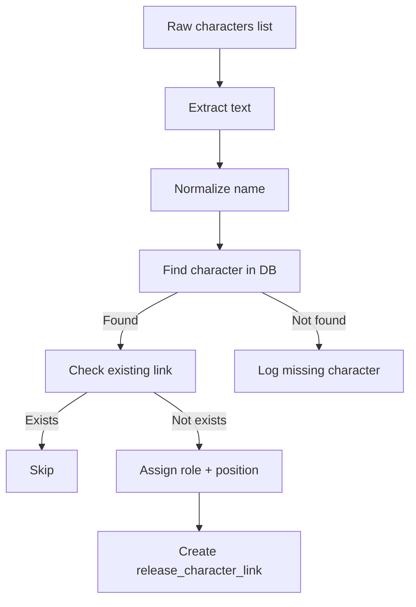

:::info
`CharacterResolverService` is responsible for mapping **parsed character data** to existing domain characters and creating relational records in `release_character_link`.
:::

## Purpose

`CharacterResolverService` resolves character references extracted from a `ParsedRelease`
and links them to existing `character` records in the database.  
It assigns a **MAIN** role to the first character and **SECONDARY** roles to
all subsequent ones.

The service writes the resulting links into `release_character_link`.

## Context and Dependencies

### Depends on

- `TitleFormatter` — normalizes the incoming character name.
- `UnitOfWorkInterface` — provides access to repositories.
- `character_role` repository — retrieves role IDs (MAIN / SECONDARY).
- `character` repository — verifies the existence of characters in the DB.
- `release_character_link` repository — checks and writes release–character relations.
- `CharacterDataInvalidError` — raised for invalid raw input.

## Input specification

### Method signature

```python
async def resolve(
        self,
        uow: UnitOfWorkInterface[Any, Repositories],
        release_id: int,
        characters: list

) -> None:
```

### Params

<!-- markdownlint-disable MD013 -->
| Name | Type | Description |
|------|------|-------------|
| `uow` | `UnitOfWorkInterface` | Provides access to repositories and transactional scope. |
| `release_id` | `int` | The release to which characters will be linked. |
| `characters` | `list` | Parsed character objects (typically containing `"text"`). |

`characters`:

```json
["Draculaura", "Frankie Stein"]
```

### Validation rules

- `characters` may be an empty list
- Each element must contain a valid string field
- Not string element -> CharacterDataInvalidError
- Names are normalized via [TitleFormatter](/docs/architecture/domain/services/name-formatter.md)

## Execution Flow

1. **Pre-check**  
Validate that `characters` list is not null.

2. **Load role IDs**  
Retrieves IDs for `CharacterRole.MAIN` and `CharacterRole.SECONDARY`

3. **Iterate through characters**  

4. **Normalize name**  
        Normalize name with `TitleFormatter.to_code()`

5. **Find character ID**  
        Get `character_id` from DB by `name` field

6. **If character_id not found**  
        raise Exception

7. **if character_id found**  
        Check if it is the first character for release

8. **If character first in release**  
        Set role = `CharacterRole.MAIN`

9. **If character not first in release**  
        Set role = `CharacterRole.SECONDARY`

10. **Save ReleaseCharacterLink**  
        Create entity ReleaseCharacterLink and save it threw repository
        ```python
        ReleaseCharacterLink(
                release_id=release_id,
                character_id=character_id,
                role_id=role_id,
                position=character_count,
        )
        ```

### Mermaid diagram



---

## Error Handling

### [CharacterDataInvalidError]()

### Logged but not raised

- Character provided in parsed data but not found in DB

---

## Logging

## Example usage

```python
service = CharacterResolverService()

async with uow_factory.create() as uow:
    await service.resolve(
        uow=uow,
        release_id=10,
        characters=[
            "Frankie Stein",
            "Draculaura"
        ]
    )
```

It will create two `ReleaseCharacterLink` records:

| release_id | character_id | role_id | position |
|------------|--------------|---------|----------|
| 10         | 1            | MAIN    | 0        |
| 10         | 2            | SECONDARY| 1       |

---

## What to Test

### ✔ Role Assignment

- First → MAIN  
- Others → SECONDARY  

### ✔ Correct Link Creation

- `release_character_link` is populated correctly  
- Positions increase sequentially

### ✔ Duplicate Protection

- Existing link is skipped  
- No duplicate insertions

### ✔ Missing Characters

- Logged properly  
- Does not break execution

### ✔ Invalid Data

- Missing `text` → raises `CharacterDataInvalidError`

---

## Future Extensions

A TODO exists in the code:

- Add event to generate new character when it appears in parsing data but does not exist in DB.

---
