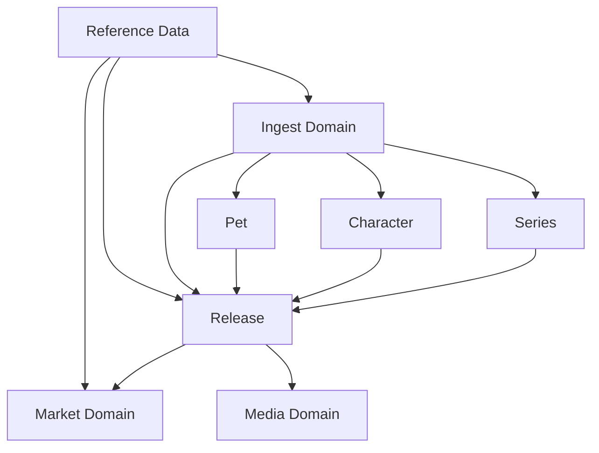

# Domain Overview

Monstrino is centered around a **canonical collectible catalog** that is enriched from external sources, extended with market data, and linked to a reusable media system.

This section documents the main domain areas and how they fit together.

---

## Domain Areas

### Catalog
The catalog domain contains the canonical business entities that users interact with most often:

- `Release`
- `Series`
- `Character`
- `Pet`
- catalog reference data such as release types, relation types, exclusive vendors, and character roles

The catalog is the stable, cleaned, user-facing representation of Monster High entities.

### Market
The market domain records where a release appears in real stores or marketplaces and how its price changes over time.

It contains:

- `ReleaseMarketLink`
- `MarketProductPriceObservation`
- `ReleaseMsrp`
- `ReleaseMsrpSource`

### Media
The media domain stores reusable media assets independently from any one business entity.

It contains:

- `MediaAsset`
- `MediaAttachment`
- `MediaAssetVariant`
- `MediaIngestionJob`

This separation allows one storage model to serve releases, characters, pets, admin uploads, parsed assets, and future user content.

### Ingest
The ingest domain is the raw and semi-structured staging layer between external sources and the canonical catalog.

It contains:

- `ParsedRelease`
- `ParsedCharacter`
- `ParsedSeries`
- `ParsedPet`

These entities are intentionally less stable than canonical catalog entities.

### Reference Data
Reference data supports multiple domain areas and standardizes identifiers, country metadata, currencies, and source definitions.

It contains:

- `Source`
- `SourceCountry`
- `GeoCountry`
- `MoneyCurrency`
- `SourceType`
- `SourceTechType`

---

## Architectural Intent

:::note Key Design Rules
1. **Canonical entities are separate from parsed entities.** Raw source data is not treated as trusted business truth.
2. **Media is reusable infrastructure-backed domain data**, not just release image URLs.
3. **Market data is historical and append-oriented.** Price observations should not overwrite past observations.
4. **Reference data is explicit.** Codes, countries, currencies, source types, and relation types are modeled instead of being hardcoded across services.
5. **Relationships are first-class.** Releases are connected to series, characters, pets, market listings, sources, and media through dedicated link models.
:::

---

## High-Level Domain Map

---

## Design Summary

| Domain | Answers the question |
|---|---|
| **Catalog** | What is the thing? |
| **Ingest** | Where did the information come from and what was parsed? |
| **Market** | Where is the thing sold and for how much? |
| **Media** | Which assets represent the thing? |
| **Reference data** | Which codes and classifications are valid? |

---

## Recommended Reading Order

1. [Catalog Domain](./catalog-domain)
2. [Release Model](./release-model)
3. [Series Model](./series-model)
4. [Character and Pet Model](./character-and-pet-model)
5. [Release Relationships](./release-relationships)
6. [Market Model](./market-model)
7. [Media Model](./media-model)
8. [Ingest Model](./ingest-model)
9. [Reference Data](./reference-data)
10. [Value Objects and Enums](./value-objects-and-enums)
11. [Processing and Scheduling](./processing-and-scheduling)
