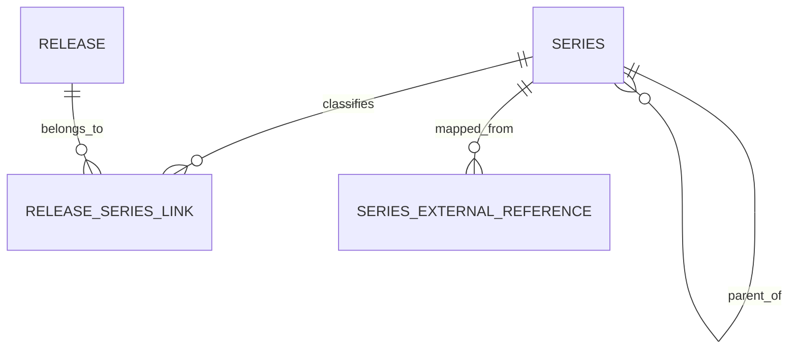

# Series Model

`Series` provides the **hierarchical taxonomy** used to organize releases into lines, sublines, and waves.

---

## Core DTO

| Field | Description |
|---|---|
| `id` | internal identifier |
| `title` | display name |
| `description` | optional description |
| `series_type` | classification type |
| `primary_image` | representative image reference |
| `parent_id` | optional parent series (enables hierarchy) |
| `code` | internal platform code |
| `slug` | URL-friendly identifier |
| `created_at` / `updated_at` | timestamps |

---

## Hierarchy

The presence of `parent_id` makes the series model hierarchical.

Typical structures:

```
line
├── subline
│   └── wave
└── wave
```

This allows Monstrino to model both broad franchise lines and more granular campaign structures.

---

## Series Kinds and Value Objects

The DTO uses `series_type`, while value objects define richer distinctions:

| Value Object | Values |
|---|---|
| `SeriesKind` | `line`, `subline`, `wave` |
| Series relation types | `primary`, `secondary` |

Documenting these separately keeps the core entity stable while allowing classification rules to evolve.

---

## Release Membership

A release connects to a series through `ReleaseSeriesLink`:

| Field | Description |
|---|---|
| `release_id` | the release |
| `series_id` | the series |
| `relation_type` | semantics of the membership - primary or secondary |

:::tip
Membership **can have semantics**, not just containment. A release may belong primarily to one series and secondarily to another - both are explicit.
:::

---

## Diagram



---

## Modeling Rules

| Rule | Rationale |
|---|---|
| **Series is a taxonomy entity** | not a release variant - it classifies, not describes |
| **Hierarchy is optional** | top-level lines remain valid as standalone objects |
| **Membership metadata belongs on the link** | primary vs secondary stored on `ReleaseSeriesLink`, not inferred from order |

---

## Recommended Usage

Use `Series` when the platform needs to answer:

- Which line does this release belong to?
- Which releases are part of this wave?
- Is this release in more than one series context?
- What is the display hierarchy for catalog navigation?

---

## Future-Friendly Extensions

This model is ready to support:

- breadcrumbs and faceted navigation
- series landing pages
- fan-facing grouping by era or generation
- editorial tags layered on top of core series hierarchy

---

## Related Pages

- [Release Model](./release-model)
- [Release Relationships](./release-relationships)
