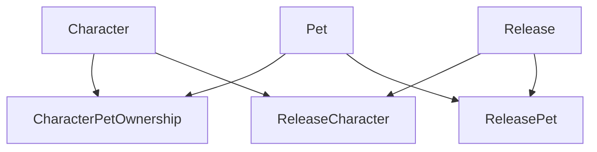

# Character and Pet Model

Monstrino separates **canonical identity** from **release-specific appearance**.

This is one of the most important modeling decisions in the catalog domain.

---

## Character

The canonical `Character` model contains **identity-level information** - what is always true about a character regardless of which release it appears in.

| Field | Description |
|---|---|
| `id` | internal identifier |
| `title` | canonical character name |
| `gender` | character gender |
| `description` | canonical description |
| `primary_image` | representative image reference |
| `slug` | URL-friendly identifier |
| `code` | internal platform code |
| `alt_names` | alternative or source-specific names |
| `notes` | editorial notes |

A character exists independently from any one release.

---

## Pet

The canonical `Pet` model is a **first-class entity**, not a text field attached to a character or release.

| Field | Description |
|---|---|
| `id` | internal identifier |
| `title` | canonical pet name |
| `description` | canonical description |
| `primary_image` | representative image reference |
| `code` | internal platform code |
| `slug` | URL-friendly identifier |

---

## Character-to-Pet Ownership

`CharacterPetOwnership` links a canonical character to a canonical pet.

This answers:
- Which pet belongs to this character canonically?
- Which pets are associated with this character across the platform?

---

## Release-Specific Representation

### ReleaseCharacter
When a character appears in a release, that appearance is modeled through `ReleaseCharacter`.

This link carries **release-specific** information:

| Field | Description |
|---|---|
| `role_id` | character's role in this release |
| `position` | packaging position |
| `is_uniq_to_release` | whether this variant is exclusive to this release |
| body, face, hair fields | styling variant details |
| `articulation` | articulation level |
| notes and description | release-specific editorial fields |

### ReleasePet
When a pet appears in a release, that appearance is modeled through `ReleasePet`.

This link carries:

| Field | Description |
|---|---|
| `position` | packaging position |
| `is_uniq_to_release` | whether this variant is exclusive to this release |
| `finish` | surface finish type |
| `size_variant` | size classification |
| `pose_variant` | pose classification |
| `colorway` | color scheme |
| notes and description | release-specific editorial fields |

---

## Character and Pet Images

Release-specific image models:

- `ReleaseCharacterImage`
- `ReleasePetImage`

allow variant-level imagery to be represented without overloading the canonical character or pet record.

---

## Diagram

---

## Modeling Rules

:::note
1. Canonical `Character` and `Pet` records describe stable identity - what is always true.
2. Release-specific styling or packaging facts belong on `ReleaseCharacter` and `ReleasePet`.
3. Images can exist at both canonical and release-specific levels.
4. Character-to-pet ownership should remain separate from release composition.
:::

---

## Why This Separation Matters

Without this model, the platform would conflate:

| Conflation | Correct Separation |
|---|---|
| Who the character is | → canonical `Character` |
| Which variant of the character is in a specific release | → `ReleaseCharacter` |
| Which pet canonically belongs to a character | → `CharacterPetOwnership` |
| Which pet variant is in a specific package | → `ReleasePet` |

Keeping these layers separate makes the data model reliable across all UI and data contexts.

---

## Related Pages

- [Release Model](./release-model)
- [Release Relationships](./release-relationships)
